# System Design Document

**Project Name:** Simulated Crypto Trading Platform — *Haizz Exchange*
**Version:** 1.0
**Date:** April 21, 2026
**Author:** Haizz (Product Owner & Developer)
**Status:** Draft — ready for implementation
**Related Documents:** `BRD.md` v1.0, `SRS.md` v1.0, `SRS_Appendix_*.md`

---

## 0. Document Map

This is the **master** system design document. It covers cross-cutting architecture, topology, contracts, and standards that apply across all services. Per-service implementation detail lives in appendices:

| Appendix | Covers |
|----------|--------|
| `SystemDesign_Appendix_UserAuthService.md` | Auth module internals, JWT lifecycle, SSO plug-in design |
| `SystemDesign_Appendix_WalletService.md` | Wallet aggregates, balance operations, concurrency implementation |
| `SystemDesign_Appendix_OrderService.md` | Order state machine, validation pipeline, outbox relay |
| `SystemDesign_Appendix_MatchingEngine.md` | Simulation algorithm, open-orders index, fill computation |
| `SystemDesign_Appendix_MarketDataService.md` | Binance integration, TimescaleDB schema, UDF endpoints |
| `SystemDesign_Appendix_Gateway.md` | API Gateway routing + WebSocket Gateway fan-out |
| `SystemDesign_Appendix_Frontend.md` | Next.js embeddable module, TradingView wrapper, mount contract |

Reading order for a new contributor: this master → service appendix matching their first task → referenced sections in SRS appendix when implementation detail is needed.

---

## 1. Introduction & Scope

### 1.1 Purpose

This document specifies **how** the Haizz Exchange platform is built. It translates SRS requirements into concrete architecture, module boundaries, data flows, contracts, and conventions. It does not restate *what* the system must do — for that, refer to `SRS.md`. It does not prescribe line-level code — that is the coding agent's responsibility. It operates at the level of: service decomposition, technology mapping, interaction patterns, and standards that keep seven independently-developed services coherent.

### 1.2 Audience

- **The implementing coding agent** — needs unambiguous, executable guidance.
- **Future contributors** (including the original developer revisiting after gaps).
- **Stage 2 host-app team** — needs contract detail to embed the frontend and integrate SSO.

### 1.3 How This Doc Relates to SRS

SRS defines requirements (SR-xxx) and per-service acceptance criteria. System Design defines the *constructions* that satisfy those requirements. Wherever a design decision traces directly to an SR-xxx, the traceability is noted inline. Wherever this document introduces a concept not present in SRS (e.g., shared outbox utility, gateway layering), it is called out as a design choice with rationale.

If this document and the SRS ever conflict, the SRS wins on *what* (requirements) and this document wins on *how* (design). Any conflict is a bug in one of the two — flag it.

### 1.4 Non-Goals

- No language/framework introductions. Readers are expected to know Spring Boot, Kafka, PostgreSQL basics.
- No CI/CD pipeline design at MVP scope — deployment is local `docker-compose`. CI/CD is Chapter 10 post-MVP notes only.
- No Kubernetes, service mesh, or multi-region design. Per BRD §9 and SRS §7.1.
- No marketing-level architecture prose. Every diagram and section earns its space by unblocking a build or integration decision.

### 1.5 Document Conventions

- **Must / Should / May** carry RFC 2119 semantics.
- Inline Mermaid diagrams are authoritative; prose descriptions adjacent are summary, not spec.
- Code snippets are illustrative unless labelled `[NORMATIVE]`.
- Traceability notes use the form `(traces SR-xxx)` or `(traces BR-xxx)`.
- Design decisions captured in Chapter 12 (Decision Log) use `ADR-xxx` identifiers.

---

## 2. Architecture Overview

### 2.1 Architecture Style

**Microservices with shared-nothing persistence, asynchronous event-driven core pipeline, synchronous HTTP for time-sensitive operations, and a single-mount embeddable frontend.**

**Why microservices for an MVP with 100 concurrent users?** The scale does not justify it. The architecture itself is a learning/portfolio objective (per BRD §1) and must support Phase 2 expansion (VN equities, margin, futures) without rewrite. Starting with a modular monolith and extracting later is the more pragmatic default — but was explicitly declined in BRD §9. This design accepts the consequence: more moving parts in MVP, in exchange for domain-boundary clarity from day one.

**Mitigations against solo-dev complexity risk** (BRD R-001, R-010):

1. **Single-host docker-compose** deployment — no orchestration, no service mesh, no distributed secrets manager.
2. **Shared Maven multi-module repo** — all services in one Git repository; single clone, single `mvn install`.
3. **Shared code in `exchange-common`** — enums, value objects, event schemas centralised so every service speaks the same vocabulary.
4. **Event-first communication** — avoids sync call-graph explosions that plague naive microservices.
5. **Escape hatch documented** — if the split becomes unbearable during MVP, the project can collapse services back into a modular monolith (Chapter 13.1). This is explicit, not implicit.

### 2.2 C4 Level 1 — System Context

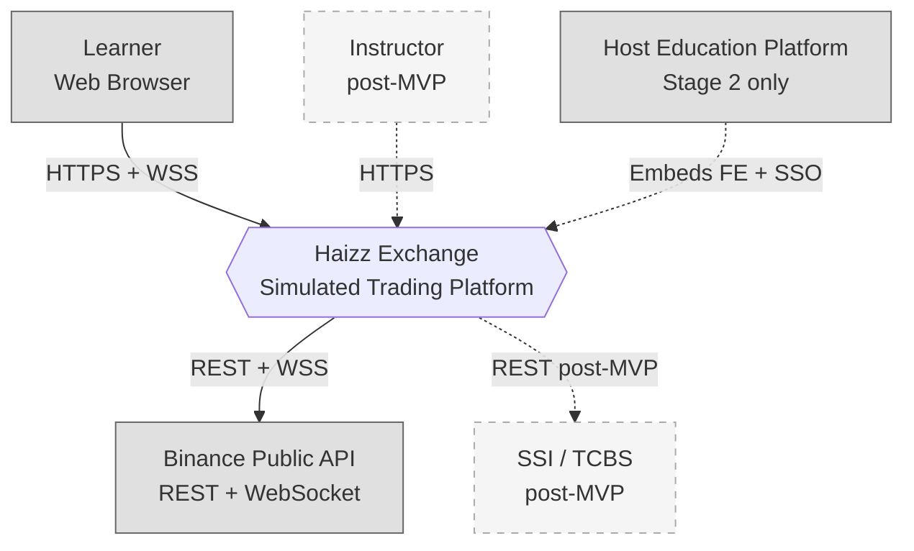

**Boundary summary:**

- **End users** (Learners) interact via browser, initially standalone, later embedded in host.
- **Binance** is the sole external data source in MVP; everything price-related is derived from or anchored to Binance feeds.
- **Host education platform** enters the picture in Stage 2 for embedding and SSO. MVP is standalone.
- All other post-MVP actors (SSI, Instructor console) are stubbed out of scope.

### 2.3 C4 Level 2 — Container / Service Topology

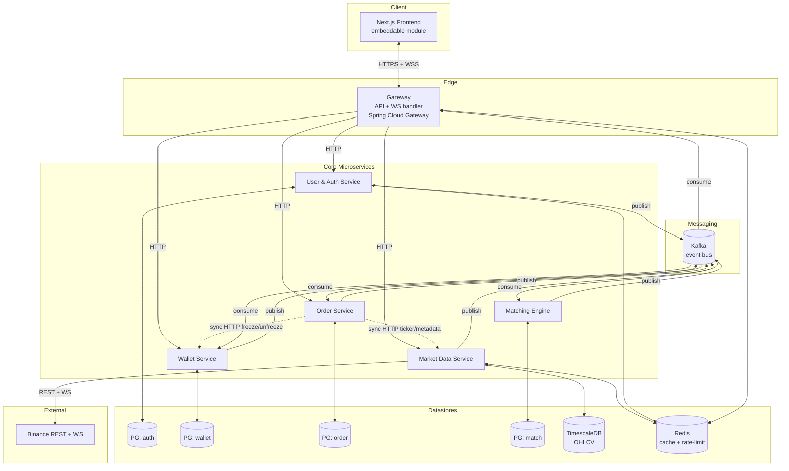

**Legend:**
- Solid arrows: owned communication (service to own datastore, or request/response HTTP).
- Dashed red arrows: synchronous inter-service HTTP (kept minimal; see §2.5).
- Green arrows (implicit via Kafka): asynchronous event flow.

### 2.4 Service Inventory

| # | Service | Ownership (domain) | Tech | Owned PG schema | Deployment unit |
|---|---------|-------------------|------|----------------|-----------------|
| 1 | **User & Auth** | Identity, authentication, JWT issuance | Spring Boot 3.x, Spring Security 6 | `auth` | Docker image `haizz/auth-service` |
| 2 | **Wallet** | Balances, deposits, withdrawals, wallet audit | Spring Boot 3.x, JPA | `wallet` | `haizz/wallet-service` |
| 3 | **Order** | Order intent, state, history, reference data (Asset, TradingPair) for MVP | Spring Boot 3.x, JPA | `order` | `haizz/order-service` |
| 4 | **Matching Engine** | Simulated fill execution, Trade persistence | Spring Boot 3.x, in-memory index | `match` | `haizz/matching-engine` |
| 5 | **Market Data** | Binance ingestion, OHLCV storage, UDF endpoints, depth cache | Spring Boot 3.x, WebFlux WebClient | `marketdata` + TimescaleDB | `haizz/market-data-service` |
| 6 | **Gateway** | HTTP routing + JWT validation + WebSocket fan-out | Spring Cloud Gateway (reactive) + Spring WebSocket | none (stateless) | `haizz/gateway` |
| 7 | **Frontend** | UI, chart, embedding surface | Next.js 14+, React 18+, TradingView Lightweight Charts v5 | none | `haizz/frontend` (Docker for standalone; npm package for Stage 2 embed) |

Supporting infrastructure (not services, but deployed alongside): PostgreSQL 15+, TimescaleDB (Postgres extension), Redis 7+, Kafka (KRaft mode — no Zookeeper).

### 2.5 Communication Patterns at a Glance

| Pattern | Use | Examples | Why |
|---------|-----|----------|-----|
| **Synchronous HTTP (request-response)** | Time-sensitive, must-complete-before-continuing operations | `Order → Wallet` freeze; `Order → MarketData` ticker/metadata; Gateway → any service for user requests | Strong consistency required; caller must react to success/failure immediately |
| **Asynchronous Kafka events** | Domain state transitions, cross-service projection updates, market data broadcast | `OrderPlaced`, `TradeExecuted`, `UserRegistered`, `ExternalTradeObserved` | Decoupling, resilience, replayability, fan-out |
| **WebSocket (Gateway → FE)** | Live push to browser | Price ticks, order state updates, wallet balance updates | Low-latency client push without polling |
| **REST (FE → Gateway → services)** | User-initiated commands & queries | Place order, fetch history, check balance | Standard web client idiom |
| **Outbox → Kafka** | Atomic "save state + emit event" | Every domain event that must be durable | Prevents dual-write problem (DB commit + Kafka publish race) |

Detailed contracts in Chapters 6 (Kafka catalog) and 7 (sequence flows).

### 2.6 Design Principles (applied, not aspirational)

1. **Database-per-service, non-negotiable.** No cross-service SQL joins. If service A needs data owned by service B, it either holds a projection (via Kafka) or calls B synchronously (only when latency budget permits). Violation = architecture bug.
2. **Events are facts, not commands.** Topic names and event names describe what *happened* (`OrderPlaced`, `TradeExecuted`), not what should happen (`PlaceOrder`, `ExecuteTrade`). Commands go through REST; events broadcast results.
3. **Idempotency everywhere that matters.** Every Kafka consumer, every retryable HTTP write, every external integration. Keyed on domain IDs (orderId, tradeId, clientRequestId). Dedup store: per-service Redis set or DB unique constraint.
4. **Outbox pattern for every service that publishes events.** Zero tolerance for "DB committed but event not published" (or vice versa). §6.4.
5. **Optimistic locking by default, pessimistic as fallback.** Wallet Service is the canonical example (§SRS_Appendix_WalletService §4). Generalised to any aggregate with potential concurrent mutation.
6. **Correlation ID on every hop.** Generated at Gateway, propagated via HTTP header `X-Correlation-Id` and Kafka header `correlation-id`. Logged on every entry.
7. **Circuit-break external dependencies, not internal ones.** Binance gets Resilience4j circuit breaker. Internal sync HTTP calls (`Order → Wallet`) get tight timeouts (500 ms) and retry with jittered backoff, but no circuit breaker — a tripped internal breaker during MVP operation causes more confusion than it prevents.
8. **Fail closed on financial operations.** Any ambiguity in wallet or order state → reject, don't guess. A rejected order is recoverable; a phantom fill is not.

### 2.7 Architectural Trade-offs Accepted

| Trade-off | What we accept | Why we accept it | Escape hatch |
|-----------|----------------|------------------|--------------|
| 7 services for 100-user MVP | Higher operational complexity, more network hops | Architecture is a stated learning objective (BRD §1) | Chapter 13.1 — collapse to modular monolith if solo-dev bandwidth breaks |
| Single-node PG, Kafka, Redis | No HA, no disaster recovery | Per BRD §9 (POC scope); SRS §6.3 accepts "best-effort 99%" | Post-MVP: managed DB services, Kafka replication factor ≥ 3 |
| Shared ref data (Asset, TradingPair) in Order Service | Order Service gains a tiny reference-catalog responsibility outside its core domain | MVP simplification; a Catalog Service for 5 pairs is overkill | Chapter 13.2 — extraction path when ≥ 20 pairs or multi-market |
| Matching Engine in-memory open-orders index | Service is stateful; cold start is slow (rebuilds from Order Service) | Simpler than Redis-backed shared state; scale doesn't require it | Post-MVP: Redis-backed index with sharding by pair |
| No schema registry for Kafka (schemas in `exchange-common` JAR) | Producers and consumers must be deployed with compatible library versions | Schema Registry (Confluent or Apicurio) is infrastructure overhead not justified at 5 producers | Chapter 13.3 — migrate to registry when consumer count grows |

---

## 3. Technology Stack

### 3.1 Authoritative Technology Matrix

| Layer | Technology | Version | Used by | Rationale |
|-------|-----------|---------|---------|-----------|
| **Language** | Java | 21 LTS | All BE services | Mandated (BRD §9); records/pattern matching/virtual threads useful for this system |
| **BE framework** | Spring Boot | 3.3.x | All BE services | Mandated; ecosystem coverage (Security, Data, Cloud Gateway, Kafka) |
| **Build** | Maven (multi-module) | 3.9+ | Monorepo | Mandated; matches existing habits |
| **REST HTTP** | Spring MVC (servlet) | bundled | Auth, Wallet, Order, Matching, Market Data | Standard request-response services |
| **Reactive HTTP** | Spring WebFlux | bundled | Gateway, Market Data WS client | Non-blocking needed for Binance WS ingestion + Gateway fan-out |
| **Persistence ORM** | Spring Data JPA + Hibernate | bundled | Auth, Wallet, Order, Matching | Strong fit for aggregate-root persistence |
| **Database** | PostgreSQL | 15+ | All BE services (separate schema/DB per service) | ACID required for financial ops; widely known |
| **Time-series** | TimescaleDB | 2.14+ (Postgres extension) | Market Data | Hypertable partitioning for OHLCV |
| **Cache / short-state** | Redis | 7+ | Market Data, Auth (rate limit), Matching (idempotency dedup), Gateway (rate limit) | Standard; Redlock for distributed locks if ever needed |
| **Message broker** | Kafka (KRaft) | 3.7+ | All services | Event streaming, replay, partitioning |
| **Schema transport** | Java POJOs in `exchange-common` + Jackson JSON | bundled | All services | Schema registry deferred (ADR-005) |
| **Kafka client** | Spring for Apache Kafka | 3.x | All BE services | Consumer groups, KafkaTemplate abstraction |
| **Circuit breaker** | Resilience4j | 2.x | Market Data (Binance), Order → Wallet (timeout + retry, no CB) | Lightweight, annotation-driven |
| **FE framework** | Next.js | 14+ (App Router) | Frontend | Mandated; host app is also Next.js |
| **FE charting** | TradingView Lightweight Charts | v5 | Frontend | Mandated by BRD §9 |
| **FE state** | Zustand | 4.x | Frontend | Minimal, SSR-friendly, easier than Redux for this scope — ADR-006 |
| **FE API client** | Fetch + lightweight wrapper (`@haizz/api-client`) | — | Frontend | No heavy dep; typed via shared types |
| **FE WS client** | Native WebSocket + subscription manager | — | Frontend | See §9.5 |
| **Container** | Docker + docker-compose | — | All | Mandated by BRD §9 |
| **Observability** | Logback JSON encoder + MDC | — | All BE services | OpenTelemetry deferred (SRS §6.7 NFR-062) |
| **Secrets (MVP)** | Docker environment variables + `.env` files (gitignored) | — | All | Vault overkill at MVP; ADR-007 |

### 3.2 Dependency Baseline (Maven BOM)

The Maven parent POM pins versions for consistency:

```xml
<properties>
    <java.version>21</java.version>
    <spring-boot.version>3.3.4</spring-boot.version>
    <spring-cloud.version>2023.0.3</spring-cloud.version>
    <resilience4j.version>2.2.0</resilience4j.version>
    <testcontainers.version>1.20.1</testcontainers.version>
</properties>
```

Each service module declares dependencies against the parent BOM — no ad-hoc version overrides unless documented as ADR.

### 3.3 What We Explicitly Do Not Use

| Technology | Reason |
|-----------|--------|
| Kubernetes / service mesh | Out of MVP scope (BRD §9) |
| Spring Cloud Config / Vault / Consul | Config via env vars and `application-<profile>.yml` is sufficient for 7 services on one host |
| Eureka / Spring Cloud Netflix | Static service resolution (Docker DNS) is enough at this scale |
| Schema registry (Confluent / Apicurio) | ADR-005; `exchange-common` JAR suffices |
| OpenTelemetry / Jaeger | SRS NFR-062 defers to post-MVP; Logback + correlationId for MVP |
| GraalVM native image | Cold-start and memory are not constraints on the 32 GB dev host |
| gRPC | REST for internal sync is fine at current call volume; gRPC adds build complexity |
| Flyway / Liquibase *as formal migration tool in MVP* | **Exception: use Flyway**. Schema changes across 5 PG databases without migration tooling is a bug farm. ADR-008. |

### 3.4 Shared Library: `exchange-common`

A Maven module every service depends on. Contents:

```
exchange-common/
├── src/main/java/com/haizz/exchange/common/
│   ├── enums/         # OrderSide, OrderStatus, OrderType, TradeRole, AssetCode, WalletTxnType
│   ├── value/         # Money, Price, Quantity, Pair — all immutable, BigDecimal-backed
│   ├── event/
│   │   ├── order/     # OrderPlacedEvent, OrderCancelRequestedEvent, ...
│   │   ├── trade/     # TradeExecutedEvent, OrderFilledEvent, ...
│   │   ├── wallet/    # WalletTransactionEvent
│   │   ├── user/      # UserRegisteredEvent
│   │   └── market/    # ExternalTradeObservedEvent, MarketDataFeedDegradedEvent, ...
│   ├── outbox/        # OutboxEntity, OutboxRelay abstract, OutboxPublisher interface
│   ├── web/           # CorrelationIdFilter, ErrorResponse POJO, BaseException
│   └── kafka/         # TopicNames constants, KafkaHeaders constants
└── src/test/          # shared test utilities (AbstractIntegrationTest, TestcontainersConfig)
```

**Strict rules for `exchange-common`:**

1. **No business logic.** If it encodes "how to do X", it doesn't belong here.
2. **No database dependencies.** Entity classes are per-service; shared code must not import JPA.
3. **No Spring dependencies** except for `spring-boot-starter` level abstractions needed for cross-cutting concerns (e.g., filters, outbox framework). Never import service-specific Spring components.
4. **Version compatibility is a team contract.** Breaking changes to event schemas require coordinated deployment. ADR-005.

See Chapter 6.5 for event schema versioning rules.

---

## 4. Service Topology & Responsibilities

This chapter expands the one-line service inventory (§2.4) into a sufficient spec for planning implementation order and module boundaries. Implementation-level internals (packages, classes) are in each service's appendix.

### 4.1 User & Auth Service

**Bounded context:** Identity and authentication.

**Primary responsibilities:** (traces SRS §3.1, SRS_Appendix_UserAuthService)
- Register users; hash passwords (bcrypt cost 12).
- Authenticate (email+password in Stage 1; OIDC token exchange in Stage 2).
- Issue and rotate JWT access (1 h TTL) + opaque refresh tokens (7 d TTL).
- Publish `UserRegistered` on Kafka so Wallet Service can provision wallets.
- Rate-limit login attempts via Redis.
- Expose `/internal/auth/validate-token` for Gateway (fallback; Gateway prefers local JWT verification with public key).

**Owns:** `users`, `credentials`, `sessions`, `login_attempts`, `auth_outbox` tables.

**Does not own:** Wallets, orders, authorization beyond authentication. Each service enforces its own authorization based on `user_id` claim from JWT.

**Dependencies:**
- Inbound: Gateway (HTTP).
- Outbound: Kafka (publish `UserRegistered`). None else.
- Sync HTTP from Gateway-only.

**Key design notes:**
- `IdentityProvider` strategy interface (`LocalIdentityProvider`, `OidcIdentityProvider` stub) enables Stage 2 SSO plug-in without touching login orchestration. ADR-003.
- Token storage: refresh tokens stored as SHA-256 hash; access tokens stateless (no server storage).
- Signing algorithm: RS256 in production, HS256 allowed in local dev. Public key distributed to Gateway at startup via config.

### 4.2 Wallet Service

**Bounded context:** Balance state and audit.

**Primary responsibilities:** (traces SRS §3.2, SRS_Appendix_WalletService)
- Hold per-user per-asset balances with tri-state tracking (`total`, `available`, `frozen`).
- Enforce the invariant `total = available + frozen` at every commit.
- Maintain immutable audit log (`wallet_transactions`) with signed delta columns.
- Expose internal freeze/unfreeze endpoints for Order Service (synchronous HTTP).
- Expose user-facing deposit/withdrawal endpoints with idempotency via `clientRequestId`.
- Consume `UserRegistered` → create 6 initial wallets (USDT + 5 base assets), credit 10,000 USDT.
- Consume `TradeExecuted` → apply trade debit/credit + fee, release leftover freeze.
- Publish `WalletTransaction` events (log-only consumers for now).

**Owns:** `wallets`, `wallet_transactions`, `deposit_records`, `withdrawal_records`, `wallet_outbox`.

**Does not own:** Orders, trades, users (only holds `user_id` reference).

**Dependencies:**
- Inbound: Gateway (user endpoints), Order Service (internal freeze/unfreeze), Kafka consumers.
- Outbound: Kafka publishes only.

**Key design notes:**
- Optimistic lock (JPA `@Version`) default, pessimistic fallback after 3 retries. Concurrency appendix §4.
- Multi-wallet operations (trade consumer loads base + quote wallets) enforce alphabetical lock order to prevent deadlock.
- Dev-mode seeding via `ApplicationRunner` with `@Profile("dev")`, routed through service layer (not raw SQL).

### 4.3 Order Service

**Bounded context:** Order intent and lifecycle.

**Primary responsibilities:** (traces SRS §3.3, SRS_Appendix_OrderService)
- Accept `POST /api/v1/orders` with validation against pair metadata (tick_size, step_size, min_notional, active flag).
- Enforce idempotency via `client_order_id` (per user, 24 h window).
- Call Wallet Service to freeze balance (synchronous HTTP, required before persisting).
- Persist Order aggregate and insert outbox row in the **same DB transaction**.
- Publish `OrderPlaced`, `OrderCancelRequested` events (via outbox relay).
- Consume `matching.events.v1` (`OrderPartiallyFilled`, `OrderFilled`, `OrderCancelled`) → update order state.
- Expose read API: `GET /api/v1/orders`, `GET /api/v1/orders/{id}`.
- Own reference data (Asset, TradingPair, FeeSchedule) for MVP. Post-MVP extraction per Chapter 13.2.

**Owns:** `orders`, `assets`, `trading_pairs`, `fee_schedules`, `order_outbox`.

**Dependencies:**
- Inbound: Gateway (user endpoints), Matching Engine (via Kafka events).
- Outbound: Wallet Service (sync HTTP freeze), Market Data Service (sync HTTP ticker/metadata), Kafka publish.
- Tight coupling via sync call to Wallet: 500 ms timeout, 1 retry on 5xx, no retry on 4xx. Circuit breaker deliberately omitted (ADR-004).

**Key design notes:**
- State machine: `NEW → OPEN → PARTIALLY_FILLED → FILLED / CANCELLED / REJECTED`. Illegal transitions rejected at service layer.
- `avg_fill_price` maintained as a computed column updated on each fill event.
- Market order freeze amount calculated using Market Data ticker snapshot + 5% safety buffer; leftover released post-fill by Wallet Service.
- Outbox relay: `@Scheduled(fixedDelay = 100 ms)`, batch 100, cap 10 attempts per row.

### 4.4 Matching Engine

**Bounded context:** Execution simulation.

**Primary responsibilities:** (traces SRS §3.4, SRS_Appendix_MatchingEngine)
- Consume `OrderPlaced` → register limit orders in in-memory index; execute market orders immediately against depth snapshots.
- Consume `OrderCancelRequested` → remove from index, emit `OrderCancelled`.
- Consume `ExternalTradeObserved` → evaluate open limit orders for fill eligibility (FIFO by `created_at`), emit `TradeExecuted`, `OrderPartiallyFilled`, `OrderFilled`.
- Compute maker/taker fees per the fee schedule.
- Persist `Trade` rows atomically with outbox.
- Rebuild in-memory index from Order Service at cold start (query all orders in `OPEN`, `PARTIALLY_FILLED`).

**Owns:** `trades`, `matching_outbox`.

**Does not own:** Order state (Order Service), wallet balances (Wallet Service), market data (Market Data Service).

**Dependencies:**
- Inbound: Kafka (orders.events.v1, market-data.events.v1). No HTTP endpoints exposed to users.
- Outbound: Kafka publish to `matching.events.v1`; Market Data sync HTTP for walk-the-book depth snapshots.
- Cold start dependency: Order Service internal API (`GET /internal/orders?state=OPEN,PARTIALLY_FILLED`) paginated.

**Key design notes:**
- In-memory index: per-pair per-side `TreeMap<Price, TreeMap<CreatedAtMicros, Order>>`. Scale target at MVP (~500 open orders per pair) makes a simple linked-list scan acceptable; TreeMap is future-proofing.
- Idempotency: Redis set of processed `event_id` with TTL 24 h. Duplicate Kafka deliveries filtered.
- External trade buffer: last 5 seconds of external trades per pair in memory, used only for handling race between `OrderPlaced` and `ExternalTradeObserved` consumption — not for retroactive fills.
- Service is **stateful** at runtime, but all state is recoverable from DB. §6 of MatchingEngine appendix.

### 4.5 Market Data Service

**Bounded context:** External market observation and distribution.

**Primary responsibilities:** (traces SRS §3.5, SRS_Appendix_MarketDataService)
- Binance REST: fetch `exchangeInfo` at startup + every 24 h; fetch historical klines on demand and for gap-fill.
- Binance WebSocket: subscribe to `@trade`, `@depth20@100ms`, optionally `@kline_1m` for 5 pairs via single combined stream.
- Persist OHLCV in TimescaleDB (`candlesticks` hypertable).
- Cache current depth (top 20 per side) and best bid/ask in Redis with short TTL.
- Publish `ExternalTradeObserved` to Kafka (one per Binance trade per supported pair).
- Expose TradingView UDF endpoints (`/udf/config`, `/udf/symbols`, `/udf/history`) for the FE chart.
- Expose `/internal/ticker/{pair}`, `/internal/depth/{pair}`, `/internal/pairs/{pair}/metadata`, `/internal/market-data/health` for other services.
- Detect feed degradation (> 2 s = STALE, > 10 s = DEGRADED, disconnect = DISCONNECTED) and publish `MarketDataFeedDegraded` / `MarketDataFeedRecovered` events.

**Owns:** `candlesticks` (TimescaleDB hypertable), Redis keys under `md:*`.

**Dependencies:**
- Inbound: Order Service (sync HTTP), Matching Engine (sync HTTP for depth), Gateway → FE (UDF + WS push of live updates).
- Outbound: Binance REST/WS, Kafka publish.
- Circuit breaker on Binance REST: Resilience4j 50% failure threshold, 20-call window, 30 s open duration.

**Key design notes:**
- `MarketDataFeedProvider` interface enables post-MVP swap (SSI, CoinGecko fallback).
- Reconnect backoff: 1, 2, 4, 8, 16 s, capped 60 s.
- Depth cache staleness threshold: 1 s. Fallback: REST snapshot on cache miss or stale.

### 4.6 Gateway (API + WebSocket)

**Bounded context:** Edge — traffic ingress, identity enforcement, and client fan-out.

**Primary responsibilities:**
- **API routing (Spring Cloud Gateway, reactive):** route `/api/v1/auth/**` → Auth, `/api/v1/wallets/**`, `/api/v1/deposits/**`, `/api/v1/withdrawals/**` → Wallet, `/api/v1/orders/**` → Order, `/udf/**`, `/api/v1/marketdata/**` → Market Data.
- **JWT validation:** verify signature using Auth's public key (loaded at startup) on every authenticated request. Inject `X-User-Id` and `X-Correlation-Id` headers downstream.
- **Rate limiting:** per-user 60 RPS sustained, 120 burst, via Redis `INCR` + `EXPIRE` token bucket. Login endpoint: 10 attempts / 10 min per email.
- **Correlation ID generation:** if request has no `X-Correlation-Id`, generate UUID.
- **WebSocket endpoint (`/ws`):** authenticated via JWT in handshake `Authorization` header or `?token=` query param. One WS connection per authenticated user.
- **WebSocket subscription routing:** client sends `{"op": "subscribe", "channel": "kline.BTCUSDT.1m"}`; Gateway maintains per-connection subscription map and fans out relevant Kafka messages.
- **WebSocket fan-out:** consume relevant Kafka topics (`market.kline.*`, `market.trade.*`, `market.depth.*`, `order.updates.<userId>`, `wallet.balance.<userId>`) and push to subscribed connections.

**Owns:** No persistent state. Stateless aside from in-memory WebSocket connection registry.

**Dependencies:**
- Inbound: All FE traffic.
- Outbound: Every BE service via HTTP; Kafka as consumer for WS fan-out; Redis for rate limit + Auth public key cache; Auth's public-key endpoint at startup.

**Key design notes:**
- **Why ghép chung API + WS?** (ADR-001) At MVP scale (100 users), running separate gateway processes adds ops burden without benefit. Spring Cloud Gateway supports WebSocket endpoints alongside HTTP routes in the same app. Post-MVP, split is trivial since WS code is isolated to one module.
- WS connections are sticky to a single gateway instance in MVP (single instance anyway). Post-MVP horizontal scale requires a sticky-session LB and/or Redis Pub/Sub for cross-instance fan-out.
- User-scoped WS topics: Gateway subscribes to a per-user-partition pattern (e.g., Kafka consumer subscribes to `order.updates.v1` and filters by userId from message headers against the connection's authenticated userId) — simpler than creating topic-per-user.

### 4.7 Frontend (Next.js Embeddable Module)

**Bounded context:** User interface, chart rendering, embedding surface.

**Primary responsibilities:** (traces SRS §3.6)
- Standalone mode (Stage 1): full Next.js app with its own auth flow.
- Embedded mode (Stage 2): mounted as a dynamically-imported module inside the host app; receives auth token via mount props; renders without CSS collision.
- Screens: Login/Register, Wallet Overview, Trade, Order History, Trade History, Deposit/Withdraw.
- TradingView Lightweight Charts v5 wrapper component consuming UDF endpoints.
- WebSocket subscription manager (one connection, multiplexed channels).
- Responsive ≥ 1024 px; mobile deferred.

**Does not own:** No persistent state. Auth tokens in memory (access) + httpOnly cookie or localStorage (refresh) per §9.7.

**Dependencies:**
- Gateway for all REST and WS traffic.
- Browser APIs (WebSocket, localStorage, cookies).

**Key design notes:** Full design in Chapter 9 and `SystemDesign_Appendix_Frontend.md`.

### 4.8 Service Dependency Graph

Static dependency graph (what depends on what at design time):

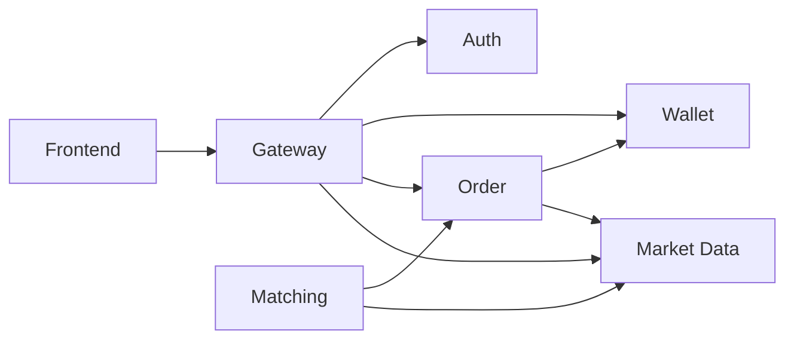

Arrows are **synchronous call-time** dependencies. Kafka dependencies are not shown here (see §6.2 catalog) because events decouple services at deploy time.

**Key property:** no cycles. Wallet, Auth, and Market Data are leaves (do not call out to other services synchronously — Auth and Market Data publish Kafka events but make no sync calls). This is intentional and should be preserved.

---

## 5. Data Architecture

### 5.1 Database-per-Service Map

Each service has an exclusive PostgreSQL database (or schema within a shared cluster — see §5.5 on physical layout). Cross-service access is **forbidden** and enforced by connection string isolation.

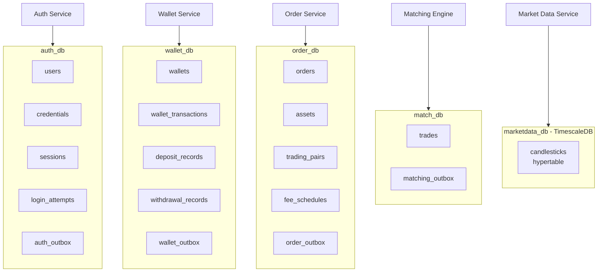

**Isolation rules:**

1. Each service's Spring DataSource URL points to its own database; credentials rotated per service. No shared schemas.
2. Foreign keys across databases are impossible — `user_id` in Wallet's `wallets` table is a UUID without DB-level FK. Referential integrity is enforced at the event-processing layer.
3. Any developer tempted to write `SELECT ... FROM wallet_db.wallets JOIN order_db.orders ...` should be stopped at review. Use events, projections, or dedicated internal APIs.

### 5.2 Physical Deployment of Data Stores

In MVP single-host docker-compose, the physical layout consolidates where possible without violating logical isolation:

| Container | Instance | Databases/Schemas | Purpose |
|-----------|----------|-------------------|---------|
| `postgres-main` | PostgreSQL 15 | `auth_db`, `wallet_db`, `order_db`, `match_db` | All transactional data except OHLCV |
| `postgres-timescale` | TimescaleDB 2.14 (Postgres 15 + extension) | `marketdata_db` | OHLCV hypertable; kept separate so Market Data's heavy time-series writes don't affect transactional DBs |
| `redis` | Redis 7 | db 0: cache; db 1: rate-limit; db 2: idempotency | Logical separation via Redis DB numbers + key prefix convention |
| `kafka` | Kafka 3.7 (KRaft) | N/A | Single broker, `advertised.listeners=PLAINTEXT://kafka:9092` |

**Why two PG containers?** TimescaleDB pressure (insert-heavy, range-heavy) shouldn't starve lock-sensitive wallet/order writes. Physical separation at container level is cheap insurance at MVP. Post-MVP this becomes two separate PG clusters trivially.

**Connection details:** see Chapter 10.3 docker-compose manifest.

### 5.3 Entity Ownership Reference

Recapping SRS §4.1 with system-design-level additions:

| Entity | Authoritative owner | Projected to (if any) | Replication mechanism |
|--------|---------------------|----------------------|----------------------|
| User | Auth Service | *None required in MVP*; services only need `userId` from JWT | — (JWT carries identity) |
| Asset (catalog) | Order Service | Wallet Service reads via internal API when creating wallets on `UserRegistered` | Sync HTTP call `Order → Wallet` not reversed: Wallet hardcodes asset list at MVP and uses `trading_pair_metadata` from Order only if needed post-MVP |
| TradingPair | Order Service | Matching Engine (cached locally, 5-min TTL) | Sync HTTP + optional `PairMetadataUpdated` event from Market Data |
| FeeSchedule | Order Service (MVP single tier) | Matching Engine (computes fees using this) | Sync HTTP on each fill (hot path — considered expensive; MVP accepts because single tier is static; post-MVP extract to Matching Engine or pass in `OrderPlaced` payload) |
| Wallet | Wallet Service | — (no projection) | — |
| WalletTransaction | Wallet Service | — | — |
| Order | Order Service | Matching Engine (in-memory open-orders index) | Sync HTTP at cold start + Kafka `OrderPlaced` for deltas |
| Trade | Matching Engine | Order Service (updates `filled_qty`, `avg_fill_price`); Wallet Service (applies debit/credit) | Kafka `TradeExecuted`, `OrderPartiallyFilled`, `OrderFilled` |
| Candlestick | Market Data Service | — (FE reads via UDF endpoint) | — |
| DepositRecord / WithdrawalRecord | Wallet Service | — | — |

**Design note on FeeSchedule hot-path lookup:** Fetching fee rate on every fill via sync HTTP from Matching Engine → Order Service is an obvious performance red flag. At MVP with single hard-coded tier, Matching Engine caches the fee config (bootstrapped from Order at startup, refreshed on a schedule). This is documented as a temporary simplification — ADR-009.

### 5.4 Redis Key Namespace Convention

All services share a single Redis instance but strictly segregate keys by service prefix. The convention is **normative**:

```
<service>:<purpose>:<identifier>[:<sub-identifier>]
```

| Prefix | Owner | Purpose | TTL |
|--------|-------|---------|-----|
| `md:ticker:<pair>` | Market Data | Current best bid/ask per pair | 10 s (refreshed per WS tick) |
| `md:depth:<pair>` | Market Data | Current depth snapshot (JSON) | 2 s (refreshed per WS depth update) |
| `md:exchangeInfo` | Market Data | Hash, pair→metadata JSON | 24 h (refreshed on fetch) |
| `md:kline:<pair>:<resolution>:<openTime>` | Market Data | Latest partial kline (live) | until replaced |
| `auth:ratelimit:login:<email>` | Auth | Login attempt counter | 15 min |
| `auth:ratelimit:ip:<ip>` | Auth | IP-based attempt counter | 15 min |
| `gw:ratelimit:user:<userId>` | Gateway | Per-user token bucket | 60 s |
| `gw:ratelimit:ip:<ip>` | Gateway | Per-IP token bucket (pre-auth) | 60 s |
| `match:idempotency:<eventId>` | Matching Engine | Processed Kafka event_id dedup | 24 h |
| `wallet:idempotency:<clientRequestId>` | Wallet Service | Deposit/withdrawal dedup | 60 s (matches SRS request window) |

**Anti-patterns to avoid:**
- Unprefixed keys (e.g., `user:123`) — ambiguous ownership.
- Keys without TTL for cache data — memory leak.
- JSON blobs larger than 1 MB — Redis is not a document store.

### 5.5 Key Schemas (Summary)

Full DDL lives in each service appendix. Summary here for cross-reference:

**Wallet Service — `wallets`:**

```sql
CREATE TABLE wallets (
    id                 UUID PRIMARY KEY,
    user_id            UUID NOT NULL,
    asset_code         VARCHAR(10) NOT NULL,
    total_balance      DECIMAL(36, 18) NOT NULL DEFAULT 0,
    available_balance  DECIMAL(36, 18) NOT NULL DEFAULT 0,
    frozen_balance     DECIMAL(36, 18) NOT NULL DEFAULT 0,
    version            BIGINT NOT NULL DEFAULT 0,
    created_at         TIMESTAMPTZ NOT NULL DEFAULT NOW(),
    updated_at         TIMESTAMPTZ NOT NULL DEFAULT NOW(),
    UNIQUE (user_id, asset_code),
    CHECK (total_balance = available_balance + frozen_balance),
    CHECK (available_balance >= 0),
    CHECK (frozen_balance >= 0)
);
CREATE INDEX ix_wallets_user ON wallets (user_id);
```

**Order Service — `orders`:**

```sql
CREATE TABLE orders (
    id                 UUID PRIMARY KEY,
    client_order_id    UUID,
    user_id            UUID NOT NULL,
    pair               VARCHAR(20) NOT NULL,
    side               VARCHAR(4) NOT NULL,  -- BUY | SELL
    type               VARCHAR(6) NOT NULL,  -- MARKET | LIMIT
    quantity           DECIMAL(36, 18) NOT NULL,
    limit_price        DECIMAL(36, 18),
    time_in_force      VARCHAR(3) NOT NULL DEFAULT 'GTC',
    state              VARCHAR(20) NOT NULL,
    filled_qty         DECIMAL(36, 18) NOT NULL DEFAULT 0,
    avg_fill_price     DECIMAL(36, 18),
    freeze_amount      DECIMAL(36, 18) NOT NULL,
    freeze_asset       VARCHAR(10) NOT NULL,
    rejection_reason   VARCHAR(40),
    version            BIGINT NOT NULL DEFAULT 0,
    created_at         TIMESTAMPTZ NOT NULL DEFAULT NOW(),
    updated_at         TIMESTAMPTZ NOT NULL DEFAULT NOW(),
    UNIQUE (user_id, client_order_id),
    CHECK (filled_qty <= quantity),
    CHECK ((type = 'LIMIT' AND limit_price IS NOT NULL) OR (type = 'MARKET' AND limit_price IS NULL))
);
CREATE INDEX ix_orders_user_state ON orders (user_id, state, created_at DESC);
CREATE INDEX ix_orders_pair_state ON orders (pair, state) WHERE state IN ('OPEN', 'PARTIALLY_FILLED');
```

**Matching Engine — `trades`:** See SRS_Appendix_MatchingEngine §5.1.

**Market Data — `candlesticks` (TimescaleDB hypertable):**

```sql
CREATE TABLE candlesticks (
    pair         VARCHAR(20) NOT NULL,
    resolution   VARCHAR(4) NOT NULL,   -- 1m, 5m, 15m, 1h, 4h, 1d
    open_time    TIMESTAMPTZ NOT NULL,
    open         DECIMAL(36, 18) NOT NULL,
    high         DECIMAL(36, 18) NOT NULL,
    low          DECIMAL(36, 18) NOT NULL,
    close        DECIMAL(36, 18) NOT NULL,
    volume       DECIMAL(36, 18) NOT NULL,
    close_time   TIMESTAMPTZ NOT NULL,
    PRIMARY KEY (pair, resolution, open_time)
);
SELECT create_hypertable('candlesticks', 'open_time', chunk_time_interval => INTERVAL '7 days');
CREATE INDEX ix_candlesticks_pair_res_time ON candlesticks (pair, resolution, open_time DESC);
```

Retention policy (TimescaleDB): keep 1m for 30 d, 5m for 90 d, 15m for 180 d, 1h for 1 y, 4h/1d indefinitely. Configured via `add_retention_policy` at setup.

### 5.6 Outbox Table Standard

All services that publish Kafka events have an outbox table with a **canonical schema** (ADR-002):

```sql
CREATE TABLE <service>_outbox (
    id             UUID PRIMARY KEY,
    event_type     VARCHAR(60) NOT NULL,      -- e.g., "OrderPlaced"
    aggregate_type VARCHAR(40) NOT NULL,      -- e.g., "Order"
    aggregate_id   VARCHAR(64) NOT NULL,      -- e.g., orderId UUID as string
    payload_json   JSONB NOT NULL,            -- event body
    headers_json   JSONB,                     -- Kafka headers (correlationId, etc)
    partition_key  VARCHAR(128) NOT NULL,     -- Kafka partition key value
    topic          VARCHAR(80) NOT NULL,      -- target Kafka topic
    created_at     TIMESTAMPTZ NOT NULL DEFAULT NOW(),
    published_at   TIMESTAMPTZ,
    attempts       INT NOT NULL DEFAULT 0,
    last_error     TEXT
);
CREATE INDEX ix_<service>_outbox_unpublished
    ON <service>_outbox (created_at)
    WHERE published_at IS NULL;
```

**Why canonical?** Every service uses the same `OutboxRelay` utility from `exchange-common`. A shared relay reads from "a table with this shape" — the polymorphism is purely in the service name. See §6.4 for the implementation.

### 5.7 Migration Strategy (Flyway)

Each service ships its own Flyway migration set under `src/main/resources/db/migration/`. Naming: `V<date>__<description>.sql` (e.g., `V20260421_001__create_wallets.sql`).

Rules:
- **Never edit a committed migration.** Always add a new `V…` file.
- Repeatable migrations (`R__*.sql`) for views, functions, and static seed data that should be re-applied on change.
- `spring.flyway.schemas=<service>_schema` per service to keep isolation explicit when sharing a PG container.
- Dev-only seed data loaded via `ApplicationRunner` under `@Profile("dev")`, **not** migrations — seeds shouldn't run in staging/prod.

---

## 6. Communication Patterns

This chapter is the single authoritative source for: Kafka topic catalog, event schemas (summary), consumer group conventions, sync HTTP contracts, outbox implementation, and correlation/idempotency standards.

### 6.1 Topic Naming Convention

```
<domain>.events.v<version>
```

- `domain` = logical source (`orders`, `wallet`, `matching`, `market-data`, `auth`, `user`). Not service name — domain name. Events are grouped by *what they describe*, not by who emits them.
- `version` = integer bumped only on **breaking** schema change. Additive fields do not bump version.
- Exception: high-volume market-data streams use per-pair topics — see §6.2.

SRS §Appendix C uses a slightly older `order.placed`, `trade.executed` (one-event-per-topic) style. **This design consolidates into domain topics** (`orders.events.v1`, `matching.events.v1`) with an `eventType` discriminator field, because per-event topics multiply partitions unnecessarily at MVP scale. This is a design-level refinement of the SRS catalog; both are logically equivalent. (ADR-010)

### 6.2 Kafka Topic Catalog

| Topic | Producer | Consumers | Partitions | Partition key | Retention | Payload eventTypes |
|-------|----------|-----------|-----------|--------------|-----------|-------------------|
| `user.events.v1` | Auth Service | Wallet Service | 3 | `userId` | 7 d | `UserRegistered`, `UserDisabled` (post-MVP) |
| `orders.events.v1` | Order Service | Matching Engine, Wallet Service (log) | 6 | `orderId` | 7 d | `OrderPlaced`, `OrderCancelRequested`, `OrderRejected` |
| `matching.events.v1` | Matching Engine | Order Service, Wallet Service, Gateway (WS fan-out) | 6 | `orderId` | 7 d | `TradeExecuted`, `OrderPartiallyFilled`, `OrderFilled`, `OrderCancelled` |
| `wallet.events.v1` | Wallet Service | (log only in MVP); Gateway for user balance push | 3 | `userId` | 7 d | `WalletTransaction`, `WalletBalanceChanged` |
| `market-data.events.v1` | Market Data | Matching Engine, Gateway (WS fan-out) | 10 (one per pair × 2 buffer) | `pair` | 3 d | `ExternalTradeObserved`, `MarketDataFeedDegraded`, `MarketDataFeedRecovered`, `PairMetadataUpdated` |
| `market.kline.<pair>` | Market Data | Gateway (WS fan-out) | 1 | — | 1 d | Live 1-min kline tick |
| `market.depth.<pair>` | Market Data | Gateway (WS fan-out) | 1 | — | 1 d | Live depth update |

**Notes on partitioning:**

- Domain topics are partitioned by the natural aggregate key — `userId` for user-scoped domains, `orderId` for order-scoped, `pair` for market-scoped. This ensures event ordering per aggregate.
- `market.kline.<pair>` and `market.depth.<pair>` are per-pair topics **and** single-partition because ordering per pair is the only constraint and fan-out volume is low.
- Default partitions count is conservative. Scale-out is a broker config change, not a code change.

### 6.3 Event Envelope (Normative)

Every event on a `*.events.v1` topic conforms to:

```json
{
  "eventId": "<UUID>",
  "eventType": "OrderPlaced",
  "eventVersion": 1,
  "occurredAt": "2026-04-21T10:15:30.123Z",
  "aggregateType": "Order",
  "aggregateId": "<orderId UUID>",
  "payload": { /* event-specific fields */ },
  "metadata": {
    "correlationId": "<UUID>",
    "causationId": "<UUID of triggering event, if any>",
    "producerService": "order-service",
    "producerVersion": "1.0.3"
  }
}
```

Kafka record headers mirror key metadata for fast filtering without parsing:

| Header | Value |
|--------|-------|
| `event-type` | `payload.eventType` |
| `event-version` | `payload.eventVersion` as string |
| `correlation-id` | `payload.metadata.correlationId` |
| `causation-id` | `payload.metadata.causationId` (if set) |
| `content-type` | `application/json` |

**Key envelope properties:**

- `eventId` is UUID — used by all consumers for idempotency dedup.
- `causationId` forms an event chain; useful for debugging (e.g., `OrderFilled` causation → `TradeExecuted.eventId` causation → `ExternalTradeObserved.eventId`).
- `correlationId` is stable across an entire user interaction; a single REST call may produce one correlationId visible in HTTP logs *and* in every downstream event emitted because of that call.

### 6.4 Outbox Pattern Implementation

**Motivation:** A service that does `DB.commit(); kafka.publish();` will lose events if it crashes between the two steps. Outbox pattern solves this by writing the event into a DB table in the same transaction as the state change, then publishing asynchronously.

**Chosen strategy (ADR-002):** Shared utility in `exchange-common` — each service implements a thin relay bean.

**Architecture:**

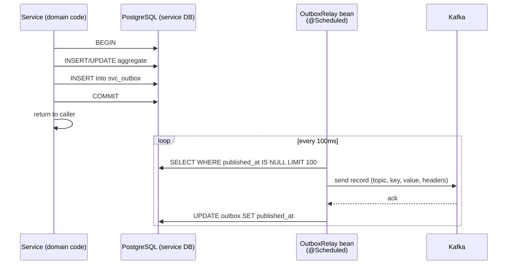

**Shared utility sketch (`exchange-common`):**

```java
// abstract base in exchange-common
public abstract class OutboxEntity {
    protected UUID id;
    protected String eventType;
    protected String aggregateType;
    protected String aggregateId;
    protected String payloadJson;
    protected String headersJson;
    protected String partitionKey;
    protected String topic;
    protected Instant createdAt;
    protected Instant publishedAt;
    protected int attempts;
    protected String lastError;
}

public interface OutboxRepository<E extends OutboxEntity> {
    List<E> findUnpublished(int limit);
    void markPublished(UUID id);
    void recordFailure(UUID id, String error);
}

@Component
public class OutboxRelay {
    // Constructor-injected: OutboxRepository, KafkaTemplate, ObjectMapper

    @Scheduled(fixedDelay = 100)
    public void publishPending() {
        List<? extends OutboxEntity> batch = repo.findUnpublished(100);
        for (OutboxEntity row : batch) {
            try {
                ProducerRecord<String, String> rec = buildRecord(row);
                kafkaTemplate.send(rec).get(5, SECONDS);
                repo.markPublished(row.getId());
            } catch (Exception e) {
                repo.recordFailure(row.getId(), e.getMessage());
                if (row.getAttempts() >= 10) {
                    // move to dead-letter table (outside this sketch)
                }
            }
        }
    }
}
```

**Per-service integration:**

Each service defines its own concrete `@Entity` extending `OutboxEntity` and its own `@Repository` extending `OutboxRepository`. This preserves the DB-per-service rule (each service has its own `*_outbox` table in its own DB) while sharing the relay logic.

**Dead-letter handling:** After 10 attempts, the row is not deleted but moved to `<service>_outbox_dead_letter` (same shape) for manual inspection. An alert fires (log at ERROR level; Chapter 11 observability) — the operator (solo dev) investigates.

**Why not Debezium?** ADR-002: adds a CDC infrastructure component, Postgres WAL replication config, and a new failure mode. Shared-utility approach is sufficient at MVP and can be swapped later without domain-code changes.

### 6.5 Event Schema Versioning

**Additive changes (new optional fields):** no version bump. Consumers must ignore unknown fields; producers must not remove fields without going through deprecation.

**Breaking changes:** new topic version (`orders.events.v2`), dual-publish during migration:

1. Producer publishes to both `orders.events.v1` and `orders.events.v2` for a deprecation window.
2. Consumers migrate to `v2` one at a time.
3. Once all consumers on `v2`, producer stops publishing `v1`.
4. After retention window elapses, `v1` topic is deleted.

At MVP (single team, single deploy), this is theoretical. The process is documented so it's ready when needed.

### 6.6 Consumer Group Convention

| Consumer group | Service consuming | Topic(s) | Behaviour |
|---------------|-------------------|----------|-----------|
| `wallet-service` | Wallet | `user.events.v1`, `matching.events.v1` | Each event processed once by one wallet instance |
| `order-service` | Order | `matching.events.v1` | Each event processed once |
| `matching-engine` | Matching | `orders.events.v1`, `market-data.events.v1` | Each event processed once |
| `gateway-ws-fanout` | Gateway | `matching.events.v1`, `wallet.events.v1`, `market.kline.*`, `market.depth.*`, `market-data.events.v1` | Gateway fans out to WS clients based on subscription filters |

**Consumer concurrency:**
- Wallet Service `trade-executed` consumer: concurrency = 3 (matches 3 user-partitions reasonable for MVP).
- Matching Engine `external-trade` consumer: concurrency = 5 (one thread per pair, since partitioned by pair).
- Others: concurrency = 1 at MVP unless load testing shows need.

### 6.7 Synchronous HTTP Contracts Between Services

**Principle:** internal sync calls are deliberately minimal. Only two paths exist at MVP:

#### 6.7.1 Order → Wallet: Freeze / Unfreeze

```
POST /api/v1/wallets/internal/freeze    (Wallet Service)
POST /api/v1/wallets/internal/unfreeze  (Wallet Service)
```

- **Network:** internal Docker network; not exposed at Gateway.
- **Auth:** service-to-service via a shared secret HMAC header `X-Internal-Auth` (MVP; OAuth2 client-credentials post-MVP). ADR-011.
- **Timeout:** 500 ms at the Order Service side.
- **Retry:** 1 retry on 5xx with 100 ms backoff; 0 retries on 4xx.
- **Idempotency:** Wallet Service dedupes by `(referenceType=ORDER, referenceId=<orderId>, type=ORDER_FREEZE)`.
- **Failure handling:** if freeze fails (including timeout), Order Service returns HTTP 400 `INSUFFICIENT_AVAILABLE_BALANCE` or 503 `WALLET_SERVICE_UNAVAILABLE` to the user; no outbox row, no Kafka event published.

#### 6.7.2 Order/Matching → Market Data: Ticker, Depth, Metadata

```
GET /internal/ticker/{pair}              (Market Data Service)
GET /internal/depth/{pair}               (Market Data Service)
GET /internal/pairs/{pair}/metadata      (Market Data Service)
GET /internal/market-data/health         (Market Data Service)
```

- **Timeout:** 200 ms.
- **Cache at caller:** Order Service caches `metadata` locally for 5 min (rarely changes); fetches `ticker` fresh on each market-order placement (no cache).
- **Retry:** none (latency budget too tight; on failure, caller proceeds with cached data if available, else rejects user request with `MARKET_DATA_UNAVAILABLE`).
- **Circuit breaker:** not applied to internal calls (ADR-004). The caller tolerates failure by degraded response.

### 6.8 Correlation ID Propagation

**Rules:**

1. Gateway generates `X-Correlation-Id` UUID if absent on incoming request.
2. Every downstream HTTP call receives the header.
3. Every Kafka event emitted during request handling copies the correlationId into `metadata.correlationId` and Kafka header.
4. Every consumer reads the header into MDC (`MDC.put("correlationId", ...)`) at the start of processing and clears it at the end. Logs automatically include it via the logging pattern.
5. Internal-only operations (scheduled jobs, outbox relay) generate a new correlationId per run.

**Logging pattern:**

```
%d{ISO8601} [%thread] %-5level [svc=<service>,cid=%X{correlationId},uid=%X{userId}] %logger{36} - %msg%n
```

### 6.9 Idempotency Strategy Matrix

| Operation | Key | Store | Scope |
|-----------|-----|-------|-------|
| Place order | `client_order_id` | `orders.client_order_id` unique (user_id, client_order_id) — DB-level | 24 h by cleanup job |
| Deposit | `clientRequestId` | Redis `wallet:idempotency:<id>` | 60 s |
| Withdrawal | `clientRequestId` | Redis `wallet:idempotency:<id>` | 60 s |
| Freeze | `(referenceType=ORDER, referenceId)` | `wallet_transactions` query | lifetime |
| Unfreeze | `(referenceType=ORDER, referenceId, reason)` | `wallet_transactions` query | lifetime |
| Kafka consumer processing | `eventId` | Redis `<svc>:idempotency:<eventId>` OR DB unique constraint on `<domain>_processed_events(event_id)` | 24 h (Kafka retention) |
| Trade application (Wallet) | `tradeId` | `wallet_transactions.reference_id WHERE reference_type='TRADE'` | lifetime |

**Why a mix?** Financial operations (freeze, trade application) get DB-backed lifetime idempotency — no expiry, because replaying is catastrophic if we miss dedup. Rate-limit-style operations (deposit) get Redis-backed short-window idempotency — sufficient to catch user double-clicks.

---

## 7. Critical Flows (Sequence Diagrams)

This chapter documents the end-to-end flows that exercise multiple services. Each flow calls out the failure modes and exactly which service handles each step. These flows are **normative** — implementations must match them. Where they conflict with an earlier section, this chapter governs for the specific flow described.

### 7.1 User Registration & Initial Wallet Provisioning

**Trigger:** `POST /api/v1/auth/register` from the Frontend.

```mermaid
sequenceDiagram
    actor User
    participant FE as Frontend
    participant GW as Gateway
    participant AUTH as Auth Service
    participant AUTH_DB as Auth DB
    participant KAFKA as Kafka
    participant WALLET as Wallet Service
    participant WALLET_DB as Wallet DB

    User->>FE: Fill register form
    FE->>GW: POST /api/v1/auth/register {email, password}
    GW->>AUTH: POST /auth/register (+correlationId)

    AUTH->>AUTH: validate email format + password policy
    AUTH->>AUTH_DB: BEGIN tx
    AUTH->>AUTH_DB: INSERT users
    AUTH->>AUTH_DB: INSERT credentials (bcrypt hash)
    AUTH->>AUTH_DB: INSERT auth_outbox (UserRegistered)
    AUTH->>AUTH_DB: COMMIT
    AUTH->>AUTH: issue JWT + refresh token
    AUTH-->>GW: 201 {accessToken, refreshToken}
    GW-->>FE: 201
    FE-->>User: redirected to wallet page (empty)

    Note over AUTH,KAFKA: Async, out of request path
    AUTH->>KAFKA: publish UserRegistered (via outbox relay)
    KAFKA->>WALLET: consume UserRegistered
    WALLET->>WALLET_DB: BEGIN tx
    loop for each supported asset (USDT, BTC, ETH, BNB, SOL, XRP)
        WALLET->>WALLET_DB: INSERT wallet
    end
    WALLET->>WALLET_DB: UPDATE usdt_wallet SET available=10000, total=10000
    WALLET->>WALLET_DB: INSERT wallet_transaction (SIGNUP_GRANT 10000)
    WALLET->>WALLET_DB: COMMIT

    Note over FE,WALLET: User may see empty wallet for <1s; FE polls GET /wallets/me
    FE->>GW: GET /api/v1/wallets/me (after brief delay)
    GW->>WALLET: forward
    WALLET-->>FE: 6 wallets with USDT=10000
```

**Key points:**

- Registration response (HTTP 201) arrives **before** wallets exist. The FE must tolerate a brief "no wallets yet" window and retry. Post-MVP, synchronous bootstrap (Auth service waits for wallet creation via request-reply pattern) could be added if UX requires.
- If Kafka is down, the `UserRegistered` event sits in the outbox; user can log in but wallets show empty until Kafka recovers.
- Duplicate user: unique constraint on `email_normalized` throws `DataIntegrityViolationException`, translated to 409 `EMAIL_ALREADY_EXISTS`.

### 7.2 Place Market Order (Happy Path)

**Trigger:** `POST /api/v1/orders` with `{type: MARKET, side: BUY, pair: BTCUSDT, quantity: 0.01}`.

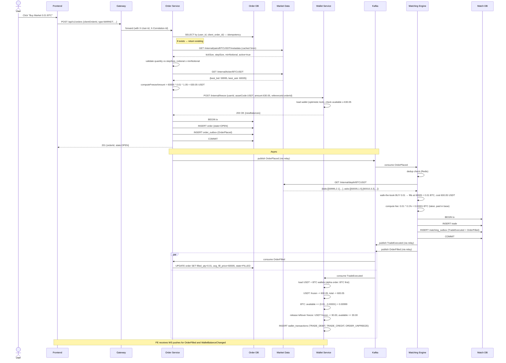

**Critical ordering constraints:**

1. Freeze **must** complete successfully before `OrderPlaced` is persisted. If freeze fails, the order is never created — no compensating action needed.
2. Order insert + outbox insert **must** be in the same DB transaction. The outbox relay publishes the event only after the DB commit.
3. Wallet Service's trade application **must** load both wallets in alphabetical order by assetCode to prevent deadlock (BTC before USDT).
4. The "leftover freeze release" in Wallet Service requires knowing the original freeze amount vs trade cost. This information is on the Order aggregate (accessed via sync internal call) or passed in the event payload. **Decision (ADR-012):** passed in event payload — `TradeExecuted.orderOriginalFreezeAmount` — to avoid sync calls on a hot path.

**Failure points and handling:**

| Step | Failure | Handling |
|------|---------|----------|
| Metadata fetch | Market Data down | Order Service returns 503 `MARKET_DATA_UNAVAILABLE`; user retries |
| Ticker fetch | Market Data down, no cached value | Same as above |
| Freeze | Insufficient balance | 400 `INSUFFICIENT_AVAILABLE_BALANCE` |
| Freeze | Timeout | 503 `WALLET_SERVICE_UNAVAILABLE`; no partial state |
| DB commit | Constraint violation | 500 with generic error code; developer investigates |
| Kafka publish (outbox relay) | Kafka down | Event retries indefinitely; DB state already committed |
| Matching consume | Duplicate delivery | Dedupe via Redis; no double-fill |
| Wallet trade consume | Order Service state unreachable for leftover freeze | Payload-carried value is sufficient (ADR-012); no sync call |

### 7.3 Place Limit Order with Partial Fill

**Trigger:** `POST /api/v1/orders` with `{type: LIMIT, side: BUY, pair: BTCUSDT, quantity: 1.0, limitPrice: 59000}`.

```mermaid
sequenceDiagram
    participant FE as Frontend
    participant GW as Gateway
    participant ORDER as Order Service
    participant WALLET as Wallet Service
    participant KAFKA as Kafka
    participant MATCH as Matching Engine
    participant MD as Market Data (Binance feed)

    FE->>GW: POST /orders {type:LIMIT, side:BUY, qty:1.0, price:59000}
    GW->>ORDER: forward
    
    ORDER->>ORDER: validate (tick/step/notional)
    ORDER->>WALLET: freeze 59000 USDT (price × qty; no buffer for LIMIT)
    WALLET-->>ORDER: ok
    ORDER->>ORDER: INSERT order (state=OPEN), INSERT outbox
    ORDER-->>FE: 201 OPEN
    
    ORDER->>KAFKA: OrderPlaced
    KAFKA->>MATCH: consume
    MATCH->>MATCH: add to in-memory index: BTCUSDT/BUY at 59000

    Note over MATCH,MD: Time passes; Binance price drops, an external trade at 59000 occurs
    
    MD->>MATCH: ExternalTradeObserved {pair:BTCUSDT, price:59000, qty:0.3, side:SELL}
    MATCH->>MATCH: findEligibleFills(BTCUSDT, 59000, BUY) → [our order]
    MATCH->>MATCH: our order wants 1.0, external trade has 0.3 → partial fill 0.3
    MATCH->>MATCH: compute fee: 0.3 * 0.1% = 0.0003 BTC (maker, paid in base)
    
    MATCH->>MATCH: INSERT trade, INSERT outbox (TradeExecuted + OrderPartiallyFilled)
    MATCH->>MATCH: updateRemaining(orderId, 0.7)  in-memory
    
    MATCH->>KAFKA: TradeExecuted, OrderPartiallyFilled
    
    par
        KAFKA->>ORDER: OrderPartiallyFilled
        ORDER->>ORDER: UPDATE filled_qty=0.3, avg_fill_price=59000, state=PARTIALLY_FILLED
    and
        KAFKA->>WALLET: TradeExecuted
        WALLET->>WALLET: USDT frozen -= 17700, total -= 17700
        WALLET->>WALLET: BTC available += 0.2997
        Note right of WALLET: No leftover release yet — order is not terminal
    end
    
    Note over MATCH,MD: More time passes; another external trade completes the fill
    
    MD->>MATCH: ExternalTradeObserved {price:58990, qty:0.7, side:SELL}
    MATCH->>MATCH: eligible (58990 ≤ our 59000 — touch at or below for BUY limit)
    Note right of MATCH: fill at 59000 (our limit, not 58990 — in sim model)
    MATCH->>MATCH: fill 0.7 → order FILLED at weighted avg 59000
    
    MATCH->>KAFKA: TradeExecuted, OrderFilled
    
    par
        KAFKA->>ORDER: OrderFilled
        ORDER->>ORDER: UPDATE filled_qty=1.0, state=FILLED
    and
        KAFKA->>WALLET: TradeExecuted (second fill)
        WALLET->>WALLET: USDT frozen -= 41300, total -= 41300
        WALLET->>WALLET: BTC available += 0.6993
        Note right of WALLET: Order now FILLED; frozen USDT = 0, no leftover to release
    end
```

**Design notes specific to limit-order fills:**

- **Fill price is the limit price**, not the external trade price (this is the simulation choice documented in `SRS_Appendix_MatchingEngine`). This matches how a resting limit order would behave on a real exchange: it fills at its own price, not at the incoming taker's price.
- **FIFO ordering** when multiple learner orders are eligible: oldest `created_at` first.
- **Fee role:** maker (resting limit orders are makers); fee paid in base asset for BUY, quote asset for SELL.
- The 5-second external trade buffer (`SRS_Appendix_MatchingEngine` §2.2) covers the race between a newly-placed `OrderPlaced` being consumed *after* an external trade that should have touched it. It does **not** cause retroactive fills — only fills within the 5 s lookback.

### 7.4 Cancel Open Order

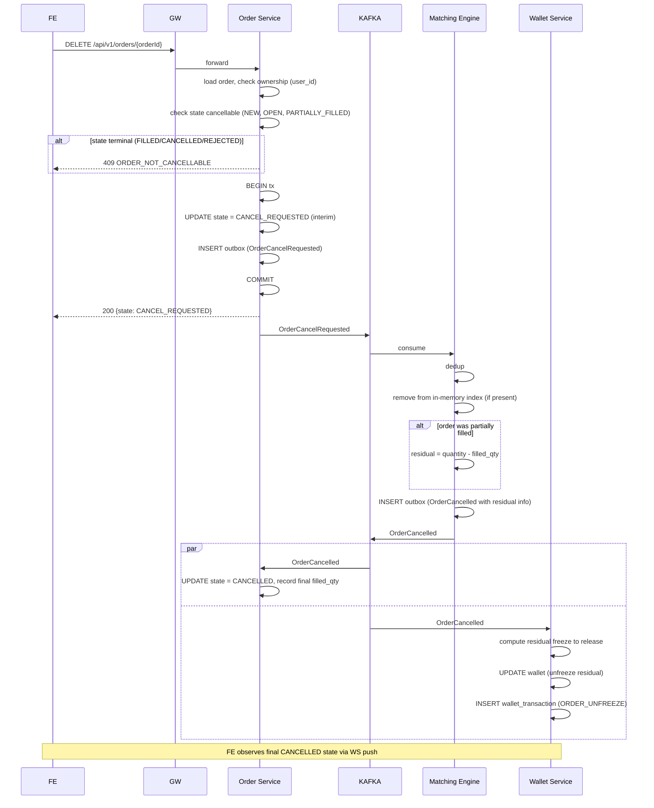

**Race: concurrent fill and cancel.**

If an `ExternalTradeObserved` arrives between `OrderCancelRequested` publish and consume, the order may be partially filled in between. The matching engine resolves by state at consumption time:

- If the order is **still in the index** when `OrderCancelRequested` is processed → remove, emit `OrderCancelled` with whatever residual is remaining.
- If the order was **removed due to `FILLED`** before the cancel consume → `OrderCancelled` consumer finds no matching order in the index → emit `OrderCancelled` **anyway** with `residual=0` so Order Service idempotently records the final state. Order Service state machine: `FILLED` is terminal; receiving `OrderCancelled` after `FILLED` is a no-op logged at INFO.

### 7.5 Chart Load (FE → Market Data UDF)

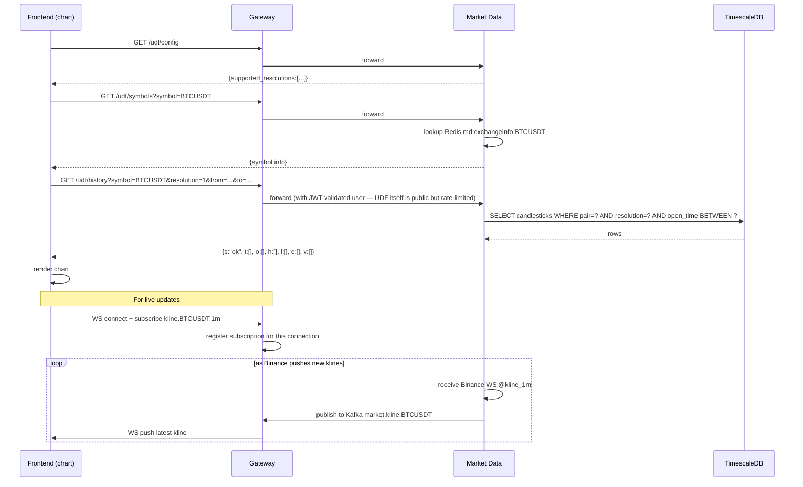

### 7.6 Binance Disconnect & Degraded Mode

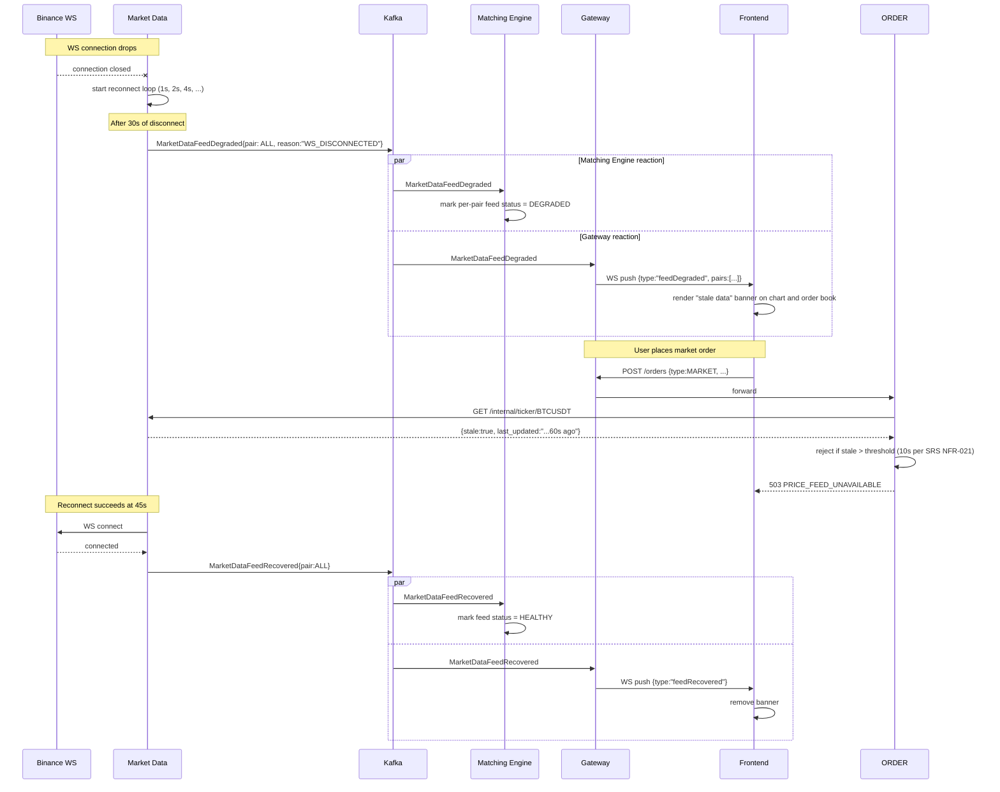

**Behaviours during degraded mode:**

- **Open limit orders:** remain in the matching engine index; they simply cannot fill while no trades are observed. When feed recovers, they become eligible again — no special handling needed.
- **New limit orders:** still accepted (user isn't locked out from placing orders; they just may not fill immediately).
- **New market orders:** rejected with `PRICE_FEED_UNAVAILABLE` because fill price is undefined.
- **UDF history requests:** still served from TimescaleDB (historical data doesn't degrade).
- **Order book display:** shows `stale: true` flag with last known snapshot.

---

## 8. Cross-Cutting Concerns

This chapter collects the standards that every service must implement the same way. Avoid divergence — a service inventing its own error-code scheme or correlation-id header fragments debugging across service boundaries.

### 8.1 Error Response Format (Normative)

Every REST endpoint returns errors in this shape:

```json
{
  "timestamp": "2026-04-21T10:15:30.123Z",
  "status": 400,
  "error": "Bad Request",
  "code": "INSUFFICIENT_AVAILABLE_BALANCE",
  "message": "Insufficient available balance. Cancel open orders to free frozen balance.",
  "details": {
    "available": "10000.00000000",
    "requested": "20000.00000000",
    "frozen": "60000.00000000"
  },
  "path": "/api/v1/withdrawals",
  "correlationId": "7d3e...-..."
}
```

- `code` is a machine-readable SCREAMING_SNAKE identifier, stable across releases within a major version.
- `message` is human-readable English; FE may override with localized text based on `code`.
- `details` is an open-shape object — fields specific to the error.
- 5xx errors omit `details` and `message` (or give a generic message) to avoid leaking internals.

Implementation: `exchange-common.web.ErrorResponse` POJO + `GlobalExceptionHandler` base class that services extend.

### 8.2 Authentication & Authorization Propagation

**Mechanism:**

1. FE attaches `Authorization: Bearer <accessToken>` to every REST request and to WS handshake.
2. Gateway verifies the JWT signature locally using Auth's public key (cached at Gateway startup; refreshed every 1 h). No hop to Auth on every request.
3. On valid JWT, Gateway injects:
   - `X-User-Id: <uuid>`
   - `X-User-Roles: <comma-separated>` (MVP: always `user`)
   - `X-Correlation-Id: <uuid>`
4. Downstream services **trust these headers** because the internal network is closed. They do not re-verify JWT.
5. Each service applies its own authorization check: does `userId` (from header) own the resource being accessed?

**Authorization matrix (MVP):**

| Resource | Operation | Rule |
|----------|-----------|------|
| `/api/v1/wallets/me` | GET | Always scoped to `X-User-Id`; user can only fetch own wallets |
| `/api/v1/orders` | POST/GET/DELETE | Resource owner check: `order.user_id == X-User-Id` |
| `/api/v1/deposits`, `/withdrawals` | POST/GET | Same owner check |
| `/api/v1/marketdata/**`, `/udf/**` | GET | Public within authenticated session; no resource-ownership check |
| `/internal/**` | Any | Service-to-service HMAC auth (§6.7.1); not exposed via Gateway |

**What happens if a service receives a request without `X-User-Id`?** Reject 401. This indicates either a bug (Gateway misconfig) or a direct-network attack (already mitigated by firewall, but defence-in-depth).

### 8.3 Resilience Patterns

| Pattern | Where applied | Config |
|---------|--------------|--------|
| **Circuit Breaker** | Market Data → Binance REST | Resilience4j: 50% failure rate over 20 calls, 30 s open, 3 call half-open trial |
| **Retry** | Outbox relay → Kafka | Up to 10 attempts per row, exponential backoff 100 ms, 200 ms, 400 ms, ..., cap 60 s. After cap, dead-letter. |
| **Retry** | Order → Wallet freeze | 1 retry on 5xx with 100 ms backoff |
| **Timeout** | All sync HTTP internal calls | 500 ms default; Market Data reads 200 ms |
| **Bulkhead** | N/A at MVP | Single-host scale doesn't warrant; post-MVP use per-thread-pool isolation |
| **Rate limit** | Gateway per-user, per-IP | Redis token bucket |
| **Degraded mode** | Market Data feed loss | See §7.6 |
| **Idempotency** | All writes | See §6.9 |

**Deliberate non-use:** internal service-to-service circuit breakers (ADR-004). Rationale: at MVP scale with tight HTTP timeouts and retries, a tripped breaker on an internal call creates more debugging confusion than it prevents. External (Binance) gets a breaker because its failure modes are richer.

### 8.4 Configuration Management

**Sources (precedence, lowest to highest):**

1. Hard-coded defaults in `@ConfigurationProperties` classes.
2. `application.yml` — baseline config, committed.
3. `application-<profile>.yml` — profile-specific, committed (except secrets).
4. Environment variables — injected via docker-compose `environment:` block.
5. `.env` file loaded by docker-compose — gitignored; holds secrets.

**Profiles:**

| Profile | Use | Key overrides |
|---------|-----|---------------|
| `dev` | Local single-developer; enables `DataSeeder` | Logging DEBUG, H2 fallback if PG unreachable |
| `docker` | Running inside docker-compose | Service discovery via Docker DNS (`postgres-main`, `kafka`, etc.) |
| `prod` | Future production | JSON-only logs, no dev endpoints, stricter CORS |

**Secret handling (MVP):**
- JWT signing keys, DB passwords, internal HMAC secret, Binance API key (if any) live in `.env`.
- docker-compose substitutes them into containers via `${VAR}` syntax.
- Never committed; `.env.example` committed with placeholder values.

### 8.5 Logging Standard

**Format (JSON):**

```json
{
  "@timestamp": "2026-04-21T10:15:30.123Z",
  "level": "INFO",
  "logger": "com.haizz.exchange.order.api.OrderController",
  "thread": "http-nio-8081-exec-3",
  "service": "order-service",
  "correlationId": "7d3e...",
  "userId": "6a2f...",
  "message": "Order placed",
  "orderId": "fd12...",
  "pair": "BTCUSDT"
}
```

**Rules:**
- Use SLF4J; avoid direct `System.out`.
- Structured fields via MDC (`MDC.put("orderId", ...)`) — not by string concatenation in the message.
- Never log passwords, tokens, or raw card data. Redact `Authorization` header to `Bearer ***` in access logs.
- Log levels:
  - `ERROR`: unhandled exceptions, outbox dead-letter, broken invariants.
  - `WARN`: retries exhausted, feed degradations, rate limit exceeded.
  - `INFO`: business events (order placed, user registered, deposit confirmed).
  - `DEBUG`: detailed flow for troubleshooting; off by default.

### 8.6 Health Checks

Every service exposes:

| Endpoint | Purpose | Depth |
|----------|---------|-------|
| `/actuator/health/liveness` | "Am I running?" | Trivial — just returns 200 |
| `/actuator/health/readiness` | "Can I serve traffic?" | Checks DB connectivity, Kafka producer, Redis if used |
| `/actuator/info` | Build info | Git commit SHA, build time, version |
| `/actuator/metrics` | Micrometer metrics | JVM, HTTP, Kafka, custom business counters |

Matching Engine and Market Data additionally expose service-specific health detail (open-orders count, feed status per pair) via `/internal/market-data/health` etc.

### 8.7 Time & Precision Standards

- **All timestamps:** UTC, `TIMESTAMPTZ` in PostgreSQL, `Instant` in Java, ISO-8601 with millisecond precision in JSON.
- **All monetary values:** `DECIMAL(36, 18)` in DB, `BigDecimal` in Java, strings in JSON (to avoid JS float loss).
- **Rounding:** `HALF_UP` per BRD assumptions.
- **Pair symbols:** uppercase, concatenated (`BTCUSDT`), never hyphenated or slashed in data; display-only formatting (`BTC/USDT`) is an FE concern.
- **UUID everywhere for IDs.** No sequential integer PKs — prevents leaking counts and simplifies cross-service references.

---

## 9. Frontend Architecture

This chapter covers the Next.js frontend that serves two deployment modes: **standalone** (Stage 1 MVP) and **embedded module** inside a host Next.js app (Stage 2). Implementation-level detail (folder layout, per-component breakdown, API client internals) is in `SystemDesign_Appendix_Frontend.md`.

### 9.1 Dual-Mode Architecture Overview

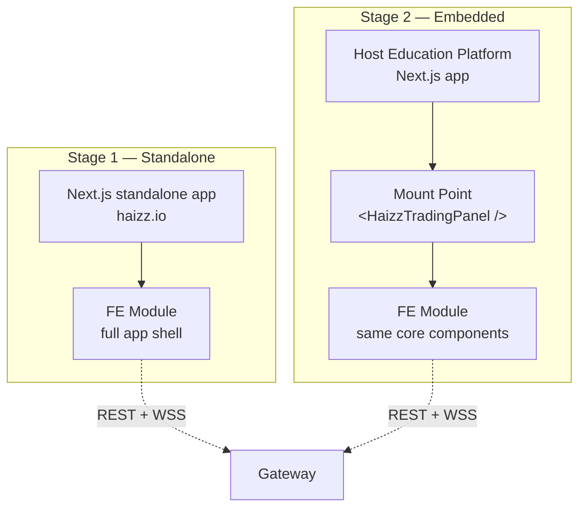

The FE codebase is **one project** with two build/mount targets. The `TradingPanel` root component accepts props that parameterize mode behaviour:

```tsx
interface HaizzTradingPanelProps {
  mode: 'standalone' | 'embedded';
  auth?: {                              // required in embedded mode
    accessToken: string;                 // short-lived, provided by host
    refreshCallback?: () => Promise<string>;  // host-provided refresher
    onAuthExpired?: () => void;          // host handles re-auth UI
  };
  gatewayBaseUrl?: string;              // default from env in standalone; required in embedded
  theme?: 'light' | 'dark' | 'inherit'; // 'inherit' picks up host CSS variables
  locale?: string;                      // default 'en'
  onEvent?: (event: HaizzEvent) => void; // host hook for analytics/tracking
}
```

**Key invariant:** no code path assumes standalone mode. Every feature (auth, routing, theming, error display) branches on `mode` at the top of its execution path.

### 9.2 Module Federation Mount Contract (Stage 2)

The chosen embedding approach (per stated default): **Next.js dynamic imports with module federation-style boundary**. The FE module ships as an npm package `@haizz/trading-panel`, exposing `HaizzTradingPanel` as its default export. Host imports it with `next/dynamic` for SSR-safe lazy loading:

```tsx
// In host's page
import dynamic from 'next/dynamic';

const HaizzTradingPanel = dynamic(
  () => import('@haizz/trading-panel').then(m => m.HaizzTradingPanel),
  { ssr: false, loading: () => <PanelSkeleton /> }
);

export default function TradingPage() {
  return (
    <HaizzTradingPanel
      mode="embedded"
      auth={{ accessToken: hostToken, refreshCallback: hostRefresh }}
      gatewayBaseUrl={process.env.NEXT_PUBLIC_HAIZZ_GATEWAY}
      theme="inherit"
    />
  );
}
```

**Why not iframe?** CSS/JS isolation is the iframe win, but the cost — cross-frame auth handover, separate scroll context, clipboard quirks, and the inability to share React context — is too high for Stage 2's "seamless embed" goal. Module federation gets UX continuity; CSS isolation is solved with the shadow-DOM-style scoping in §9.3.

**Why not iframe as a fallback?** Two mounting mechanisms double the surface area. If a host app needs iframe isolation later (e.g., strict CSP), it's a non-breaking addition — wrap `HaizzTradingPanel` in an iframe shim. Documented, not built.

### 9.3 CSS Isolation Strategy

Module federation embedding means FE styles live in the host's DOM. Two collision vectors:

1. **Global selectors** in the FE leak onto host elements.
2. **Global selectors** in the host leak onto FE elements.

**Approach: scoped CSS-in-JS with deterministic prefix.**

- All FE components use CSS Modules (Next.js built-in) or a CSS-in-JS library (Vanilla Extract or Emotion; pick one in Appendix §3).
- Build config prepends every class with `haizz-` prefix (e.g., `.haizz-TradingForm__submit-1a2b`). This is deterministic from the build, so host CSS targeting `.submit` never matches.
- Root container has `.haizz-root` class; FE-owned CSS resets (font, box-sizing) are scoped under this class, not `body` or `html`.
- No global CSS imports in embedded mode; fonts/icons loaded by the host or via dynamic `<link>` injection scoped by a `data-haizz` attribute.

**Theme inheritance (`theme="inherit"`):** FE reads the host's CSS custom properties (`--color-primary`, `--font-sans`, etc.) and uses them with fallback defaults. A theme map documents which variables the FE looks for:

| FE variable | Fallback | Host CSS var consumed |
|-------------|----------|----------------------|
| `--haizz-color-accent` | `#2563eb` | `--color-primary` |
| `--haizz-color-bg` | `#ffffff` | `--color-background` |
| `--haizz-color-text` | `#111827` | `--color-text` |
| `--haizz-font-sans` | `system-ui, sans-serif` | `--font-sans` |

### 9.4 Authentication Handover

#### 9.4.1 Standalone Mode

FE owns the auth lifecycle end-to-end:

- Login/Register screens live in the FE.
- Access token stored in memory (React state / Zustand); refresh token stored in `localStorage` (not httpOnly cookie, because Gateway and FE may be on different origins for dev; production pins to same origin via reverse proxy if possible).
- Axios/fetch wrapper attaches `Authorization: Bearer <token>` to every request.
- 401 response triggers refresh flow; if refresh fails, user routed to login.

#### 9.4.2 Embedded Mode

Host owns user identity; FE receives a short-lived delegated token.

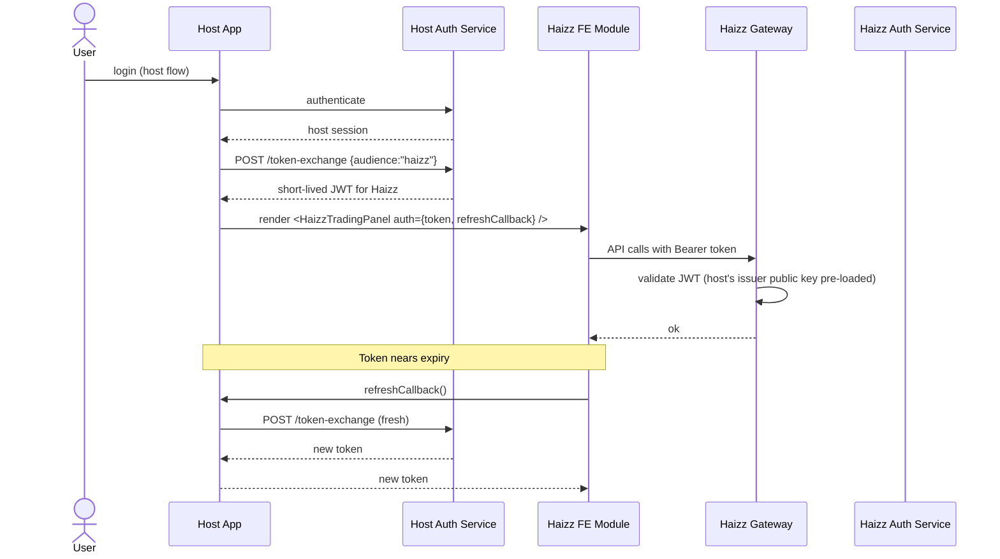

**Contract requirements:**

- Host's issuer public key is trusted by Haizz Gateway (configured via environment at Gateway startup).
- Claims required in the delegated JWT: `sub` (user ID in Haizz; mapped from host user ID at token-exchange), `aud` = `haizz`, `exp` ≤ 15 min, `iss` = host's configured issuer.
- **User provisioning on first delegated login:** Gateway checks if `sub` exists as a Haizz user; if not, triggers a bootstrap flow that creates the user row and provisions wallets (same path as registration — publishes `UserRegistered` event).
- Refresh token **never** leaves the host; FE calls `refreshCallback` instead of a refresh endpoint.

### 9.5 WebSocket Subscription Manager

One WS connection per authenticated user, multiplexed across channels. The FE maintains a singleton `WSManager`:

```typescript
class WSManager {
  private ws: WebSocket | null = null;
  private subscriptions = new Map<string, Set<(msg: unknown) => void>>();
  private reconnectAttempt = 0;

  subscribe(channel: string, handler: (msg: unknown) => void): () => void {
    // ensure connected; send subscribe frame; track handler
    // returns unsubscribe fn
  }

  private connect() {
    this.ws = new WebSocket(`${gatewayBaseUrl}/ws`);
    this.ws.onopen = () => { this.reconnectAttempt = 0; this.resubscribeAll(); };
    this.ws.onclose = () => { this.scheduleReconnect(); };
    this.ws.onmessage = (evt) => { this.dispatch(JSON.parse(evt.data)); };
  }

  private scheduleReconnect() {
    const delay = Math.min(1000 * 2 ** this.reconnectAttempt++, 30000);
    setTimeout(() => this.connect(), delay);
  }
}
```

**Channel conventions:**

| Channel format | Purpose | Message shape |
|----------------|---------|---------------|
| `kline.<pair>.<resolution>` | Live candle updates | `{type:"kline", pair, resolution, o, h, l, c, v, openTime, closeTime}` |
| `depth.<pair>` | Order book depth updates | `{type:"depth", pair, bids:[[price,qty]], asks:[[price,qty]], lastUpdateId}` |
| `trade.<pair>` | Recent trades ticker | `{type:"trade", pair, price, qty, side, ts}` |
| `order.updates` | Current user's order state changes | `{type:"orderUpdate", orderId, state, filledQty, avgFillPrice}` |
| `wallet.updates` | Current user's balance changes | `{type:"walletUpdate", asset, total, available, frozen}` |
| `feed.status` | Feed degradation notifications | `{type:"feedStatus", status:"degraded" | "recovered", pairs:[]}` |

**Subscription protocol (client → server):**

```json
{"op": "subscribe", "channels": ["kline.BTCUSDT.1m", "depth.BTCUSDT"]}
{"op": "unsubscribe", "channels": ["depth.BTCUSDT"]}
```

**Server → client error protocol:**

```json
{"type":"error", "code":"UNAUTHORIZED_CHANNEL", "channel":"order.updates.<otherUser>"}
```

`order.updates` and `wallet.updates` are **implicitly scoped** to the authenticated user — FE does not specify a userId, and Gateway enforces it from the JWT claim.

### 9.6 State Management Layout (Zustand)

Zustand chosen over Redux/Context for: smaller bundle, direct subscription semantics, less boilerplate (ADR-006). Store shape:

```
useAuthStore         # accessToken, user profile, login/logout actions
useWalletStore       # per-asset balances, refresh action, selectors
useOrdersStore       # open orders, history, place/cancel actions
useMarketDataStore   # last ticker per pair, subscribed pairs
useChartStore        # selected pair, resolution, UI preferences
useUIStore           # modals, toasts, sidebar collapsed state
```

**Subscription pattern:** WS messages update stores directly (no Redux middleware layer needed). Components subscribe to the slices they care about.

**SSR note:** stores are initialised lazily on first access, so they work with Next.js App Router's hydration. Embedded mode skips SSR entirely (`dynamic({ssr: false})`).

### 9.7 Routing Integration

**Standalone mode:** uses Next.js App Router. Routes: `/`, `/login`, `/register`, `/wallet`, `/trade/[pair]`, `/orders`, `/history`, `/deposit`, `/withdraw`.

**Embedded mode:** the FE module **does not own the URL**. Navigation is internal state (which screen is visible) managed by `useUIStore.currentScreen`. The host's URL is not hijacked. Optional prop `initialScreen` lets the host deep-link:

```tsx
<HaizzTradingPanel mode="embedded" initialScreen="trade/BTCUSDT" ... />
```

If the host wants true URL reflection, an `onScreenChange` callback prop lets the host update its own URL (e.g., `/learn/trading?panel=trade-btcusdt`).

### 9.8 TradingView Chart Wrapper

The chart is the most performance-sensitive component. It is isolated behind a wrapper component with a stable interface:

```tsx
<HaizzChart
  pair="BTCUSDT"
  resolution="1m"
  theme={theme}
  onResolutionChange={(res) => setResolution(res)}
/>
```

**Responsibilities of the wrapper:**

- Instantiate TradingView Lightweight Charts v5 on mount, dispose on unmount (critical for embedded mode where the component may mount/unmount as host navigates).
- Wire the UDF datafeed to `${gatewayBaseUrl}/udf/*` endpoints.
- Subscribe to `kline.<pair>.<resolution>` WS channel for live updates.
- Handle resize via ResizeObserver.
- Propagate user-initiated resolution changes upward via `onResolutionChange`.

**Non-responsibilities:**

- Does not manage state outside the chart (pair selection lives in `useChartStore`).
- Does not own WS connection; uses `WSManager.subscribe()`.

### 9.9 API Client Layer

A thin `@haizz/api-client` module wraps fetch with:

- Base URL + auth header injection.
- Request/response type definitions matching Gateway contracts (shared types package post-MVP; duplicated for now).
- Error normalization: Gateway error responses (§8.1) are parsed into typed `HaizzApiError` instances carrying `code`, `message`, `details`.
- Correlation ID generation: if not provided by caller, generates a UUID and attaches as `X-Correlation-Id`; returns it so UI can display it on error screens for support tickets.

**No retry logic in the client by default** — retries are UI decisions (e.g., "place order" should not silently retry), so callers opt in where appropriate.

### 9.10 Stage 1 vs Stage 2 Build Variants

| Concern | Stage 1 (Standalone) | Stage 2 (Embedded npm package) |
|---------|---------------------|-------------------------------|
| Build target | Next.js app (`next build` → Docker image) | ESM library (`tsup` or similar → npm publish) |
| Routing | Next.js App Router | Internal state machine |
| SSR | enabled for marketing/login pages | disabled (`ssr: false`) |
| Auth UI | full login/register screens | hidden; receives token via props |
| Env vars | `NEXT_PUBLIC_GATEWAY_URL` at build time | `gatewayBaseUrl` prop at mount time |
| Analytics | FE-owned (Plausible/similar) | host-owned; FE calls `onEvent` callback |
| Fonts | bundled via `next/font` | deferred to host; FE uses `font-family: inherit` or loaded once by host |

Both variants import from the **same** `@haizz/trading-core` package containing the component library, stores, API client, and WS manager. The entry points differ (`next/app` for standalone, a single exported React component for embedded).

### 9.11 Error Handling in the UI

Three layers:

1. **API errors** (thrown by `@haizz/api-client`): rendered as toasts using error codes mapped to localized messages. Unknown codes show the raw `message` field with correlationId appended for support.
2. **Unrecoverable errors** (React error boundary): full-screen error component; `onEvent({type:"errorBoundary", error})` notifies host in embedded mode.
3. **Feed degradation** (via `feed.status` WS channel): non-blocking banner above chart and order book.

---

## 10. Deployment Architecture

This chapter specifies the MVP deployment on a single developer host using docker-compose. Production-grade CI/CD, multi-host, and cloud deployment are post-MVP concerns noted only in §10.6.

### 10.1 Deployment Target

- **Host:** single machine (developer workstation or single Linux VM).
- **OS:** Windows 11 + Docker Desktop (developer), Ubuntu 22.04 + Docker Engine (optional staging).
- **Resource assumptions:** ≥ 16 GB RAM, ≥ 4 CPU cores, ≥ 50 GB disk. Developer's i5 14600KF + 32 GB is comfortably above baseline.
- **Network:** all services reachable only on Docker bridge network `haizz-net`; only Gateway exposes a host port.

### 10.2 Container Topology

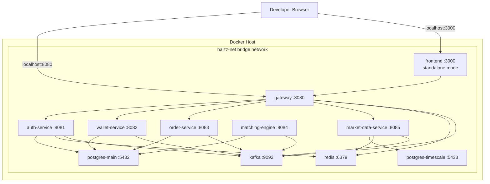

**Port exposure policy:**
- Gateway (8080) and Frontend (3000) are exposed to host for developer access.
- All other ports are container-internal only (no `ports:` in compose for them; only `expose:`).
- PostgreSQL and Kafka get host-port mapping **only in dev profile** (for DB clients / Kafka UI). Profile `prod` in docker-compose hides them.

### 10.3 docker-compose Manifest Skeleton

Full manifest in the repo; structure normative:

```yaml
# docker-compose.yml (root of repo)
name: haizz-exchange
services:

  postgres-main:
    image: postgres:15-alpine
    environment:
      POSTGRES_MULTIPLE_DATABASES: auth_db,wallet_db,order_db,match_db
      POSTGRES_USER: ${PG_USER}
      POSTGRES_PASSWORD: ${PG_PASSWORD}
    volumes:
      - pg_main_data:/var/lib/postgresql/data
      - ./infra/postgres/init:/docker-entrypoint-initdb.d
    networks: [haizz-net]
    healthcheck:
      test: ["CMD", "pg_isready", "-U", "${PG_USER}"]
      interval: 10s

  postgres-timescale:
    image: timescale/timescaledb:2.14.2-pg15
    environment:
      POSTGRES_DB: marketdata_db
      POSTGRES_USER: ${PG_USER}
      POSTGRES_PASSWORD: ${PG_PASSWORD}
    volumes:
      - pg_timescale_data:/var/lib/postgresql/data
    networks: [haizz-net]

  redis:
    image: redis:7-alpine
    command: redis-server --appendonly yes
    volumes:
      - redis_data:/data
    networks: [haizz-net]

  kafka:
    image: apache/kafka:3.7.0
    environment:
      KAFKA_NODE_ID: 1
      KAFKA_PROCESS_ROLES: broker,controller
      KAFKA_LISTENERS: PLAINTEXT://:9092,CONTROLLER://:9093
      KAFKA_ADVERTISED_LISTENERS: PLAINTEXT://kafka:9092
      KAFKA_CONTROLLER_QUORUM_VOTERS: 1@kafka:9093
      KAFKA_CONTROLLER_LISTENER_NAMES: CONTROLLER
      KAFKA_OFFSETS_TOPIC_REPLICATION_FACTOR: 1
      KAFKA_AUTO_CREATE_TOPICS_ENABLE: "false"  # topics created explicitly
    volumes:
      - kafka_data:/var/lib/kafka/data
    networks: [haizz-net]

  # --- Backend services ---
  auth-service:
    build:
      context: ./services/auth-service
      dockerfile: Dockerfile
    environment:
      SPRING_PROFILES_ACTIVE: docker
      SPRING_DATASOURCE_URL: jdbc:postgresql://postgres-main:5432/auth_db
      SPRING_DATASOURCE_USERNAME: ${PG_USER}
      SPRING_DATASOURCE_PASSWORD: ${PG_PASSWORD}
      SPRING_KAFKA_BOOTSTRAP_SERVERS: kafka:9092
      SPRING_DATA_REDIS_HOST: redis
      JWT_SIGNING_KEY: ${JWT_SIGNING_KEY}
      INTERNAL_HMAC_SECRET: ${INTERNAL_HMAC_SECRET}
    depends_on:
      postgres-main:
        condition: service_healthy
      kafka: { condition: service_started }
      redis: { condition: service_started }
    networks: [haizz-net]

  wallet-service: { ... }   # similar shape
  order-service:   { ... }
  matching-engine: { ... }
  market-data-service:
    environment:
      SPRING_DATASOURCE_URL: jdbc:postgresql://postgres-timescale:5432/marketdata_db
      BINANCE_REST_URL: https://api.binance.com
      BINANCE_WS_URL: wss://stream.binance.com:9443
      # ... other env
    depends_on: [postgres-timescale, kafka, redis]

  gateway:
    build: ./services/gateway
    environment:
      AUTH_SERVICE_URL: http://auth-service:8081
      WALLET_SERVICE_URL: http://wallet-service:8082
      ORDER_SERVICE_URL: http://order-service:8083
      MARKET_DATA_SERVICE_URL: http://market-data-service:8085
      JWT_PUBLIC_KEY_URL: http://auth-service:8081/internal/auth/jwks
      SPRING_KAFKA_BOOTSTRAP_SERVERS: kafka:9092
      SPRING_DATA_REDIS_HOST: redis
    ports:
      - "8080:8080"
    depends_on: [auth-service, wallet-service, order-service, market-data-service]
    networks: [haizz-net]

  frontend:
    build: ./frontend
    environment:
      NEXT_PUBLIC_GATEWAY_URL: http://localhost:8080
    ports:
      - "3000:3000"
    networks: [haizz-net]

networks:
  haizz-net:
    driver: bridge

volumes:
  pg_main_data:
  pg_timescale_data:
  redis_data:
  kafka_data:
```

**Key choices explained:**

- **`depends_on` with `service_healthy`** for postgres only — Kafka's healthy state is unreliable in KRaft mode, so services tolerate Kafka not-yet-ready with retries in their Kafka client configuration.
- **`POSTGRES_MULTIPLE_DATABASES`** is not a native postgres env var — handled by an init script in `./infra/postgres/init/` that iterates the comma-separated list and `CREATE DATABASE`s each.
- **Secrets via `.env` file** (gitignored) loaded by docker-compose automatically. `.env.example` committed.
- **No `restart: always`** — developer controls lifecycle explicitly. In hands-off staging, switch to `restart: unless-stopped`.

### 10.4 Startup Order & Bootstrap

docker-compose respects `depends_on` but not business-level readiness. The effective startup sequence:

1. `postgres-main`, `postgres-timescale`, `redis`, `kafka` start together.
2. Postgres init scripts create per-service databases.
3. BE services start; each runs Flyway migrations against its own DB at boot.
4. BE services start consuming/publishing Kafka; topics auto-created at first access (dev) or by an `init` one-shot container (prod — see §10.5).
5. Gateway starts last, loads Auth public key via `JWT_PUBLIC_KEY_URL` (retries with backoff).
6. Frontend starts; developer hits `localhost:3000`.

**Topic bootstrap container (optional but recommended):**

```yaml
kafka-init:
  image: apache/kafka:3.7.0
  depends_on: [kafka]
  entrypoint: /bin/bash
  command: >
    -c "
    /opt/kafka/bin/kafka-topics.sh --bootstrap-server kafka:9092 --create --if-not-exists --topic user.events.v1 --partitions 3 --replication-factor 1;
    /opt/kafka/bin/kafka-topics.sh --bootstrap-server kafka:9092 --create --if-not-exists --topic orders.events.v1 --partitions 6 --replication-factor 1;
    /opt/kafka/bin/kafka-topics.sh --bootstrap-server kafka:9092 --create --if-not-exists --topic matching.events.v1 --partitions 6 --replication-factor 1;
    /opt/kafka/bin/kafka-topics.sh --bootstrap-server kafka:9092 --create --if-not-exists --topic wallet.events.v1 --partitions 3 --replication-factor 1;
    /opt/kafka/bin/kafka-topics.sh --bootstrap-server kafka:9092 --create --if-not-exists --topic market-data.events.v1 --partitions 10 --replication-factor 1
    "
  networks: [haizz-net]
  restart: "no"
```

Runs once per `docker compose up`; exits immediately when topics exist.

### 10.5 Profiles & Overrides

| File | Purpose |
|------|---------|
| `docker-compose.yml` | Baseline — all services, dev-friendly defaults |
| `docker-compose.dev.yml` | Override: expose DB/Kafka ports to host, enable `SPRING_PROFILES_ACTIVE=dev` for DataSeeder |
| `docker-compose.prod.yml` | Override: hide all internal ports, JSON logging, `restart: unless-stopped` |

Developer runs `docker compose up` (picks up `dev` override by default via `COMPOSE_FILE` env var).

### 10.6 Post-MVP Deployment Evolution

Not built, but planned escape path:

- **CI/CD:** GitHub Actions → build per-service Docker images → push to registry → deploy via `docker compose pull && up -d` on target host.
- **Multi-host:** add docker-swarm or migrate to K8s. Services are already stateless-or-explicitly-stateful-with-state-in-DB/Redis, so horizontal scale is primarily a matter of Gateway sticky sessions (WS) and Matching Engine consumer partition assignment.
- **Managed services:** PostgreSQL → RDS/Neon; Redis → Upstash/ElastiCache; Kafka → Confluent Cloud / MSK. Remove respective containers from compose, update env vars.
- **TLS termination:** add nginx or Traefik in front of Gateway; FE reached via HTTPS; WSS for WebSocket.

---

## 11. Observability & Operations

This chapter covers logging, metrics, health, startup verification, and runbook-level operations needed for the solo developer to debug and maintain the system.

### 11.1 Logging

Standards already defined in §8.5. Repeated implementation notes here:

- Logback with `logstash-logback-encoder` for JSON in dev/prod, plain text only in local IDE.
- MDC populated at three points: (1) Gateway on inbound request; (2) every Kafka consumer's `onMessage` entry; (3) every outbox relay batch.
- Access log format at Gateway includes: method, path, status, duration, correlationId, userId.
- Log retention in docker-compose: default (5 files × 10 MB per container); configured via Docker's `logging:` block per service.

### 11.2 Metrics

Micrometer + Prometheus-style endpoints. No Prometheus server in MVP — metrics are collected on-demand:

- Every BE service exposes `/actuator/prometheus`.
- A one-shot `curl` or `scripts/collect-metrics.sh` dumps metrics when debugging.
- Key custom metrics to instrument from day one:

| Metric | Service | Use |
|--------|---------|-----|
| `haizz.orders.placed.count{pair, type}` | Order | Order volume sanity check |
| `haizz.orders.rejected.count{reason}` | Order | Validation failure patterns |
| `haizz.wallet.freeze.duration` (timer) | Wallet | Detect slow freeze calls |
| `haizz.matching.fill.duration` (timer) | Matching | Fill latency |
| `haizz.outbox.pending.size` (gauge) | All | Pile-up detector |
| `haizz.outbox.dead_letter.count` | All | Alert trigger |
| `haizz.marketdata.feed.status{pair}` (gauge 0/1/2) | Market Data | Feed health |
| `haizz.ws.connections.active` (gauge) | Gateway | WS scale indicator |
| `haizz.kafka.consumer.lag{topic, group}` | All consumers | Processing backlog |

### 11.3 Distributed Tracing (MVP Substitute)

OpenTelemetry deferred per SRS NFR-062. MVP substitute: **correlationId chain tracing via log aggregation**.

Operation: "trace" a user request by `grep cid=<correlationId> *.log | sort -k1`. This spans HTTP hops and Kafka causation chains.

Post-MVP: add OpenTelemetry Java Agent to each service, export to Jaeger. No code change required — agent instruments Spring, Kafka, JDBC automatically.

### 11.4 Health Check Endpoints

Per §8.6. Operational use:

- `curl http://localhost:8080/actuator/health/readiness` on Gateway returns 503 until all downstream services readable → useful for "is the stack up?" check.
- Each service's readiness checks its own DB, Kafka (if used), Redis (if used). Binance reachability does **not** affect readiness (Market Data remains UP in degraded feed mode).

### 11.5 Startup Verification Checklist

After `docker compose up`, a developer runs:

```bash
# 1. All services up
docker compose ps

# 2. Databases reachable
docker compose exec postgres-main pg_isready

# 3. Kafka topics exist
docker compose exec kafka /opt/kafka/bin/kafka-topics.sh --bootstrap-server localhost:9092 --list

# 4. Gateway healthy
curl -f http://localhost:8080/actuator/health

# 5. Auth JWKs served
curl http://localhost:8080/api/v1/auth/.well-known/jwks.json

# 6. Market data has started ingesting
curl http://localhost:8080/udf/symbols?symbol=BTCUSDT

# 7. FE loads
curl -I http://localhost:3000
```

`scripts/verify-stack.sh` automates the above and exits non-zero on any failure.

### 11.6 Runbook: Common Issues

| Symptom | First check | Typical cause | Fix |
|---------|-------------|--------------|-----|
| `docker compose up` hangs at Gateway | Gateway log | Auth not yet exposing JWKs endpoint | Add retry to Gateway JWKs fetch (already done); re-`up` |
| Orders stay in `OPEN` forever | Matching Engine log, Kafka consumer lag | Matching consumer not running or Kafka partition imbalance | Restart matching-engine container |
| Wallet balances "drift" | Wallet `wallet_transactions` table | Double-applied trade event (missed idempotency) | Query `SELECT reference_id, COUNT(*) FROM wallet_transactions WHERE reference_type='TRADE' GROUP BY reference_id HAVING COUNT(*) > 2` — should return 0 rows |
| Outbox pile-up | `SELECT COUNT(*) FROM <svc>_outbox WHERE published_at IS NULL` | Kafka down or outbox relay thread stuck | Check Kafka; restart service; investigate dead-letter table |
| FE shows "stale data" banner | Market Data `/internal/market-data/health` | Binance WS disconnected | Verify Binance reachable from Docker network; check logs for reconnect attempts |
| Login fails with 500 | Auth log for stacktrace | Redis down (rate-limit counter) or bcrypt mismatch | Restart Redis; verify `$BCRYPT_COST` env var |

### 11.7 Graceful Shutdown

Each Spring Boot service configures:

```yaml
server:
  shutdown: graceful
spring:
  lifecycle:
    timeout-per-shutdown-phase: 25s
```

This ensures in-flight HTTP requests complete, Kafka consumers commit last offset, outbox relay finishes current batch. docker-compose `stop_grace_period: 30s` per service allows this to complete before SIGKILL.

---

## 12. Decision Log

Cumulative record of architectural decisions referenced inline. Each entry: context, options considered, choice, consequences.

### ADR-001 — WebSocket Gateway Co-located with API Gateway

**Context:** SRS SR-083/084 specify WebSocket endpoints for client push. Two deployment options: separate `ws-gateway` service or integrate into API Gateway.

**Options:**
- (A) Separate service — clean separation; independent scaling.
- (B) Co-locate — Spring Cloud Gateway handles HTTP + WebSocket in one app.

**Choice:** (B).

**Consequences:** Fewer moving parts at MVP. Scaling the Gateway scales both. Post-MVP split requires extracting WS handler module — straightforward since already isolated in the Gateway codebase.

### ADR-002 — Outbox via Shared `exchange-common` Utility (Not Debezium CDC)

**Context:** Every service that publishes Kafka events needs atomic "state + event" guarantees.

**Options:**
- (A) Per-service ad-hoc outbox — code duplication.
- (B) Shared utility in `exchange-common` — one relay implementation.
- (C) Debezium CDC from Postgres WAL — zero application code, adds infrastructure.

**Choice:** (B).

**Consequences:** Services stay in control of their event emission. One relay implementation to maintain. Small coupling via shared lib. Migration path to Debezium later is possible but unlikely needed.

### ADR-003 — `IdentityProvider` Strategy Pattern for SSO Readiness

**Context:** Stage 2 needs SSO without rewriting auth.

**Options:**
- (A) Build only local login for MVP, refactor later.
- (B) Introduce `IdentityProvider` interface with `LocalIdentityProvider` now, stub `OidcIdentityProvider` for later.

**Choice:** (B).

**Consequences:** Tiny upfront cost; prevents big refactor at Stage 2. Login orchestration is provider-agnostic.

### ADR-004 — No Circuit Breaker on Internal Sync Calls

**Context:** Resilience4j is available; question is where to apply it.

**Options:**
- (A) Circuit-break every service-to-service call.
- (B) Circuit-break only external (Binance); internal gets tight timeouts + limited retry.

**Choice:** (B).

**Consequences:** Simpler failure semantics; internal tripped breakers create confusion during debugging at solo-dev scale.

### ADR-005 — No Schema Registry at MVP

**Context:** Kafka events need schema discipline.

**Options:**
- (A) Confluent Schema Registry / Apicurio.
- (B) Schemas as Java POJOs in shared `exchange-common` JAR.

**Choice:** (B).

**Consequences:** Coordinated deploys required for breaking schema changes; dual-publish process documented for when it's needed. Trivial to add registry later.

### ADR-006 — Zustand over Redux for Frontend State

**Context:** FE needs cross-component state (auth, wallet, orders, market data).

**Options:**
- (A) Redux Toolkit.
- (B) Zustand.
- (C) React Context only.

**Choice:** (B).

**Consequences:** Smaller bundle, less ceremony, easier to teach. No time-travel debugging — acceptable for this scope. Context skipped because multiple providers = re-render headaches.

### ADR-007 — `.env` Files for Secrets at MVP

**Context:** Where to store JWT keys, DB passwords, HMAC secret.

**Options:**
- (A) Vault / Doppler / AWS Secrets Manager.
- (B) `.env` (gitignored).

**Choice:** (B).

**Consequences:** Not production-grade; adequate for MVP single-host. Migration path: replace env vars with Vault-issued tokens at deploy time.

### ADR-008 — Flyway for Migrations (Exception to "No Extra Tools")

**Context:** Five PG databases need schema evolution; SRS prefers minimum tooling.

**Options:**
- (A) Hand-written SQL scripts versioned in Git.
- (B) Flyway.
- (C) Liquibase.

**Choice:** (B).

**Consequences:** Small dependency; saves significant pain. Liquibase is more feature-rich but overkill here.

### ADR-009 — FeeSchedule Cached in Matching Engine

**Context:** Fee rate needed on every fill; Order Service owns it.

**Options:**
- (A) Sync HTTP `Matching → Order` on every fill.
- (B) Matching caches fee config at startup, refreshes on schedule.
- (C) Fee rate pushed into `OrderPlaced` event payload.

**Choice:** (B) for MVP; (C) as the cleaner long-term design.

**Consequences:** Stale cache window (seconds) between config change and Matching picking it up — irrelevant at MVP since fee config doesn't change. Revisit when fee tiers are added.

### ADR-010 — Domain Topics with eventType Discriminator

**Context:** Kafka topic granularity — one event per topic vs domain grouping.

**Options:**
- (A) Per-event topics (`order.placed`, `order.cancelled`, `trade.executed`).
- (B) Per-domain topics (`orders.events.v1` containing multiple eventTypes).

**Choice:** (B).

**Consequences:** Simpler topic administration; lower partition count at MVP scale. Consumers filter on `eventType` header. Small overhead if one consumer only cares about a subset of events within a domain topic — acceptable.

### ADR-011 — HMAC Shared Secret for Service-to-Service Auth (MVP)

**Context:** Internal HTTP calls (Order → Wallet) need authentication.

**Options:**
- (A) mTLS.
- (B) OAuth2 client credentials (requires Auth as OAuth2 issuer).
- (C) Shared secret HMAC in header.

**Choice:** (C).

**Consequences:** Lightweight; adequate on trusted Docker network. Rotate the secret periodically. Migration path: Auth evolves into OAuth2 authorization server; services acquire tokens via client-credentials flow.

### ADR-012 — Leftover Freeze Amount in `TradeExecuted` Payload

**Context:** Wallet Service, on `TradeExecuted`, needs to know how much of the original freeze was "over-reserved" so it can release the remainder.

**Options:**
- (A) Wallet calls Order Service sync HTTP to fetch `order.freeze_amount`.
- (B) `TradeExecuted` payload carries `orderOriginalFreezeAmount`.

**Choice:** (B).

**Consequences:** Avoids sync call on hot path; slight payload bloat; requires Matching Engine to know the original freeze amount (pulled from `OrderPlaced` event, which already carries it).

---

## 13. Evolution Roadmap

This chapter sketches architectural moves expected **after** MVP ships. Each entry: trigger (what signals it's time), mechanics (what changes), blast radius (what breaks).

### 13.1 Modular Monolith Escape Hatch

**Trigger:** solo-dev bandwidth exhausted by microservice overhead during MVP build; deadline pressure forcing simplification.

**Mechanics:**
- Merge Auth, Wallet, Order, Matching, Market Data into a single Spring Boot app with modules per bounded context.
- Keep `exchange-common` — events become in-process application events (`ApplicationEventPublisher`) instead of Kafka.
- Keep DB-per-schema (one Postgres DB, separate schemas) — later re-extraction remains clean.
- Gateway + Frontend stay separate.

**Blast radius:** significant refactor of build/deploy; code itself largely unchanged if package boundaries were respected. Kafka infrastructure retired until needed.

**Status:** documented as insurance; not expected to be invoked if SRS scope is respected.

### 13.2 Catalog Service Extraction

**Trigger:** ≥ 20 trading pairs, or VN equities added alongside crypto (multi-market), or FeeSchedule grows beyond single tier.

**Mechanics:**
- New `catalog-service` owns `assets`, `trading_pairs`, `fee_schedules`, `markets`.
- Order Service drops those tables; reads via `catalog-service` internal API with local caching.
- Matching Engine reads fee schedule from catalog (directly or via cache).
- Market Data Service reads supported pairs from catalog (replaces hardcoded list / exchangeInfo filter).

**Blast radius:** medium. Data migration scripts needed; new service introduced; Order Service simplified.

### 13.3 Schema Registry Adoption

**Trigger:** external consumers of Kafka topics (analytics pipelines, post-MVP partners), or > 10 consumer services.

**Mechanics:**
- Deploy Apicurio or Confluent Schema Registry container.
- Switch JSON serialization to JSON Schema or Avro; publish schemas on first deploy.
- Producers use `KafkaAvroSerializer` / JSON Schema serializer.
- `exchange-common` still holds generated classes but they're regenerated from registry schemas.

**Blast radius:** low-to-medium. Done service-by-service with dual-format publishing during transition.

### 13.4 WebSocket Gateway Split

**Trigger:** Gateway pod CPU > 60% on WS workloads sustained; or WS user count > 1,000.

**Mechanics:**
- Extract WS module from Gateway into `ws-gateway` service.
- API Gateway retains HTTP routing only.
- Introduce Redis Pub/Sub or Kafka-direct subscription per instance for cross-instance fan-out.
- Sticky-session load balancer at ingress.

**Blast radius:** low. WS code already modularized (per §4.6); extraction is a deployment change more than a code change.

### 13.5 Matching Engine: Real P2P Matching

**Trigger:** BRD Phase 3 goal — transition from "track Binance" to "match learner orders against each other" for certain venues.

**Mechanics:**
- Matching Engine gains a true order-book data structure per pair (price-time priority).
- Incoming orders attempt to cross the book directly; any residual rests.
- `ExternalTradeObserved` still consumed but only for limit-order touch-price simulation (backward compatibility).
- Wallet debit/credit flow unchanged — still driven by `TradeExecuted`.

**Blast radius:** significant within Matching Engine; minimal elsewhere. Event contracts unchanged.

### 13.6 Additional Service Additions (Feature Roadmap)

| Service | When | Responsibility |
|---------|------|----------------|
| Notification Service | Phase 2 | Email/push notifications for order fills, deposits, price alerts |
| Instructor Console BE | Phase 2 | Class management, learner progress tracking |
| VN Equities Feed Adapter | Phase 2 | SSI/TCBS WS ingestion alongside Binance |
| Margin Service | Phase 3 | Borrowing, margin balance, liquidation logic |
| Futures / Perps Service | Phase 3 | Derivative positions, funding rates, leverage |

Each addition should follow this master's conventions: owns its own DB, publishes outbox-backed events, consumes domain events it cares about.

### 13.7 Observability Upgrade

**Trigger:** debugging by grep becomes painful; MTTR > 30 min on incidents.

**Mechanics:**
- Add OpenTelemetry Java Agent to each service (no code change).
- Deploy Jaeger (or Grafana Tempo) for trace storage.
- Deploy Prometheus + Grafana for metrics.
- Correlation-ID chain in logs supplemented by real distributed traces.

**Blast radius:** zero to service code; infrastructure additions only.

---

*End of master System Design document. See appendix files for per-service implementation detail.*
