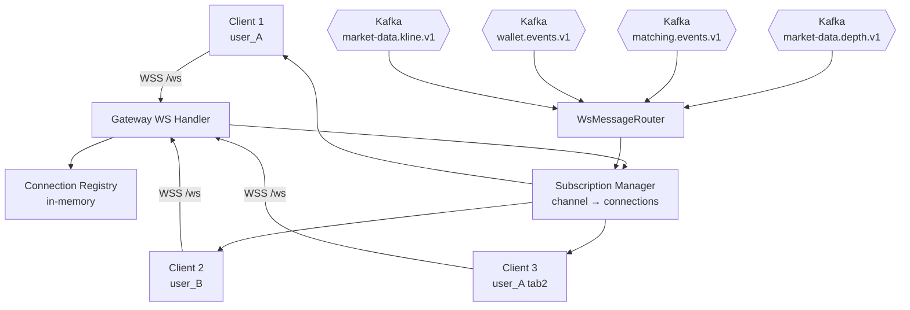

# System Design Appendix — API + WebSocket Gateway

**Parent Document:** `SystemDesign.md` v1.0
**Service:** `gateway`
**Port:** 8080
**Bounded Context:** Edge — traffic ingress, identity enforcement, client fan-out
**Owned Entities:** None (stateless; Redis for ephemeral state)
**Related SRS:** `SRS.md` §3.7 (SR-080 through SR-084)
**ADR:** ADR-001 (WS combined with API Gateway)
**Status:** Ready for implementation

---

## Table of Contents

1. [Scope & Design Goals](#1-scope--design-goals)
2. [Module Structure](#2-module-structure)
3. [HTTP Routing](#3-http-routing)
4. [JWT Validation & Header Injection](#4-jwt-validation--header-injection)
5. [Rate Limiting](#5-rate-limiting)
6. [WebSocket Subsystem](#6-websocket-subsystem)
7. [Kafka Consumer for Fan-out](#7-kafka-consumer-for-fan-out)
8. [CORS & Security Headers](#8-cors--security-headers)
9. [Health & Observability](#9-health--observability)
10. [Configuration](#10-configuration)
11. [Error Handling](#11-error-handling)
12. [Testing Strategy](#12-testing-strategy)
13. [Open Implementation Notes](#13-open-implementation-notes)

---

## 1. Scope & Design Goals

The Gateway is the **only entry point** from the browser. No backend service is directly reachable from outside the Docker network. It has two distinct workloads — HTTP routing and WebSocket fan-out — running in the same process (ADR-001).

### 1.1 Design Goals (in priority order)

1. **Single ingress point.** All FE traffic — REST and WSS — enters through port 8080. Simplifies firewall rules, TLS termination (post-MVP), and observability.
2. **Authentication gate.** Every authenticated request is JWT-verified before forwarding. Backend services trust `X-User-Id` headers injected by the Gateway.
3. **Rate limiting at the edge.** Stops abuse before it reaches business services. Redis-backed for distributed correctness (post-MVP multi-instance).
4. **Low-latency WS fan-out.** Kafka → client push ≤ 100 ms p95 at MVP load.
5. **Zero domain logic.** Gateway never interprets order semantics, wallet balances, or matching rules. It routes, authenticates, rate-limits, and fans out. Nothing else.

### 1.2 What's Explicitly Out of Scope

- **Authorization** — each backend service checks ownership (`userId == resource.owner`). Gateway only authenticates.
- **Request/response transformation** — pass-through proxy; no body rewriting.
- **Caching** — no response caching at Gateway level (backend services + Redis handle their own).
- **Service-to-service auth** — internal endpoints (`/internal/*`) are not proxied by Gateway (network-trust per ADR-010).

### 1.3 Why Spring Cloud Gateway (Not Nginx, Envoy, etc.)

- Same language as backend services — unified logging, metrics, Spring ecosystem.
- Native WebSocket support with reactive handler.
- Built-in filter chain for JWT validation, rate limiting, correlation-id injection.
- At MVP scale (100 users), performance overhead vs nginx is negligible.

---

## 2. Module Structure

### 2.1 Maven Module

```
haizz-exchange/
├── exchange-common/
├── gateway/                            ← this module
├── ...
```

Dependencies: `exchange-common`, `spring-cloud-starter-gateway`, `spring-boot-starter-actuator`, `spring-boot-starter-data-redis-reactive`, `spring-kafka`, `nimbus-jose-jwt`, `micrometer-registry-prometheus`, `lombok`.

**Not** JPA, not Flyway — Gateway has no database.

### 2.2 Package Layout

```
com.haizz.exchange.gateway/
├── GatewayApplication.java
│
├── config/
│   ├── RouteConfig.java                 # Spring Cloud Gateway route definitions
│   ├── CorsConfig.java
│   ├── SecurityConfig.java              # disables default Spring Security form login
│   ├── KafkaConfig.java                 # consumer beans for fan-out topics
│   ├── RedisConfig.java
│   └── JwtConfig.java                   # loads public key, builds JwtVerifier
│
├── filter/
│   ├── JwtAuthenticationFilter.java     # GatewayFilter — verifies JWT, injects headers
│   ├── RateLimitFilter.java             # GatewayFilter — per-user + per-IP rate limit
│   ├── CorrelationIdFilter.java         # GatewayFilter — generates/passes X-Correlation-Id
│   └── InternalPathBlockFilter.java     # GatewayFilter — blocks /internal/* from external
│
├── ws/
│   ├── WsHandler.java                   # WebSocket handler — connect, subscribe, push
│   ├── WsHandshakeInterceptor.java      # extracts JWT from query param or header
│   ├── ConnectionRegistry.java          # in-memory: connectionId → {userId, channels, session}
│   ├── SubscriptionManager.java         # manages channel→connections mapping
│   ├── WsMessageRouter.java             # Kafka message → filter → push to matching connections
│   └── dto/
│       ├── WsInboundMessage.java        # {op: subscribe|unsubscribe, channels: [...]}
│       └── WsOutboundMessage.java       # {channel, schema, payload, correlation_id}
│
├── ratelimit/
│   ├── RedisRateLimiter.java            # token bucket via Redis Lua script
│   └── RateLimitConfig.java
│
├── jwt/
│   ├── JwtVerifier.java                 # RS256 verification, claims extraction
│   └── PublicKeyLoader.java             # fetches from Auth Service or config file
│
└── health/
    └── GatewayHealthIndicator.java      # checks Redis, Kafka, downstream service health
```

### 2.3 Dependency Note

Gateway depends on `exchange-common` only for:
- Kafka event envelope schema (to deserialize and extract routing fields like `userId`, `pair`).
- Correlation-id utilities.
- Error code enum (for rate-limit error responses).

It does NOT depend on any business domain classes (Order, Wallet, etc.).

---

## 3. HTTP Routing

### 3.1 Route Table

Configured programmatically in `RouteConfig.java` (preferred over YAML for type safety and conditional logic):

```java
@Configuration
public class RouteConfig {

    @Bean
    public RouteLocator customRouteLocator(RouteLocatorBuilder builder) {
        return builder.routes()
            // Auth endpoints (some public, some authenticated)
            .route("auth-public", r -> r
                .path("/api/v1/auth/register", "/api/v1/auth/login", "/api/v1/auth/refresh")
                .filters(f -> f.filter(correlationIdFilter).filter(rateLimitFilter))
                .uri("http://auth-service:8081"))

            .route("auth-protected", r -> r
                .path("/api/v1/auth/me", "/api/v1/auth/logout")
                .filters(f -> f.filter(correlationIdFilter).filter(jwtFilter).filter(rateLimitFilter))
                .uri("http://auth-service:8081"))

            // Wallet endpoints (all authenticated)
            .route("wallets", r -> r
                .path("/api/v1/wallets/**", "/api/v1/deposits/**", "/api/v1/withdrawals/**",
                       "/api/v1/wallet-transactions/**")
                .filters(f -> f.filter(correlationIdFilter).filter(jwtFilter).filter(rateLimitFilter))
                .uri("http://wallet-service:8082"))

            // Order endpoints (all authenticated)
            .route("orders", r -> r
                .path("/api/v1/orders/**")
                .filters(f -> f.filter(correlationIdFilter).filter(jwtFilter).filter(rateLimitFilter))
                .uri("http://order-service:8083"))

            // Trade history (authenticated, served by Matching Engine)
            .route("trades", r -> r
                .path("/api/v1/trades/**")
                .filters(f -> f.filter(correlationIdFilter).filter(jwtFilter).filter(rateLimitFilter))
                .uri("http://matching-engine:8084"))

            // Market Data — UDF endpoints (public, no auth)
            .route("udf", r -> r
                .path("/udf/**")
                .filters(f -> f.filter(correlationIdFilter).filter(rateLimitFilter))
                .uri("http://market-data-service:8085"))

            // Market Data — public (some authenticated for WS subscription context)
            .route("marketdata-public", r -> r
                .path("/api/v1/marketdata/**")
                .filters(f -> f.filter(correlationIdFilter).filter(rateLimitFilter))
                .uri("http://market-data-service:8085"))

            // Block /internal/* — defense-in-depth
            .route("block-internal", r -> r
                .path("/internal/**")
                .filters(f -> f.filter(internalPathBlockFilter))
                .uri("no://op"))

            .build();
    }
}
```

### 3.2 Filter Chain Order

For each authenticated route, filters execute in this order:

```
Request → CorrelationIdFilter → JwtAuthenticationFilter → RateLimitFilter → [proxy to backend]
```

1. **CorrelationIdFilter**: Check `X-Correlation-Id` header; if absent, generate UUID and set it. Pass to downstream and add to response.
2. **JwtAuthenticationFilter**: Extract `Authorization: Bearer <token>`, verify signature + expiry, extract claims, inject `X-User-Id` and `X-User-Email` headers downstream. On failure → 401 immediately (short-circuit).
3. **RateLimitFilter**: Check rate limit using user_id (if authed) or IP (if public). On exceeded → 429 (short-circuit).

### 3.3 Internal Path Blocking

```java
@Component
public class InternalPathBlockFilter implements GatewayFilter {
    @Override
    public Mono<Void> filter(ServerWebExchange exchange, GatewayFilterChain chain) {
        exchange.getResponse().setStatusCode(HttpStatus.NOT_FOUND);
        return exchange.getResponse().setComplete();
    }
}
```

Returns 404 (not 403, to avoid revealing internal paths exist). Defense-in-depth — Docker network already isolates, but misconfiguration could expose.

---

## 4. JWT Validation & Header Injection

> **⚠️ IMPLEMENTATION NOTE (back-ported from gateway build, 2026-06):** This section
> originally specified RS256 with a loaded public key. The **actual** Auth Service
> (`JwtTokenProvider.java`) signs with **HS256 + a shared secret** in dev, and in
> RS256 mode it generates an **ephemeral in-memory key per startup with no published
> JWKS** — so local RS256 verification at the Gateway is impossible in dev. The Gateway
> therefore verifies **HS256 with the same shared secret** (`JWT_SECRET`) and issuer
> `haizz-auth`. RS256 + a real key-distribution mechanism (file/JWKS) is deferred to
> prod hardening; when added, the Gateway selects the algorithm via `gateway.jwt.algorithm`
> to mirror Auth.

### 4.1 Signing Key Loading

The Gateway shares Auth's signing configuration:

- **Dev (default): HS256.** Symmetric secret from `JWT_SECRET` (same value Auth uses).
  No network call to Auth — eliminates startup ordering dependency.
- **Prod (deferred): RS256.** Public key from `JWT_PUBLIC_KEY` (PEM) or a JWKS endpoint.
  Requires Auth to persist its key pair and publish the public key first
  (`GET /internal/auth/public-key`), which the MVP Auth Service does **not** yet do.

```java
@Component
public class JwtKeyProvider {
    @Value("${gateway.jwt.algorithm:HS256}") private String algorithm;
    @Value("${gateway.jwt.secret:}")         private String secret;       // HS256
    @Value("${gateway.jwt.public-key:}")     private String publicKeyPem; // RS256 (prod)

    @PostConstruct
    public void init() {
        // HS256 → MACVerifier(secret); RS256 → RSASSAVerifier(parsePem(publicKeyPem))
    }
}
```

### 4.2 JWT Verification

```java
@Component
public class JwtVerifier {
    private final JwtKeyProvider keyProvider;   // HS256 MACVerifier (dev) / RS256 (prod)

    public JwtClaims verify(String token) {
        try {
            var jwt = SignedJWT.parse(token);
            if (!jwt.verify(keyProvider.verifier())) throw new JwtException("Invalid signature");

            var claims = jwt.getJWTClaimsSet();
            if (claims.getExpirationTime().before(new Date())) throw new JwtException("Token expired");
            if (!"haizz-auth".equals(claims.getIssuer())) throw new JwtException("Invalid issuer");

            // Actual Auth claims: sub, email, scope(="user"), jti. There is NO `roles` claim.
            return new JwtClaims(
                claims.getSubject(),                    // user_id
                claims.getStringClaim("email"),
                claims.getStringClaim("scope"),         // used as X-User-Roles downstream
                claims.getStringClaim("jti")            // jti for potential blacklist check
            );
        } catch (ParseException | JOSEException e) {
            throw new JwtException("Malformed token");
        }
    }
}
```

### 4.3 Authentication Filter

```java
@Component
public class JwtAuthenticationFilter implements GatewayFilter, Ordered {
    private static final List<String> PUBLIC_PATHS = List.of(
        "/api/v1/auth/register", "/api/v1/auth/login", "/api/v1/auth/refresh", "/udf/"
    );

    @Override
    public Mono<Void> filter(ServerWebExchange exchange, GatewayFilterChain chain) {
        var path = exchange.getRequest().getURI().getPath();
        if (PUBLIC_PATHS.stream().anyMatch(path::startsWith)) return chain.filter(exchange);

        var authHeader = exchange.getRequest().getHeaders().getFirst(HttpHeaders.AUTHORIZATION);
        if (authHeader == null || !authHeader.startsWith("Bearer ")) {
            return unauthorizedResponse(exchange, "MISSING_TOKEN");
        }

        try {
            var claims = jwtVerifier.verify(authHeader.substring(7));

            // Inject downstream headers.
            // X-User-Roles carries the `scope` claim (Auth has no `roles` claim) — matches
            // API_SPEC §6. X-User-Email/X-User-Scope kept for services that read them.
            var mutated = exchange.getRequest().mutate()
                .header("X-User-Id", claims.userId())
                .header("X-User-Email", claims.email())
                .header("X-User-Roles", claims.scope())
                .header("X-User-Scope", claims.scope())
                .build();

            return chain.filter(exchange.mutate().request(mutated).build());
        } catch (JwtException e) {
            return unauthorizedResponse(exchange, e.getCode());
        }
    }

    private Mono<Void> unauthorizedResponse(ServerWebExchange exchange, String code) {
        exchange.getResponse().setStatusCode(HttpStatus.UNAUTHORIZED);
        exchange.getResponse().getHeaders().setContentType(MediaType.APPLICATION_JSON);
        var body = ApiError.of(code, "Authentication required",
            exchange.getRequest().getHeaders().getFirst("X-Correlation-Id"));
        return exchange.getResponse().writeWith(
            Mono.just(exchange.getResponse().bufferFactory().wrap(toJson(body))));
    }

    @Override
    public int getOrder() { return 10; }  // after CorrelationIdFilter (order 5)
}
```

### 4.4 Post-MVP: Token Blacklist Check

When access token revocation is added (§14.D of master), add a Redis check in the filter:

```java
// after signature verification
var jti = claims.jti();
if (jti != null && redisTemplate.hasKey("auth:blacklist:" + jti)) {
    return unauthorizedResponse(exchange, "TOKEN_REVOKED");
}
```

Redis check adds ~1 ms. Acceptable.

---

## 5. Rate Limiting

### 5.1 Rate Limit Strategy

Two tiers:

| Tier | Key | Limit | Window | Applies To |
|------|-----|-------|--------|------------|
| Per-user | `gw:rl:user:<userId>` | 60 sustained / 120 burst | Sliding 1s | All authenticated endpoints |
| Per-IP | `gw:rl:ip:<ip>` | 120 sustained / 240 burst | Sliding 1s | All endpoints (public + authenticated) |
| Login-specific | `auth:rl:login:<email>` | 10 attempts | 10 min | `/auth/login` only (handled by Auth Service, not Gateway) |

**Per-user supersedes per-IP** for authenticated requests. Both are checked; whichever trips first returns 429.

### 5.2 Redis Token Bucket Implementation

Using a Lua script for atomic check-and-increment (single Redis roundtrip):

```lua
-- rate_limit.lua
local key = KEYS[1]
local capacity = tonumber(ARGV[1])
local refill_rate = tonumber(ARGV[2])
local now = tonumber(ARGV[3])
local ttl = tonumber(ARGV[4])

local bucket = redis.call('HMGET', key, 'tokens', 'last_refill')
local tokens = tonumber(bucket[1])
local last_refill = tonumber(bucket[2])

if tokens == nil then
    tokens = capacity
    last_refill = now
end

-- refill
local elapsed = now - last_refill
local refill = math.floor(elapsed * refill_rate)
tokens = math.min(capacity, tokens + refill)
last_refill = now

if tokens < 1 then
    redis.call('HMSET', key, 'tokens', tokens, 'last_refill', last_refill)
    redis.call('EXPIRE', key, ttl)
    return 0  -- denied
end

tokens = tokens - 1
redis.call('HMSET', key, 'tokens', tokens, 'last_refill', last_refill)
redis.call('EXPIRE', key, ttl)
return 1  -- allowed
```

### 5.3 Rate Limit Filter

```java
@Component
public class RateLimitFilter implements GatewayFilter, Ordered {
    private final RedisRateLimiter limiter;

    @Override
    public Mono<Void> filter(ServerWebExchange exchange, GatewayFilterChain chain) {
        var userId = exchange.getRequest().getHeaders().getFirst("X-User-Id");
        var ip = extractClientIp(exchange);

        return Mono.zip(
            limiter.isAllowed("gw:rl:ip:" + ip, 120, 120.0),
            userId != null
                ? limiter.isAllowed("gw:rl:user:" + userId, 60, 60.0)
                : Mono.just(true)
        ).flatMap(tuple -> {
            var ipAllowed = tuple.getT1();
            var userAllowed = tuple.getT2();
            if (!ipAllowed || !userAllowed) {
                return rateLimitResponse(exchange);
            }
            return chain.filter(exchange);
        });
    }

    private Mono<Void> rateLimitResponse(ServerWebExchange exchange) {
        exchange.getResponse().setStatusCode(HttpStatus.TOO_MANY_REQUESTS);
        exchange.getResponse().getHeaders().add("Retry-After", "1");
        var body = ApiError.of("RATE_LIMIT_EXCEEDED", "Too many requests",
            exchange.getRequest().getHeaders().getFirst("X-Correlation-Id"));
        return exchange.getResponse().writeWith(
            Mono.just(exchange.getResponse().bufferFactory().wrap(toJson(body))));
    }

    @Override
    public int getOrder() { return 20; }  // after JWT filter
}
```

### 5.4 IP Extraction

```java
private String extractClientIp(ServerWebExchange exchange) {
    var forwarded = exchange.getRequest().getHeaders().getFirst("X-Forwarded-For");
    if (forwarded != null) return forwarded.split(",")[0].trim();
    var addr = exchange.getRequest().getRemoteAddress();
    return addr != null ? addr.getAddress().getHostAddress() : "unknown";
}
```

MVP: no load balancer → `getRemoteAddress()` is the real IP. Post-MVP behind LB: trust `X-Forwarded-For` (first hop only).

---

## 6. WebSocket Subsystem

The second major workload inside Gateway. Entirely reactive.

### 6.1 Architecture Overview



### 6.2 Connection Lifecycle

```
1. Client opens WSS to /ws?token=<jwt>
2. WsHandshakeInterceptor:
   a. Extract token from query param (or Authorization header)
   b. Verify JWT via JwtVerifier
   c. On failure → reject upgrade (HTTP 401 or WS close 4401)
   d. On success → attach userId to WebSocket session attributes
3. WsHandler.afterConnectionEstablished:
   a. Generate connectionId (UUID)
   b. Register in ConnectionRegistry: connectionId → {userId, session, createdAt}
   c. Store in Redis: ws:conn:<connectionId> = {userId, opened_at} (for crash recovery observability)
   d. Log INFO "WS connected userId={} connId={}"
4. Client sends: {"op":"subscribe","channels":["market:BTCUSDT:depth","orders","wallet"]}
5. WsHandler.handleTextMessage:
   a. Parse inbound message
   b. Validate channel names (whitelist: market:*, orders, wallet)
   c. SubscriptionManager.subscribe(connectionId, channels)
   d. Store in Redis: SADD ws:sub:<userId> <channels...>
   e. Send ack: {"op":"subscribed","channels":["market:BTCUSDT:depth","orders","wallet"]}
6. [normal operation — fan-out loop]
7. Client disconnects (or token expires):
   a. WsHandler.afterConnectionClosed
   b. SubscriptionManager.unsubscribeAll(connectionId)
   c. ConnectionRegistry.remove(connectionId)
   d. Redis: DEL ws:conn:<connectionId>, SREM ws:sub:<userId> <channels...>
```

### 6.3 Handshake Interceptor

```java
@Component
public class WsHandshakeInterceptor implements HandshakeInterceptor {
    private final JwtVerifier jwtVerifier;

    @Override
    public boolean beforeHandshake(ServerHttpRequest req, ServerHttpResponse resp,
                                     WebSocketHandler handler, Map<String, Object> attrs) {
        var query = req.getURI().getQuery();
        var token = extractTokenFromQuery(query);
        if (token == null) {
            resp.setStatusCode(HttpStatus.UNAUTHORIZED);
            return false;
        }
        try {
            var claims = jwtVerifier.verify(token);
            attrs.put("userId", claims.userId());
            attrs.put("email", claims.email());
            attrs.put("tokenExp", claims.expiresAt());
            return true;
        } catch (JwtException e) {
            resp.setStatusCode(HttpStatus.UNAUTHORIZED);
            return false;
        }
    }
}
```

### 6.4 Connection Registry (In-Memory)

```java
@Component
public class ConnectionRegistry {
    private final ConcurrentHashMap<String, WsConnection> connections = new ConcurrentHashMap<>();
    private final ConcurrentHashMap<String, Set<String>> userConnections = new ConcurrentHashMap<>();
    // userId → Set<connectionId> (one user may have multiple tabs)

    public record WsConnection(
        String connectionId,
        String userId,
        WebSocketSession session,
        Instant tokenExp,
        Instant createdAt
    ) {}

    public void register(WsConnection conn) {
        connections.put(conn.connectionId(), conn);
        userConnections.computeIfAbsent(conn.userId(), k -> ConcurrentHashMap.newKeySet())
            .add(conn.connectionId());
    }

    public void remove(String connectionId) {
        var conn = connections.remove(connectionId);
        if (conn != null) {
            var userSet = userConnections.get(conn.userId());
            if (userSet != null) {
                userSet.remove(connectionId);
                if (userSet.isEmpty()) userConnections.remove(conn.userId());
            }
        }
    }

    public Set<String> connectionsForUser(String userId) {
        return userConnections.getOrDefault(userId, Set.of());
    }

    public WsConnection get(String connectionId) {
        return connections.get(connectionId);
    }

    public int activeCount() { return connections.size(); }
}
```

### 6.5 Subscription Manager

```java
@Component
public class SubscriptionManager {
    // channel → Set<connectionId>
    private final ConcurrentHashMap<String, Set<String>> channelSubscribers = new ConcurrentHashMap<>();
    // connectionId → Set<channel>
    private final ConcurrentHashMap<String, Set<String>> connectionChannels = new ConcurrentHashMap<>();

    public void subscribe(String connectionId, List<String> channels) {
        for (var ch : channels) {
            channelSubscribers.computeIfAbsent(ch, k -> ConcurrentHashMap.newKeySet()).add(connectionId);
            connectionChannels.computeIfAbsent(connectionId, k -> ConcurrentHashMap.newKeySet()).add(ch);
        }
    }

    public void unsubscribe(String connectionId, List<String> channels) {
        for (var ch : channels) {
            var subs = channelSubscribers.get(ch);
            if (subs != null) {
                subs.remove(connectionId);
                if (subs.isEmpty()) channelSubscribers.remove(ch);
            }
            var chans = connectionChannels.get(connectionId);
            if (chans != null) chans.remove(ch);
        }
    }

    public void unsubscribeAll(String connectionId) {
        var channels = connectionChannels.remove(connectionId);
        if (channels != null) {
            for (var ch : channels) {
                var subs = channelSubscribers.get(ch);
                if (subs != null) {
                    subs.remove(connectionId);
                    if (subs.isEmpty()) channelSubscribers.remove(ch);
                }
            }
        }
    }

    public Set<String> subscribersOf(String channel) {
        return channelSubscribers.getOrDefault(channel, Set.of());
    }
}
```

### 6.6 Token Expiry Monitoring

A scheduled task checks active connections for expired tokens:

```java
@Scheduled(fixedDelay = 30_000)  // every 30s
public void evictExpiredConnections() {
    var now = Instant.now();
    registry.all().stream()
        .filter(conn -> conn.tokenExp().isBefore(now))
        .forEach(conn -> {
            conn.session().close(new CloseStatus(4401, "TOKEN_EXPIRED"));
            subscriptionManager.unsubscribeAll(conn.connectionId());
            registry.remove(conn.connectionId());
        });
}
```

Client receives close code `4401` → triggers refresh + reconnect (see Frontend appendix §8.3).

---

## 7. Kafka Consumer for Fan-out

### 7.1 Consumed Topics

> **⚠️ IMPLEMENTATION NOTE (back-ported from gateway build, 2026-06):** Kafka messages
> are **NOT uniformly enveloped** on the wire. `market-data.depth.v1` and
> `market-data.kline.v1` carry the **raw event** (no `EventEnvelope`);
> `market-data.events.v1` carries a wrapped `EventEnvelope{eventType, payload}`; and the
> wallet stream is published to **`wallet.transactions.v1`** (NOT `wallet.events.v1`) as a
> **raw payload map containing only deltas**. The router therefore parses **per topic**,
> not via a single common envelope (see §7.2).

| Topic | Consumer Group | On-wire shape | Purpose |
|-------|----------------|---------------|---------|
| `market-data.depth.v1` | `ws-fanout` | raw `DepthUpdatedEvent` | Push depth to `market:<pair>:depth` subscribers |
| `market-data.kline.v1` | `ws-fanout` | raw `KlineUpdatedEvent` | Push klines to `market:<pair>:kline:<resolution>` subscribers |
| `market-data.events.v1` | `ws-fanout` | `EventEnvelope` | Push external trades to `market:<pair>:trades` subscribers |
| `wallet.transactions.v1` | `ws-fanout` | raw map (deltas) | Push wallet changes to `wallet` subscribers (filtered by userId) |
| `matching.events.v1` *(deferred — service not built)* | `ws-fanout` | `EventEnvelope` | Push order state updates to `orders` subscribers (filtered by userId) |

### 7.2 Message Router

The router maps Kafka events to WS channels and determines which connections should receive them:

```java
@Component
public class WsMessageRouter {
    private final SubscriptionManager subscriptions;
    private final ConnectionRegistry registry;

    public void route(EventEnvelope envelope) {
        var routing = resolveRouting(envelope);
        if (routing == null) return;

        var subscribers = subscriptions.subscribersOf(routing.channel());

        for (var connId : subscribers) {
            var conn = registry.get(connId);
            if (conn == null) continue;

            // User-scoped events: only deliver to the owning user
            if (routing.userId() != null && !routing.userId().equals(conn.userId())) continue;

            sendToConnection(conn, routing.channel(), envelope);
        }
    }

    // Routing is resolved per source TOPIC (not a uniform envelope). Each branch parses
    // the topic-specific JSON, builds the FE-facing `schema` string (the FE dispatch key —
    // see §7.3), the target channel, the user filter, and the (possibly transformed) payload.
    private Routing resolveRouting(String topic, JsonNode raw) {
        return switch (topic) {
            // --- raw events, broadcast to all pair subscribers ---
            case "market-data.depth.v1" -> new Routing(
                "market:" + raw.get("pair").asText() + ":depth",
                "market-data.depth.v1", null, raw);           // FE drops any suffix here

            case "market-data.kline.v1" -> new Routing(
                "market:" + raw.get("pair").asText() + ":kline:" + raw.get("interval").asText(),
                "market-data.kline.v1", null,
                klinePayload(raw));                            // openTime(Instant) → time(epoch s)

            // --- wrapped EventEnvelope ---
            case "market-data.events.v1" -> {
                var p = raw.get("payload");
                yield new Routing(
                    "market:" + p.get("pair").asText() + ":trades",   // FE tape uses :trades
                    "market-data.events.v1.ExternalTradeObserved",    // note: no "Event" suffix
                    null, tradePayload(p));                           // eventTime→executedAt, +side
            }

            // --- user-scoped: raw map from wallet.transactions.v1 ---
            case "wallet.transactions.v1" -> new Routing(
                "wallet",
                "wallet.events.v1.WalletTransactionRecorded",
                raw.get("userId").asText(), raw);             // forwarded as-is; deltas only (see note)

            // --- deferred until Matching Engine exists ---
            case "matching.events.v1" -> {
                var p = raw.get("payload");
                yield new Routing("orders",
                    "matching.events.v1." + raw.get("eventType").asText(),
                    p.get("userId").asText(), p);
            }

            default -> null;    // unknown topic — skip
        };
    }

    record Routing(String channel, String schema, String userId, Object payload) {}
}
```

> **⚠️ wallet live-balance limitation (back-ported):** `wallet.transactions.v1` carries only
> **deltas** (`deltaAvailable`, `deltaFrozen`, `deltaTotal`), but the FE wallet store
> (`applyBalanceChange`) expects **absolute** `available` / `frozen` / `balanceAfter`. A
> stateless Gateway cannot derive absolutes, so the event is forwarded as-is and the FE
> balance does not fully update from the stream alone. **Recommended back-port:** have the
> Wallet Service include post-transaction absolute balances in the event payload, OR have
> the FE refetch `/wallets/me` on receiving a wallet event.

### 7.3 Outbound Message Shape

Messages pushed to client:

```json
{
  "channel": "market:BTCUSDT:depth",
  "schema": "market-data.depth.v1",
  "payload": { "pair": "BTCUSDT", "bids": [...], "asks": [...] },
  "timestamp": "2026-04-22T10:30:15.123Z"
}
```

The FE `WsClient` (`handleMessage`) dispatches **solely by the `schema` field** and passes
`payload` to the registered handler; `channel` is informational (debugging only). The
**exact** schema strings the FE listens for (verified against `WsStoreSyncer.tsx` /
`CandlestickChart.tsx`) are:

| `schema` | FE consumer | `payload` the FE store expects |
|----------|-------------|--------------------------------|
| `market-data.depth.v1` | OrderBook | `{ pair, bids:[[p,q]], asks:[[p,q]] }` |
| `market-data.kline.v1` | Chart | `{ pair, interval, time(epoch s), open, high, low, close }` |
| `market-data.events.v1.ExternalTradeObserved` | TradesTape | `{ pair, price, quantity, executedAt }` |
| `wallet.events.v1.WalletTransactionRecorded` | Wallet balance | `{ assetCode, available?, frozen?, balanceAfter? }` |
| `matching.events.v1.OrderPartiallyFilled` / `.OrderFilled` / `.OrderCancelled` | Orders *(deferred)* | `FillUpdate` |

Because the schema string is the contract (not the topic name), the router builds it
explicitly per §7.2 — e.g. the depth schema is `market-data.depth.v1` (no `.DepthUpdated`
suffix), and the trade schema is `...ExternalTradeObserved` (no `Event` suffix).

### 7.4 Consumer Configuration

```yaml
spring:
  kafka:
    consumer:
      group-id: ws-fanout
      auto-offset-reset: latest           # don't replay old events on restart
      enable-auto-commit: true              # auto-commit for fan-out (loss = tolerable)
      max-poll-records: 200
    listener:
      concurrency: 3
```

**`auto-offset-reset: latest`** — on first start or group reset, skip all historical events. Fan-out is ephemeral; clients reconnect and re-subscribe, getting fresh data.

**`enable-auto-commit: true`** — fan-out is fire-and-forget. If Gateway crashes mid-batch, some events may replay to clients on restart — FE handles duplicates gracefully (depth/klines are idempotent by nature).

### 7.5 Fan-out Performance

At MVP scale: 5 pairs × ~10 depth events/sec + ~5 trade events/sec = ~75 events/sec total. Each event fans out to ~5–20 subscribers. Total WS sends: ~750–1500/sec. Well within a single Netty thread's capacity.

Bottleneck post-MVP: `subscribersOf(channel)` iterates a `ConcurrentHashMap.newKeySet()`. At 5000+ connections, maintain a reverse index (user → connections) with pre-filtered subscription sets. Not needed now.

---

## 8. CORS & Security Headers

### 8.1 CORS Configuration

```java
@Configuration
public class CorsConfig {
    @Bean
    public CorsWebFilter corsFilter() {
        var config = new CorsConfiguration();
        config.setAllowedOrigins(List.of(
            "http://localhost:3000",           // standalone FE
            "http://localhost:3001"            // host app dev
        ));
        config.setAllowedMethods(List.of("GET", "POST", "PUT", "DELETE", "OPTIONS"));
        config.setAllowedHeaders(List.of("*"));
        config.setAllowCredentials(true);      // for httpOnly refresh cookie
        config.setMaxAge(3600L);

        var source = new UrlBasedCorsConfigurationSource();
        source.registerCorsConfiguration("/**", config);
        return new CorsWebFilter(source);
    }
}
```

Post-MVP: `allowedOrigins` from environment variable (not hardcoded).

### 8.2 Security Headers

Response headers added via global filter:

```java
@Bean
public GlobalFilter securityHeadersFilter() {
    return (exchange, chain) -> chain.filter(exchange).then(Mono.fromRunnable(() -> {
        var headers = exchange.getResponse().getHeaders();
        headers.add("X-Content-Type-Options", "nosniff");
        headers.add("X-Frame-Options", "DENY");
        headers.add("X-XSS-Protection", "0");           // deprecated but harmless
        headers.add("Referrer-Policy", "strict-origin-when-cross-origin");
    }));
}
```

**No `Content-Security-Policy`** at Gateway level — that's the FE's responsibility (served via Next.js headers).

---

## 9. Health & Observability

### 9.1 Health Checks

```yaml
management:
  endpoints:
    web:
      exposure:
        include: health, info, prometheus
  endpoint:
    health:
      show-details: when_authorized    # public: UP/DOWN only
      probes:
        enabled: true
      group:
        liveness:
          include: ping
        readiness:
          include: redis, kafka, downstream
```

Custom indicators:

```java
@Component
public class DownstreamServicesHealthIndicator implements ReactiveHealthIndicator {
    // Checks /actuator/health on each backend service
    // All UP → UP; any DOWN → DOWN with details
}

@Component
public class WsHealthContributor implements ReactiveHealthIndicator {
    public Mono<Health> health() {
        return Mono.just(Health.up()
            .withDetail("active_connections", registry.activeCount())
            .withDetail("active_subscriptions", subscriptions.totalCount())
            .build());
    }
}
```

### 9.2 Logging

Structured JSON via logstash-logback-encoder. MDC fields: `correlation_id`, `user_id`, `remote_ip`, `method`, `path`, `status`, `duration_ms`.

Access log pattern:
```json
{
  "@timestamp": "2026-04-22T10:30:15Z",
  "level": "INFO",
  "logger": "access",
  "correlation_id": "abc",
  "user_id": "def",
  "method": "POST",
  "path": "/api/v1/orders",
  "status": 201,
  "duration_ms": 45,
  "remote_ip": "192.168.1.5"
}
```

### 9.3 Metrics

Micrometer auto-exposes via `/actuator/prometheus`:
- `gateway.requests` — tagged by `method`, `path`, `status`.
- `gateway.ws.connections.active` — gauge.
- `gateway.ws.messages.sent` — counter, tagged by `channel`.
- `gateway.ratelimit.denied` — counter, tagged by `tier` (user/ip).

Custom metrics registered in relevant components:
```java
Metrics.counter("gateway.ws.messages.sent", "channel", channel).increment();
```

---

## 10. Configuration

### 10.1 `application.yml`

```yaml
spring:
  application:
    name: gateway
  cloud:
    gateway:
      default-filters:
        - name: DedupeResponseHeader
          args:
            name: Access-Control-Allow-Origin
            strategy: RETAIN_UNIQUE
  data:
    redis:
      host: redis
      port: 6379
      lettuce:
        pool:
          max-active: 16
  kafka:
    bootstrap-servers: ${KAFKA_BOOTSTRAP:kafka:9092}
    consumer:
      group-id: ws-fanout
      auto-offset-reset: latest
      enable-auto-commit: true
      max-poll-records: 200
    listener:
      concurrency: 3

server:
  port: 8080

management:
  endpoints:
    web:
      exposure:
        include: health, info, prometheus

gateway:
  jwt:
    public-key: ${JWT_PUBLIC_KEY}         # PEM-encoded RS256 public key
    issuer: haizz-auth
  rate-limit:
    user:
      capacity: 120                       # burst
      refill-rate: 60                     # per second sustained
    ip:
      capacity: 240
      refill-rate: 120
  ws:
    token-expiry-check-interval: 30s
    max-connections-per-user: 5           # prevent tab-bomb
    max-subscriptions-per-connection: 20

cors:
  allowed-origins: ${CORS_ORIGINS:http://localhost:3000,http://localhost:3001}

logging:
  pattern:
    level: "%5p [%X{correlation_id:-}]"
  level:
    root: INFO
    com.haizz.exchange.gateway: DEBUG
    org.springframework.cloud.gateway: INFO
    reactor.netty: WARN
```

### 10.2 JVM Tuning

```
-Xms512m -Xmx768m
-XX:+UseG1GC
-XX:MaxGCPauseMillis=50
-Dreactor.netty.ioWorkerCount=4
```

Reactive stack: event-loop threads handle I/O; keep worker count modest for MVP.

---

## 11. Error Handling

### 11.1 Gateway-Level Errors

| Scenario | Response | HTTP |
|----------|----------|------|
| Missing/invalid JWT | `TOKEN_EXPIRED`, `INVALID_TOKEN`, `MISSING_TOKEN` | 401 |
| Rate limit exceeded | `RATE_LIMIT_EXCEEDED` | 429 |
| Internal path access | (empty 404) | 404 |
| Backend service unreachable | `SERVICE_UNAVAILABLE` | 503 |
| Backend service returns error | Pass-through (Gateway does not transform error bodies) | as-is |
| WS handshake auth failure | Close with 4401 | N/A (WS) |
| WS invalid subscription channel | Error frame: `{"op":"error","message":"Invalid channel"}` | N/A (WS) |
| WS max connections per user exceeded | Close with 4429 `TOO_MANY_CONNECTIONS` | N/A (WS) |

### 11.2 Pass-Through Error Policy

Gateway does NOT wrap or transform error responses from backend services. If Order Service returns:
```json
{ "error": { "code": "INSUFFICIENT_AVAILABLE_BALANCE", ... } }
```
the client sees exactly that, with the status code from Order Service. Gateway only adds `X-Correlation-Id` to the response headers.

### 11.3 Circuit Breaker on Backend Routes (Post-MVP)

Not in MVP — all routes are direct proxy. Post-MVP: Resilience4j CircuitBreaker per route group (auth, wallet, order, etc.). On open: return 503 `SERVICE_UNAVAILABLE`.

---

## 12. Testing Strategy

### 12.1 Test Pyramid

| Layer | Count | Framework | What's Tested |
|-------|-------|-----------|---------------|
| Unit — JWT | ~10 | JUnit 5 | JwtVerifier with valid/expired/malformed/wrong-issuer tokens |
| Unit — rate limit | ~10 | JUnit 5 + embedded Redis | Token bucket lua script correctness, burst/sustained behavior |
| Unit — WS routing | ~15 | JUnit 5 | WsMessageRouter channel resolution, user-scoped filtering |
| Integration — routing | ~15 | WebTestClient + WireMock | Full filter chain: auth → rate limit → proxy → response |
| Integration — WS | ~10 | Spring WebSocket test client | Handshake, subscribe, receive push, token expiry close |
| Integration — Kafka fan-out | ~5 | Testcontainers Kafka | Produce to topic → message arrives at subscribed WS client |
| E2E | ~5 | Testcontainers full stack | FE → Gateway → backend service → response; WS lifecycle |

### 12.2 Critical Test Scenarios

**JWT:**
- `validToken_proxiedWithUserIdHeader`
- `expiredToken_returns401`
- `malformedToken_returns401`
- `wrongIssuer_returns401`
- `publicEndpoint_noTokenRequired_passes`
- `missingToken_onProtectedEndpoint_returns401`

**Rate limiting:**
- `60thRequestInOneSecond_passes`
- `61stRequest_sustainedWindow_returns429`
- `burstOf120_passes_thenThrottles`
- `differentUsers_independentLimits`
- `ipRateLimit_triggersOn240thRequest`

**Routing:**
- `orderEndpoint_proxiedToOrderService`
- `internalPath_returns404`
- `udfEndpoint_noAuthRequired`
- `unknownPath_returns404`

**WebSocket:**
- `wsHandshake_validToken_connects`
- `wsHandshake_invalidToken_rejected`
- `wsSubscribe_receivesDepthUpdates`
- `wsSubscribe_ordersChannel_onlyOwnUserEvents`
- `wsTokenExpired_closedWith4401`
- `wsReconnect_resubscribesActiveChannels`
- `wsMaxConnectionsExceeded_closedWith4429`

**Fan-out:**
- `kafkaDepthMessage_pushedToDepthSubscribers`
- `kafkaTradeExecuted_pushedOnlyToOwner`
- `kafkaWalletEvent_pushedOnlyToOwner`
- `unsubscribedChannel_noMessageDelivered`

---

## 13. Open Implementation Notes

1. **Spring Cloud Gateway vs. custom Netty handler for WS.** Spring Cloud Gateway supports WS proxying but our use case is not proxying — it's fan-out from Kafka. Implementation uses Spring's `WebSocketHandler` + `WebSocketConfigurer` alongside Gateway routes in the same app. Both run on Netty; no conflict.

2. **WS message serialization cost.** Each message is serialized to JSON string once, then sent to N connections as the same `TextMessage`. Don't re-serialize per connection.

3. **Connection limits.** `max-connections-per-user: 5` prevents a user from opening 100 tabs and exhausting server resources. On the 6th WS attempt, close with `4429 TOO_MANY_CONNECTIONS`. FE shows "Maximum sessions reached."

4. **Redis for WS state — needed?** MVP stores WS state in-memory only. Redis keys (`ws:conn:*`, `ws:sub:*`) are **observability aids**, not authoritative state. On Gateway restart, connections drop, clients reconnect, state rebuilds from scratch. Redis is written to, but never read back for routing decisions. This simplifies the code — no Redis→memory sync on startup.

5. **Multi-instance Gateway (post-MVP).** When scaling to 2+ Gateway instances: client WS connects to one instance. Kafka fan-out runs on all instances. A message for user A might be consumed by instance 2, but user A is connected to instance 1. Solution: Redis Pub/Sub bridge — instance 2 publishes to `ws:push:<userId>`, instance 1 subscribes and delivers. Add this when scaling, not before.

6. **Request body size limit.** Set via Spring:
   ```yaml
   spring.codec.max-in-memory-size: 256KB
   ```
   Prevents oversized payloads from reaching backend services.

7. **Timeout on proxied requests.**
   ```yaml
   spring.cloud.gateway.httpclient.response-timeout: 10s
   spring.cloud.gateway.httpclient.connect-timeout: 2000
   ```
   If backend doesn't respond in 10 s, Gateway returns 504 `GATEWAY_TIMEOUT`.

8. **WebSocket ping/pong.** Server sends ping every 30 s. If client doesn't pong within 60 s, connection is considered dead and cleaned up. Spring's `WebSocketSession` handles this with `setSendTimeLimit` and `setSendBufferSizeLimit`.

9. **Access log format.** Post-MVP: switch to a dedicated access log filter that logs every request/response (separate from application logs) in a consistent JSON format for analytics. MVP: access logging is embedded in the general application log stream.

10. **HTTPS termination.** MVP: HTTP. Post-MVP: terminate TLS at Gateway using Spring Boot's embedded TLS (`server.ssl.*` config) or a reverse proxy (nginx/Caddy) in front. If using a reverse proxy, Gateway runs HTTP and the proxy handles TLS + `X-Forwarded-For` injection.

---

*End of `SystemDesign_Appendix_APIGateway.md`.*
