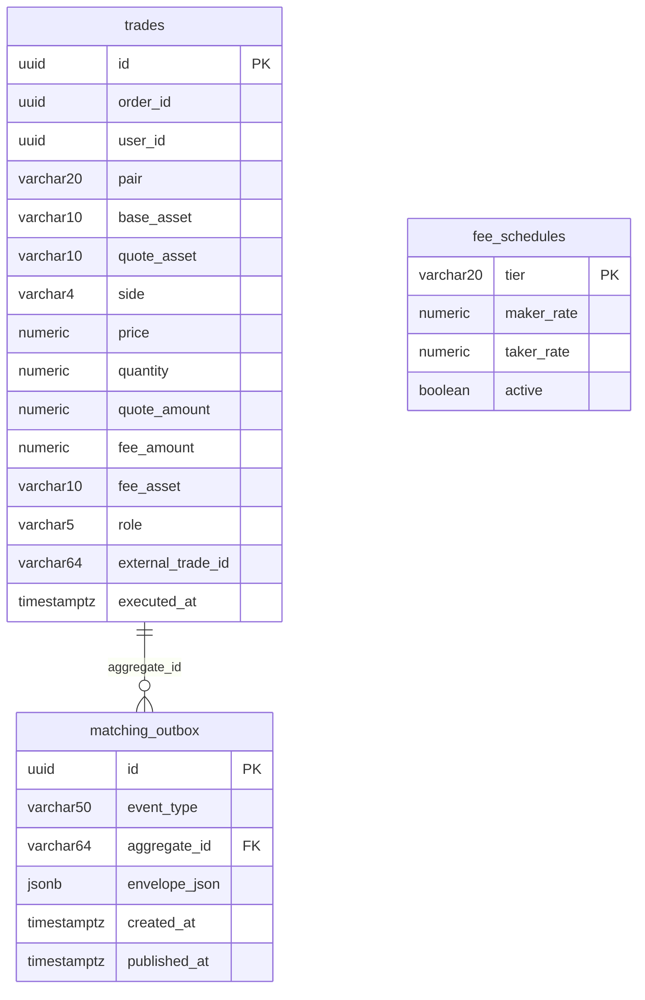

# System Design Appendix — Matching Engine

**Parent Document:** `SystemDesign.md` v1.0
**Service:** `matching-engine`
**Port:** 8084
**Owned Bounded Context:** Execution simulation
**Owned Entities:** `Trade`
**Related SRS:** `SRS_Appendix_MatchingEngine.md` v1.0
**Status:** Ready for implementation

---

## Table of Contents

1. [Scope & Design Goals](#1-scope--design-goals)
2. [Module Structure](#2-module-structure)
3. [Domain Model & Core Abstractions](#3-domain-model--core-abstractions)
4. [The Open-Orders Index](#4-the-open-orders-index)
5. [Matching Algorithms](#5-matching-algorithms)
6. [Database Schema](#6-database-schema)
7. [Kafka Integration](#7-kafka-integration)
8. [Startup & Recovery](#8-startup--recovery)
9. [Concurrency Model](#9-concurrency-model)
10. [Degraded Mode Handling](#10-degraded-mode-handling)
11. [Configuration](#11-configuration)
12. [Error Handling & Edge Cases](#12-error-handling--edge-cases)
13. [Testing Strategy](#13-testing-strategy)
14. [Open Implementation Notes](#14-open-implementation-notes)

---

## 1. Scope & Design Goals

This appendix specifies the **implementation-level design** for Matching Engine — the most algorithmically dense service in the system. It assumes familiarity with `SystemDesign.md` (particularly §5 Communication Patterns, §7.2–7.4 Critical Flows) and `SRS_Appendix_MatchingEngine.md` (which defines *what* to match; this document defines *how*).

### 1.1 Design Goals (in priority order)

1. **Correctness of fill computation.** Given identical inputs (same orders, same external trades), the engine must produce identical outputs — fills, quantities, prices, fees — bit-for-bit. This is the foundation of auditability.
2. **Strict idempotency on every consumed event.** At-least-once Kafka semantics mean duplicate delivery; duplicate processing must produce zero additional fills.
3. **FIFO fairness across users.** When multiple users' orders are eligible for the same external trade volume, earlier-placed orders get priority. Deterministic.
4. **Per-pair serialization.** Events for a given pair must process in arrival order; reordering creates arbitrary winners.
5. **Fast recovery.** On crash, the engine rebuilds its in-memory state from authoritative sources (Order Service) and resumes Kafka consumption from committed offsets. Target: ready in < 10 s at MVP scale.
6. **Swappable engine variants.** Simulation is MVP; P2P (user-vs-user) is a future variant. The design separates "what to execute" (algorithm) from "who the counterparty is" (simulation uses external market; P2P uses other users' resting orders) — so a P2P engine can reuse 80% of the code.

### 1.2 What's Explicitly Out of Scope

- **Order validation** — already done by Order Service before `OrderPlaced` is emitted. Matching Engine trusts incoming events.
- **Balance mutation** — Wallet Service consumes `TradeExecuted` and mutates.
- **Order state persistence** — Order Service consumes matching events and updates order state. Matching Engine persists only `Trade` rows.
- **Price quotation / depth** — Market Data Service owns these; Matching Engine calls `/internal/depth/{pair}` for market order walk-the-book.
- **Reference data authority** — `tickSize`, `stepSize`, `minNotional` are already validated by Order Service. Matching Engine does not re-validate (but it does use `feeRate` from its own copy of `FeeSchedule` — see §3.4).

### 1.3 The "Simulation" Nature — Core Assumption

In MVP, Matching Engine does **not** match platform users against each other. It matches each resting limit order against observed Binance trades. This is a simulation because:
- Users effectively "trade against Binance." Fairness is measured by FIFO across platform users on the eligible side, but not against real Binance queue position (unknowable from public data).
- Market orders fill against Binance **depth snapshots**, walking the book.
- Limit orders fill when Binance **trades** occur at eligible prices.

This is a critical mental model for the implementer: Matching Engine is fundamentally an **event processor** with two input streams (orders + external trades) and one primary output stream (fills).

---

## 2. Module Structure

### 2.1 Maven Module Location

```
haizz-exchange/
├── exchange-common/
├── matching-engine/                    ← this module
├── order-service/
├── ...
```

`matching-engine/pom.xml` declares:
- Dependencies: `exchange-common`, `spring-boot-starter-web` (for `/actuator`, `/internal`), `spring-boot-starter-data-jpa`, `spring-boot-starter-actuator`, `spring-kafka`, `spring-boot-starter-data-redis`, `postgresql` driver, `flyway-core`, `resilience4j-spring-boot3`, `micrometer-registry-prometheus`, `mapstruct`, `lombok`.
- **Not** `spring-boot-starter-validation` — no user-input validation happens here.
- Test: `spring-boot-starter-test`, `testcontainers` (postgresql, kafka, redis).

### 2.2 Package Layout

```
com.haizz.exchange.matching/
├── MatchingEngineApplication.java
│
├── api/                                # thin; internal endpoints only
│   ├── InternalController.java         # GET /internal/matching/orders/{id}, health details
│   ├── dto/
│   │   └── OrderInIndexProjection.java
│   └── GlobalExceptionHandler.java     # simple — mostly 500 handler since no user-facing API
│
├── application/                        # use cases
│   ├── placement/
│   │   ├── HandleOrderPlacedUseCase.java      # §5.3
│   │   └── ImmediateMarketFillUseCase.java    # §5.1
│   ├── cancellation/
│   │   └── HandleOrderCancelRequestedUseCase.java  # §5.5
│   ├── matching/
│   │   ├── EvaluateExternalTradeUseCase.java  # §5.2 — the core matching use case
│   │   ├── FillComputer.java                   # pure computation: given order + trigger → fills
│   │   └── FeeCalculator.java                  # pure computation: given fill → fee
│   └── feedstatus/
│       ├── HandleFeedDegradedUseCase.java
│       └── HandleFeedRecoveredUseCase.java
│
├── domain/                             # pure domain
│   ├── ResidentOrder.java              # in-index representation (lighter than Order Service's Order)
│   ├── Trade.java                      # aggregate root
│   ├── FillResult.java                 # value object: qty + price + fee + role
│   ├── MatchingTrigger.java            # value object: source + price + available_qty
│   ├── PairState.java                  # per-pair runtime state: NORMAL | DEGRADED
│   └── exception/
│       └── MatchingException.java
│
├── infrastructure/
│   ├── persistence/
│   │   ├── TradeJpaEntity.java
│   │   ├── TradeJpaRepository.java
│   │   └── MatchingOutboxJpaEntity.java        # uses exchange-common shared outbox
│   ├── index/
│   │   ├── OpenOrdersIndex.java                # the core data structure, see §4
│   │   ├── PerPairIndex.java
│   │   └── IndexRebuilder.java                 # startup rebuild from Order Service
│   ├── messaging/
│   │   ├── consumer/
│   │   │   ├── OrderEventsConsumer.java        # orders.events.v1
│   │   │   ├── MarketDataEventsConsumer.java   # market-data.events.v1
│   │   │   └── EventDispatcher.java
│   │   └── producer/                           # (uses OutboxWriter; no bespoke producer)
│   ├── http/
│   │   ├── OrderServiceClient.java             # /internal/orders for rebuild
│   │   └── MarketDataClient.java               # /internal/depth, /internal/market-data/health
│   ├── executor/
│   │   ├── PerPairExecutor.java                # single-threaded per pair; see §9
│   │   └── PerPairExecutorRegistry.java
│   ├── idempotency/
│   │   └── EventIdempotencyStore.java          # Redis-backed (SADD NX EX)
│   └── feedstatus/
│       └── FeedStatusRegistry.java             # in-memory map pair → PairState
│
├── config/
│   ├── KafkaConfig.java
│   ├── JpaConfig.java
│   ├── RedisConfig.java
│   ├── HttpClientConfig.java
│   ├── OutboxConfig.java
│   ├── ExecutorConfig.java
│   └── StartupRunner.java              # ApplicationRunner — orchestrates the startup sequence
│
└── shared/
    └── Constants.java
```

### 2.3 Dependency Direction

Same hexagonal rules as Order Service (§2.3 of that appendix): `domain` has zero framework imports; `application` depends on `domain` + ports; `infrastructure` implements ports. Enforced by ArchUnit.

**Additional rule for Matching Engine:** The `infrastructure.index` package is the **only** place where the in-memory index is accessed. Use cases in `application.matching` depend on an `OpenOrdersIndex` interface declared in `domain` (or `application`), implemented by `infrastructure.index.OpenOrdersIndex`. This isolation matters because the index is stateful and concurrent — encapsulating it prevents accidental leakage.

---

## 3. Domain Model & Core Abstractions

### 3.1 `ResidentOrder` — The In-Index Order

Matching Engine holds a **lightweight projection** of Order, not the full `Order` aggregate (which Order Service owns). Only fields needed for matching:

```java
// domain/ResidentOrder.java
public final class ResidentOrder {
    private final OrderId id;
    private final UserId userId;           // for TradeExecuted.user_id
    private final PairSymbol pair;
    private final OrderSide side;
    private final OrderType type;
    private final Quantity totalQuantity;
    private final Price limitPrice;        // null for MARKET
    private final Instant createdAt;       // FIFO tiebreaker
    private Quantity filledQuantity;        // mutable — updated on each fill
    // NO: freeze amount, rejection reason, version — Matching Engine doesn't care

    public Quantity remainingQuantity() {
        return totalQuantity.minus(filledQuantity);
    }

    public boolean isFullyFilled() {
        return remainingQuantity().isZero();
    }

    public void applyFill(Quantity q) {
        if (q.isGreaterThan(remainingQuantity())) {
            throw new IllegalArgumentException("Overfill");
        }
        this.filledQuantity = this.filledQuantity.plus(q);
    }
}
```

Why a separate class from Order Service's `Order`? Because the services' responsibilities differ:
- Order Service's `Order` carries freeze info, rejection reasons, version for optimistic locking, etc.
- Matching Engine's `ResidentOrder` carries only matching-relevant fields.

Both are constructed from the same Kafka event payload (`OrderPlaced`). No code sharing beyond `exchange-common` value objects.

### 3.2 `Trade` — The Persistence Aggregate

```java
public final class Trade {
    private final TradeId id;
    private final OrderId orderId;
    private final UserId userId;
    private final PairSymbol pair;
    private final AssetCode baseAsset;
    private final AssetCode quoteAsset;
    private final OrderSide side;
    private final Price price;
    private final Quantity quantity;
    private final Money quoteAmount;        // price × quantity
    private final Money fee;                 // amount + asset
    private final TradeRole role;            // MAKER | TAKER
    private final String externalTradeId;    // Binance trade ref, nullable
    private final Instant executedAt;
}
```

Trades are **write-once**. No updates. Query access patterns:
- By `userId` + time range (history queries — read via the `/trades` endpoint on Gateway routes to… where? — actually, trade history reads route to **Matching Engine**'s `/internal/trades` or an Order Service-exposed endpoint fed by a read model. For MVP, the cleanest place is Matching Engine itself exposing a read-only public endpoint. See §7 notes below.)

### 3.3 `FillResult` — Value Object

```java
public record FillResult(
    OrderId orderId,
    UserId userId,
    PairSymbol pair,
    Quantity quantity,        // how much of this order was filled
    Price price,              // the fill price for this leg
    Money fee,
    TradeRole role,
    String externalTradeId    // nullable
) { }
```

The `FillComputer` returns a list of these for a given trigger (market order placement OR external trade). The use case then persists `Trade` rows + emits events for each.

### 3.4 Reference Data — `FeeSchedule`

Matching Engine keeps a **local, read-only copy** of the active fee schedule. Options considered:
- (a) Synchronous HTTP to Order Service per trade — too much overhead.
- (b) Seed at startup + refresh on `FeeScheduleUpdated` event — chosen.
- (c) Hardcode in config — works for MVP but diverges from Order Service; post-MVP admin changes would need deploys.

**Implementation:** `matching_db.fee_schedules` table (same shape as Order Service's). Seeded from migration with `tier_0`. Refreshed on consuming a `FeeScheduleUpdated` event (post-MVP; MVP has no such event — rates are static).

### 3.5 `PairState` — Per-Pair Runtime State

```java
public enum PairState {
    NORMAL,         // matching active
    DEGRADED        // feed down; matching paused, market orders rejected
}
```

Held in-memory in `FeedStatusRegistry` (not persisted). Rebuilt on startup by polling Market Data's `/internal/market-data/health`.

---

## 4. The Open-Orders Index

The most performance-sensitive data structure in the service. Design goals:
- `add(order)` — amortized O(log n).
- `remove(orderId)` — O(log n).
- `findEligibleFills(pair, externalPrice, side)` — returns eligible orders in FIFO order.
- `updateRemaining(orderId, newRemaining)` — O(1).

### 4.1 Structure

Per-pair, per-side, price-ordered with FIFO within price level:

```
OpenOrdersIndex (singleton, concurrent access mediated by PerPairExecutor)
├── Map<PairSymbol, PerPairIndex>
    └── PerPairIndex
        ├── TreeMap<Price, Deque<ResidentOrder>> bids   // BUY: highest price first
        └── TreeMap<Price, Deque<ResidentOrder>> asks   // SELL: lowest price first
```

Secondary lookup:
```
Map<OrderId, IndexLocation> orderLocations
  IndexLocation = (pair, side, price, dequeReference)
```

The secondary map makes `remove(orderId)` O(log n) instead of O(n×m).

### 4.2 Eligibility Predicate

Given an external trade at `externalPrice` with `quantity Q`, which resting orders are eligible?

| Order side | Touch condition | Intuition |
|------------|----------------|-----------|
| BUY resting | `externalPrice ≤ order.limitPrice` | Market dropped to/below my limit — I'd buy |
| SELL resting | `externalPrice ≥ order.limitPrice` | Market rose to/above my limit — I'd sell |

Given `externalPrice` for a BUY side:
- Scan `bids` TreeMap from highest price descending.
- Stop as soon as `price < externalPrice` (no further matches possible).
- Within each eligible price level, iterate Deque in FIFO order.

Equivalent for SELL: scan `asks` ascending, stop when `price > externalPrice`.

### 4.3 Fill Allocation Within the Index

Given total external volume `Q_external` and eligible orders `[o1, o2, o3, ...]` in FIFO order:

```
remaining = Q_external
for order in eligible:
    fillQty = min(remaining, order.remainingQuantity())
    if fillQty > 0:
        emit FillResult(order, fillQty, fillPrice)
        order.applyFill(fillQty)
        if order.isFullyFilled(): removeFromIndex(order)
        remaining -= fillQty
    if remaining == 0: break
```

`fillPrice` per SRS rule: `min(limit_price, external_price)` for BUY (whichever is better for user), `max(limit_price, external_price)` for SELL.

### 4.4 Access Concurrency

The index is **not** thread-safe by construction. Per-pair single-threaded executor (§9) serializes all access. Reads from other threads (e.g., internal endpoints for debugging) copy a snapshot.

### 4.5 Size Expectations

At MVP scale:
- Open orders per pair: typically < 100, worst-case 500 (100 users × 5 open each).
- Price levels per side per pair: typically < 50.
- Orders per price level: typically 1–3.

At this scale, a `TreeMap<Price, LinkedList<ResidentOrder>>` is well within memory (< 10 KB per pair). Even a brute-force linear scan of all orders in a pair would be acceptable. The tree structure is future-proofing, not MVP necessity.

### 4.6 Snapshot for Internal Debugging

`InternalController` exposes:

```
GET /internal/matching/orders/{order_id}
→ 200 { "order_id", "pair", "side", "remaining_qty", "found_in_index": true }
→ 404 { "found_in_index": false, "reason": "already_filled_or_not_limit" }
```

This endpoint is used by Order Service's cancellation reconciliation (see SRS_Appendix_MatchingEngine §SR-MATCH-EDGE-003).

---

## 5. Matching Algorithms

### 5.1 Market Order Immediate Fill (Walk-the-Book)

Triggered on consuming `OrderPlaced` where `type == MARKET`.

**Algorithm:**

```
given orderPlacedEvent:
    if pairState(order.pair) == DEGRADED:
        emit OrderRejected(reason=MARKET_DATA_DEGRADED)
        return

    depth = marketData.getDepth(order.pair)   // bids[], asks[]
    levels = (order.side == BUY) ? depth.asks : depth.bids  // we take liquidity from opposite side
    // BUY walks asks ascending; SELL walks bids descending

    remaining = order.quantity
    fills = []

    for each (price, availableQty) in levels:
        if remaining == 0: break
        if availableQty == 0: skip (log WARN)        // SR-MATCH-EDGE-002
        fillQty = min(remaining, availableQty)
        // Apply slippage per BRL-006: BUY ask × 1.0005; SELL bid × 0.9995
        fillPrice = applySlippage(price, order.side)
        fills.append(FillResult(orderId, userId, pair, fillQty, fillPrice, fee=computeFee(...), role=TAKER))
        remaining -= fillQty

    if fills.isEmpty():
        // no depth at all
        emit OrderRejected(reason=DEPTH_EXHAUSTED)
        return

    persistTrades(fills) + outbox write in ONE txn:
        - INSERT trade rows (one per fill)
        - INSERT matching_outbox rows:
            - one TradeExecuted per fill
            - one OrderPartiallyFilled (if remaining > 0 AND fills.size ≥ 1) or OrderFilled (if remaining == 0)
            - if remaining > 0 (partial): ALSO emit synthetic OrderCancelled(filled_qty, remaining_qty)
                — Market orders cannot rest; unfilled portion is immediately cancelled.

    commit
```

> **NOTE (back-ported 2026-06-17 from services/matching/DECISIONS.md):** Implemented as designed,
> with these specifics confirmed: BUY walks `asks`, SELL walks `bids` (depth response already orders
> each side best→worst, so no re-sort); `fillQty = min(remaining, levelQty)`;
> `fillPrice = levelPrice × (1 ± marketSlippage)` (`+` BUY, `−` SELL; `marketSlippage = 0.0005`)
> rounded to **scale 8, HALF_UP**; levels with `qty ≤ 0` or malformed are skipped; **depth requested
> = 20** levels. `OrderFilled.avgPrice` = **VWAP** = `Σ(qty×price)/Σqty` over the batch, **scale 18,
> HALF_UP**. The reject/partial outcomes are emitted as **`OrderCancelled`** (`reason="REJECTED"` for
> zero-fill rejects, `reason="MARKET_PARTIAL"` for depth-exhausted partials) — there is **no
> `OrderRejected` event** (correct the `emit OrderRejected(...)` lines in the algorithm above
> accordingly). Fee uses **`RoundingMode.HALF_UP`** at scale 8 (the `§5.4 RoundingMode.DOWN` note is
> superseded).

**Why apply slippage even though we already walked the book?** Per SRS BRL-006, market orders incur a fixed 0.05% slippage penalty in addition to walk-the-book VWAP. This simulates real-world slippage even when the book looks thin. It's a pedagogical choice (the user observes realistic slippage) and a conservative one from the simulation perspective.

**Example:** MARKET BUY 1 BTC, depth asks = `[{60000: 0.5}, {60001: 0.3}, {60002: 2.0}]`.
- Leg 1: 0.5 BTC at `60000 × 1.0005 = 60030.0`.
- Leg 2: 0.3 BTC at `60001 × 1.0005 = 60031.0005`.
- Leg 3: 0.2 BTC at `60002 × 1.0005 = 60032.001`.
- Three `TradeExecuted` events, one `OrderFilled`.

### 5.2 Limit Order Fill on External Trade (The Core Loop)

Triggered on consuming `ExternalTradeObserved`. This is the **hot path** — called every time Binance reports a trade (which is roughly 1–10/sec per active pair).

**Algorithm:**

```
given externalTradeEvent (pair, externalPrice, externalQty, externalSide):
    if pairState(pair) == DEGRADED:
        // shouldn't happen — no external trades arrive for a degraded pair
        log WARN, skip
        return

    // Strategy: external trade represents market activity. Resting orders on the
    // "taker-compatible" side fill when price touches them.
    // Binance's trade side means the aggressor: externalSide=BUY means a buyer
    // took liquidity. For our simulation we don't care about the externalSide;
    // only the price matters for touch detection.

    eligibleBuys = index.findEligibleFills(pair, externalPrice, BUY)
      // orders where limitPrice >= externalPrice, sorted by price DESC, then createdAt ASC

    eligibleSells = index.findEligibleFills(pair, externalPrice, SELL)
      // orders where limitPrice <= externalPrice, sorted by price ASC, then createdAt ASC

    // Both sides can match the same external trade — they're independent.
    // External volume is "consumed" by each side independently (not shared):
    // this is the simulation model (Binance's depth has independent bid/ask stacks).

    fills = []
    remainingForBuys = externalQty
    remainingForSells = externalQty

    for order in eligibleBuys:
        if remainingForBuys == 0: break
        qty = min(remainingForBuys, order.remainingQuantity())
        fillPrice = min(order.limitPrice, externalPrice)    // better for buyer
        fills.append(fillResult(order, qty, fillPrice, role=MAKER))
        order.applyFill(qty)
        if order.isFullyFilled(): index.remove(order)
        remainingForBuys -= qty

    for order in eligibleSells:
        if remainingForSells == 0: break
        qty = min(remainingForSells, order.remainingQuantity())
        fillPrice = max(order.limitPrice, externalPrice)    // better for seller
        fills.append(fillResult(order, qty, fillPrice, role=MAKER))
        order.applyFill(qty)
        if order.isFullyFilled(): index.remove(order)
        remainingForSells -= qty

    if fills.isEmpty(): return

    persistAndEmit(fills)    // single DB txn: trade rows + outbox rows
```

**Subtle point — "independent consumption":** The external trade has one quantity `Q`, but in this simulation we allow BOTH the BUY side AND the SELL side of our book to each potentially consume up to `Q`. This is a simplification: in reality, a single Binance trade has one direction (the aggressor hit one side). We could restrict to only one side based on `externalSide`, but:
1. BRD is silent on this.
2. Simulation is more active (more fills, more learning value) if both sides can match.
3. From a pedagogy standpoint, "market trades at price X" realistically fills both my BUY limit at X+ε and my SELL limit at X−ε in the real world too (albeit via separate trades near that price).

**Decision:** MVP uses the independent-consumption model. Documented here and in SRS appendix.

### 5.3 `OrderPlaced` Handler (for LIMIT orders)

```
given orderPlacedEvent, type == LIMIT:
    if idempotency.alreadyProcessed(event_id): return
    order = ResidentOrder.fromEvent(orderPlacedEvent)
    index.add(order)
    // NO immediate match against recent external trades (SRS_EDGE_004 — no retroactive fills)
```

For `OrderPlaced` with `type == MARKET`: delegates to §5.1 instead of indexing.

### 5.4 Fee Computation (`FeeCalculator`)

Stateless. Reads `feeSchedule.takerRate` (0.0010 for MVP). Treats all fills as Taker for fee (maker/taker distinction not tracked per-order in MVP since rates are equal).

> **⚠️ NOTE (back-ported 2026-06-17 from services/matching/DECISIONS.md):** In the implementation the
> `role` field is **always `"TAKER"`** — for BOTH market and limit fills (not `MARKET → TAKER,
> LIMIT → MAKER` as written above). Fee results are rounded to **scale 8 using
> `RoundingMode.HALF_UP`** (not `RoundingMode.DOWN` as stated in the code block below).

```java
public Money computeFee(OrderSide side, Quantity fillQty, Price fillPrice,
                        AssetCode baseAsset, AssetCode quoteAsset,
                        BigDecimal feeRate) {
    if (side == OrderSide.BUY) {
        // BUY: fee in base asset
        var feeAmount = fillQty.value().multiply(feeRate);
        return Money.of(feeAmount, baseAsset);
    } else {
        // SELL: fee in quote asset
        var quoteAmount = fillQty.value().multiply(fillPrice.value());
        var feeAmount = quoteAmount.multiply(feeRate);
        return Money.of(feeAmount, quoteAsset);
    }
}
```

All division uses `MathContext.DECIMAL128` (34 significant digits). Fee results rounded to asset's decimal count using `RoundingMode.DOWN` (never round up — pedagogically safer).

### 5.5 `OrderCancelRequested` Handler

```
given cancelEvent:
    if idempotency.alreadyProcessed: return
    order = index.find(cancelEvent.orderId)
    if order == null:
        // already filled or was a completed market order
        log WARN("cancel for order not in index")
        // DO NOT emit OrderCancelled — let Order Service reconcile via /internal/matching/orders/{id}
        return

    index.remove(order)
    persist matching_outbox: OrderCancelled(filled_qty=order.filled, remaining_qty=order.remaining)
    commit
```

### 5.6 Idempotency

Every `handleX` use case starts with:
```java
if (!idempotency.tryMark(eventId, Duration.ofHours(24))) {
    log.info("Duplicate event {} — skipping", eventId);
    return;
}
```

Backed by Redis `SADD mie:processed_events:<eventId> NX EX 86400`. `tryMark` returns `true` if newly marked, `false` if already existed.

**Critical:** `tryMark` is called *before* any index mutation or DB write. A duplicate event does zero work.

**Failure case:** Redis down. Fallback to "process anyway" with risk of double-processing on replay. This is chosen over "reject" because rejection would halt matching (worse than rare double-fill, which downstream idempotency in Wallet Service catches via `trade_id` uniqueness). Logged at ERROR.

---

## 6. Database Schema

Database: `matching_db` (shared Postgres instance).

> **⚠️ NOTE (back-ported 2026-06-17 from services/matching/DECISIONS.md):** The implemented database
> is named **`match_db`** (not `matching_db`), following the per-service brevity convention
> (`wallet_db`, `marketdata_db`). Default datasource URL
> `jdbc:postgresql://localhost:5432/match_db`, overridable via `SPRING_DATASOURCE_URL`. Read every
> `matching_db` reference in this appendix (incl. §11.1 `application.yml`) as `match_db`.

### 6.1 Migration Sequence

```
V1__create_trades.sql
V2__create_outbox.sql
V3__create_fee_schedules.sql
V4__seed_fee_schedules.sql
```

### 6.2 `trades` Table

```sql
CREATE TABLE trades (
  id                UUID            PRIMARY KEY,
  order_id          UUID            NOT NULL,
  user_id           UUID            NOT NULL,
  pair              VARCHAR(20)     NOT NULL,
  base_asset        VARCHAR(10)     NOT NULL,
  quote_asset       VARCHAR(10)     NOT NULL,
  side              VARCHAR(4)      NOT NULL,       -- BUY | SELL
  price             NUMERIC(36,18)  NOT NULL        CHECK (price > 0),
  quantity          NUMERIC(36,18)  NOT NULL        CHECK (quantity > 0),
  quote_amount      NUMERIC(36,18)  NOT NULL        CHECK (quote_amount > 0),
  fee_amount        NUMERIC(36,18)  NOT NULL        CHECK (fee_amount >= 0),
  fee_asset         VARCHAR(10)     NOT NULL,
  role              VARCHAR(5)      NOT NULL,       -- MAKER | TAKER
  external_trade_id VARCHAR(64)     NULL,
  executed_at       TIMESTAMPTZ     NOT NULL        DEFAULT NOW()
);

-- User trade history (most common read)
CREATE INDEX ix_trades_user_executed ON trades (user_id, executed_at DESC);
-- For order → fills lookup (debugging, audit)
CREATE INDEX ix_trades_order          ON trades (order_id);
-- For pair-level analytics
CREATE INDEX ix_trades_pair_executed  ON trades (pair, executed_at DESC);
```

No `version` column — trades are write-once. No updates, no deletes.

### 6.3 `matching_outbox` Table

Same shape as Order Service's outbox (from `exchange-common`):

```sql
CREATE TABLE matching_outbox (
  id             UUID            PRIMARY KEY,
  event_type     VARCHAR(50)     NOT NULL,
  aggregate_type VARCHAR(40)     NOT NULL,          -- 'Order' or 'Trade'
  aggregate_id   VARCHAR(64)     NOT NULL,          -- orderId or tradeId
  topic          VARCHAR(60)     NOT NULL,          -- (back-ported 2026-06-17) 'matching.events.v1' OR 'trade.executed'; relay reads topic from row
  partition_key  VARCHAR(64)     NOT NULL,          -- order_id (lifecycle) / aggregate_id (trade)
  envelope_json  JSONB           NOT NULL,
  created_at     TIMESTAMPTZ     NOT NULL DEFAULT NOW(),
  published_at   TIMESTAMPTZ     NULL,
  attempts       INT             NOT NULL DEFAULT 0,
  last_error     TEXT            NULL
);

CREATE INDEX ix_matching_outbox_unpublished
  ON matching_outbox (created_at)
  WHERE published_at IS NULL;

CREATE TABLE matching_outbox_dead_letter (LIKE matching_outbox INCLUDING ALL);
```

### 6.4 `fee_schedules` Table

```sql
CREATE TABLE fee_schedules (
  tier        VARCHAR(20)    PRIMARY KEY,
  maker_rate  NUMERIC(10,6)  NOT NULL,
  taker_rate  NUMERIC(10,6)  NOT NULL,
  active      BOOLEAN        NOT NULL
);

INSERT INTO fee_schedules VALUES ('tier_0', 0.0010, 0.0010, TRUE);
```

Duplicated with Order Service's `fee_schedules` (per ADR-005, reference data lives in Order Service as source of truth; Matching Engine keeps a read-only copy). Synchronization in MVP is by migration parity — both services seed `tier_0` with identical rates. Post-MVP: `FeeScheduleUpdated` Kafka event propagates changes.

### 6.5 ER Diagram



---

## 7. Kafka Integration

### 7.1 Produced Events (via outbox)

> **⚠️ NOTE (back-ported 2026-06-17 from services/matching/DECISIONS.md):** The outbox publishes to
> **TWO topics**, not one:
> - **`matching.events.v1`** (key `order_id`) — lifecycle events (`OrderFilled` /
>   `OrderPartiallyFilled` / `OrderCancelled`), consumed by Order Service / Gateway.
> - **`trade.executed`** — the `TradeExecuted` event, consumed by Wallet Service for settlement.
>
> Each `matching_outbox` row stores its **own `topic` column** (and `partition_key`); the relay reads
> the topic from the row rather than resolving it from `event_type` — so the relay is
> **topic-agnostic**. Both topics carry the `exchange-common` `EventEnvelope`. There is **no
> `OrderRejected` event** (see correction below).

| Event | Topic | When Published |
|-------|-------|----------------|
| `TradeExecuted` | `trade.executed` | Each fill (many per order possible). Same DB txn as trade INSERT. **Single-sided** — see below. |
| `OrderPartiallyFilled` | `matching.events.v1` | After fills that leave some remaining. One per consumption cycle. |
| `OrderFilled` | `matching.events.v1` | When `filled_qty == total_qty`. Terminal for the order. |
| `OrderCancelled` | `matching.events.v1` | On cancel request success, synthetic cancel of leftover market qty (`reason=MARKET_PARTIAL`), or market reject (`reason=REJECTED`). |
| ~~`OrderRejected`~~ | — | **(back-ported 2026-06-17) Removed — no such event.** Market rejects use `OrderCancelled{reason="REJECTED"}`. |

> **⚠️ KEY CONTRACT — `TradeExecuted` is SINGLE-SIDED (back-ported 2026-06-17 from
> services/matching/DECISIONS.md):** The published event is the **single-sided shape Wallet
> consumes**, **not** the two-sided maker/taker P2P shape in
> `exchange-common/event/trade/TradeExecutedEvent`. The simulation has no platform counterparty, so
> there is no maker/taker pair. Shape:
> `{tradeId, orderId, userId, pair, baseAsset, quoteAsset, side, price, quantity, quoteQuantity,
> feeAmount, feeAsset, role, executedAt, isFinalFill, residualFrozenAmount, residualAsset}`.
> - **`residualFrozenAmount = 0` and `residualAsset = null` on EVERY trade.** The Matching Engine
>   **never** computes or releases the placement-time freeze; the **Order Service owns residual
>   release** on terminal (cross-ref: Order appendix Phase-6 settlement decision). Wallet skips
>   residual release when the amount is `0`.
> - **`isFinalFill = true`** only on the fill that completes the order (or the last fill of a market
>   order before auto-cancel), else `false` — lets Wallet know when an order is done.
> - `quoteQuantity = quantity × fillPrice` (scale 8 HALF_UP). Fee: BUY → `quantity × takerRate` in
>   `baseAsset`; SELL → `quantity × price × takerRate` in `quoteAsset` (scale 8 HALF_UP). `role`
>   always `"TAKER"` in MVP.

**Ordering guarantee:** All lifecycle events for an order share the partition key → they land on the
same Kafka partition → consumed in publish order by downstream consumers. This matters because Order
Service must see `OrderPartiallyFilled` before `OrderFilled` (or same batch is fine — both idempotent).

### 7.2 Consumed Events

| Topic | Event | Partition Key | Handler |
|-------|-------|---------------|---------|
| `orders.events.v1` | `OrderPlaced` | `order_id` | `HandleOrderPlacedUseCase` |
| `orders.events.v1` | `OrderCancelRequested` | `order_id` | `HandleOrderCancelRequestedUseCase` |
| `market-data.events.v1` | `ExternalTradeObserved` | `pair` | `EvaluateExternalTradeUseCase` |
| `market-data.events.v1` | `MarketDataFeedDegraded` | `pair` | `HandleFeedDegradedUseCase` |
| `market-data.events.v1` | `MarketDataFeedRecovered` | `pair` | `HandleFeedRecoveredUseCase` |

### 7.3 Consumer Configuration

```yaml
spring:
  kafka:
    consumer:
      group-id: matching-engine
      auto-offset-reset: earliest         # first-run only
      enable-auto-commit: false
      max-poll-records: 50                # keep batches modest for the hot path
      session-timeout-ms: 30000
    listener:
      ack-mode: manual
      concurrency: 3                       # 3 partitions × 2 consumers if scaled → not applicable MVP
```

**Critical wiring — partition-to-pair routing:**

`orders.events.v1` is partitioned by `order_id`, so different orders for the same pair may land on different partitions. But all events for ONE order are in one partition. That's sufficient for per-order ordering.

`market-data.events.v1` is partitioned by `pair` — all external trades for BTCUSDT land on the same partition.

The per-pair single-threaded executor (§9) serializes across BOTH topics for a given pair. Events from the Kafka listener threads are immediately handed off to the pair's executor, which processes them FIFO by arrival time.

### 7.4 Event Dispatcher

Same pattern as Order Service (master §6.4). Per-type handlers registered by schema name.

### 7.5 Dead-Letter Topic Routing

Same as Order Service (§6.5 of that appendix). Poison pills → `<topic>.dlt`.

### 7.6 Trade History Read Model (Open Question)

Who serves `GET /trades?user_id=...` to the FE?

**Option A** (chosen for MVP): Matching Engine exposes `GET /api/v1/trades` via Gateway. Simple; same service that persists reads back.

**Option B** (post-MVP): Order Service maintains a denormalized trade read model (consumes `TradeExecuted`, stores in `order_db.trade_history_view`). Benefits: single-service reads for `/orders` + `/trades`.

For MVP, go with **A**. The endpoint:

```
GET /api/v1/trades?page=0&size=50

Query:
  user_id is derived from the JWT subject; all results filter by it — no cross-user reads
  results are newest-first (executed_at DESC)

Response:
  200 OK
  { content: [TradeResponse...], page, size, total_elements, total_pages }
```

**Authorization:** Unlike Order Service's internal/user endpoints split, Matching Engine mostly has internal-only concerns EXCEPT this one user-facing endpoint.

> **⚠️ NOTE (back-ported 2026-06-17 from services/matching/DECISIONS.md):** As implemented
> (`TradesController`): `userId` comes from **`jwt.getSubject()`** (not an `X-User-Id` header), so
> there is no `userIdFromJwt == query.userId` check — the query is **always** scoped to the JWT
> subject. Page size **default 50, clamped to max 200**. Results **newest-first**
> (`findByUserIdOrderByExecutedAtDesc`). `TradeResponse` and the page wrapper are **snake_case**
> (`order_id`, `quote_quantity`, `fee_amount`, `executed_at`, `total_elements`, `total_pages`). The
> `pair`/`from`/`to` filters are **not yet implemented** (only `page`/`size` honored). `SecurityConfig`
> already authenticates everything outside `/api/v1/matching/internal/**` + `/actuator/**`, and the
> Gateway already routes `/api/v1/trades/**` → :8084, so no security/routing change was needed.

---

## 8. Startup & Recovery

The most complex part of the service's lifecycle. Managed by `StartupRunner` (`ApplicationRunner`):

### 8.1 Cold Start Sequence

```
Phase 1 — Infra connections
  1. Connect to Postgres (matching_db). Fail-fast if not reachable.
  2. Connect to Redis. Fail-fast.
  3. Connect to Kafka (producer + consumer client side). Fail-fast.

Phase 2 — Recovery of in-memory state
  4. Call OrderServiceClient.listOpenOrders() paginated, state=OPEN,PARTIALLY_FILLED.
     - Retry with exponential backoff (initial 1s, max 30s, infinite retries — cannot start without this).
     - If Order Service is unreachable for > 10 min: log at ERROR, stay in "degraded startup" — /actuator/health returns DOWN. Operator intervention required.
  5. For each returned order: build ResidentOrder, insert into OpenOrdersIndex.
  6. Call MarketDataClient.getHealth() → initialize FeedStatusRegistry.
     - If unreachable: start with all pairs in DEGRADED state (conservative).

Phase 3 — Start consumers
  7. Start Kafka consumers.
     - auto-offset-reset=earliest on first-run only; subsequent starts use committed offsets.
     - Consumers are paused until Phase 2 completes, then resumed.
  8. Start outbox relay scheduler.

Phase 4 — Ready
  9. /actuator/health transitions to UP.
```

> **⚠️ NOTE (back-ported 2026-06-17 from services/matching/DECISIONS.md):** The implemented rebuild
> (`IndexRebuildService`) runs on `ApplicationReadyEvent` and **pages**
> `GET /api/v1/orders/internal/orders` (page 0, size 200, until an empty/short/last page), building a
> `ResidentOrder` per **LIMIT** order in FIFO order (non-LIMIT rows skipped). It is **idempotent**
> (each order is `remove`d then `add`ed). It is **resilient, not fail-fast**: if Order Service is
> unreachable the loop is caught, a WARN is logged, and the app **boots in a DEGRADED state** (live
> Kafka events still processed) rather than holding readiness DOWN / blocking startup as Phase 2
> step 4 implies. Retry/reconnect is a TODO.

### 8.2 Readiness Check

```java
@Component
class MatchingEngineReadinessIndicator implements HealthIndicator {
    private final StartupState state;       // tracks phase completion

    public Health health() {
        if (!state.isIndexRebuilt())
            return Health.down().withDetail("reason", "open_orders_index_not_rebuilt").build();
        if (!state.isFeedStatusInitialized())
            return Health.down().withDetail("reason", "feed_status_not_initialized").build();
        if (!state.isConsumersStarted())
            return Health.down().withDetail("reason", "kafka_consumers_not_started").build();
        return Health.up().build();
    }
}
```

Wired into `/actuator/health/readiness` (Spring Boot liveness/readiness probes).

### 8.3 Recovery from Crash

- **Kafka consumers:** Resume from last committed offset (Kafka tracks per consumer group). Any events processed before crash had their offsets committed; events in-flight will replay — idempotency catches duplicates.
- **Outbox:** Unpublished rows in `matching_outbox` are picked up on restart.
- **In-memory index:** Rebuilt from Order Service (same as cold start). Any orders that arrived while down are in `orders.events.v1` and will be re-consumed.
- **Idempotency dedup:** Redis set has 24h TTL — survives reasonable downtime.

### 8.4 Replay Window

If the service was down for > 24h and then restarted, idempotency dedup may have expired for some events while Kafka still has them. Risk: double-processing.

**Mitigation:** Operator runbook for prolonged outage — before restart, reset Kafka consumer group to latest:
```bash
kafka-consumer-groups --reset-offsets --group matching-engine \
    --to-latest --topic orders.events.v1 --execute
```
Acceptable data loss (missed fills) vs. corrupted state. In practice MVP will not run unattended long enough for this to be an issue.

### 8.5 Post-MVP: Snapshot of Index for Faster Recovery

Not MVP. Post-MVP: periodic snapshot of `OpenOrdersIndex` to Redis (or a snapshot table) every 5 min. Startup loads snapshot + catches up from snapshot timestamp. Reduces Order Service load on restart.

---

## 9. Concurrency Model

### 9.1 The Per-Pair Single-Threaded Executor Pattern

The fundamental concurrency invariant: **all events for a pair are processed serially in arrival order**. Without this, two external trades arriving simultaneously can produce non-deterministic fill ordering (violating FIFO fairness).

> **NOTE (back-ported 2026-06-17 from services/matching/DECISIONS.md):** Implemented as
> **`PairExecutorRegistry`** (`infrastructure/index`) — one single-thread `ExecutorService` per pair
> (`ConcurrentHashMap<String, ExecutorService>`, daemon threads `pair-<symbol>-N`). `submit(pair,
> task)` serializes index mutation **and** matching per pair into a deterministic FIFO sequence; this
> is the **only** entry point for index work, which is what lets the in-memory `OpenOrdersIndex` stay
> **non-concurrent**. Both consumers wrap dispatch in `submit(pair, …)`; feed-status updates bypass
> it (the registry is already thread-safe). Task exceptions are caught so one bad task never kills the
> pair's worker.
>
> - **Eligibility:** BUY resting eligible when `limitPrice ≥ externalPrice`; SELL eligible when
>   `limitPrice ≤ externalPrice`; the eligible set is matched **FIFO by `createdAt`** across price
>   levels.
> - **Aggressing side** is inferred from the external trade's **`buyerIsMaker`** flag: if the
>   external buyer is the maker, the external taker was a seller hitting bids → OUR resting **BUY**
>   limits are candidates; otherwise OUR resting **SELL** limits are candidates.
> - Trades for a pair whose feed is `DEGRADED`/`DISCONNECTED` are **skipped** (we don't trust the
>   external price while the feed is unhealthy).

Implementation:

```java
@Component
class PerPairExecutorRegistry {
    private final Map<PairSymbol, ExecutorService> executors = new ConcurrentHashMap<>();

    public ExecutorService forPair(PairSymbol pair) {
        return executors.computeIfAbsent(pair, p ->
            Executors.newSingleThreadExecutor(r -> {
                var t = new Thread(r, "match-" + p);
                t.setDaemon(true);
                return t;
            }));
    }

    @PreDestroy
    public void shutdown() {
        executors.values().forEach(ExecutorService::shutdown);
        // await termination with timeout
    }
}
```

Kafka listener threads are the "outer" layer; they receive events and submit `Runnable`s to the appropriate pair's executor:

```java
@KafkaListener(topics = "market-data.events.v1", groupId = "matching-engine")
void onMarketEvent(ConsumerRecord<String, String> record, Acknowledgment ack) {
    var envelope = parse(record.value());
    if (!"ExternalTradeObserved".equals(envelope.schema())) {
        ack.acknowledge();
        return;
    }
    var payload = envelope.payloadAs(ExternalTradeEvent.class);
    executors.forPair(payload.pair()).submit(() -> {
        try {
            evaluateUseCase.execute(envelope);
        } finally {
            ack.acknowledge();       // ack AFTER processing — manual mode
        }
    });
}
```

**Ordering caveat:** Submitting to the executor is asynchronous from the listener thread's perspective. If the listener thread processes events E1 then E2 (from the same partition → same listener thread), they're submitted in order and — because `newSingleThreadExecutor` uses an unbounded FIFO queue — processed in that order. ✓

### 9.2 Index Access

Only the pair's single-threaded executor accesses that pair's slice of the index. No locking needed within the executor's thread. Cross-thread reads (internal debugging endpoint) use a snapshot:

```java
// In InternalController for /internal/matching/orders/{id}
OrderInIndexProjection lookup(OrderId id) {
    var future = new CompletableFuture<OrderInIndexProjection>();
    // Need to know which pair to dispatch to — for this, maintain a separate Map<OrderId, PairSymbol>
    var pair = orderToPairMap.get(id);
    if (pair == null) return notFound();
    executors.forPair(pair).submit(() -> future.complete(snapshotOf(id)));
    return future.get(1, SECONDS);      // bounded wait
}
```

### 9.3 DB Transaction Boundaries

> **⚠️ NOTE (back-ported 2026-06-17 from services/matching/DECISIONS.md):** Atomicity is implemented
> as **one DB transaction per order's fill batch** via **`FillEmitter`** (a `@Component` with
> `@Transactional` methods). For ONE order's batch it saves all `Trade` rows + enqueues all
> `TradeExecuted` events + enqueues the single lifecycle event
> (`OrderFilled`/`OrderPartiallyFilled`/`OrderCancelled`) through the outbox publisher **in one
> transaction** → atomic with the outbox (all land or none). A **market order = 1 transaction**; a
> **single external trade touching N limit orders = N independent per-order transactions** (each
> order is its own atomic unit). The outbox `enqueue` is `Propagation.MANDATORY`, so it requires the
> `FillEmitter` transaction. The matchers run the in-memory walk/distribution on the per-pair
> executor **first**, then call `FillEmitter` — so index mutation stays single-threaded and all DB
> work happens inside the transaction.

Database writes (trade inserts + outbox writes) happen on the pair's executor thread. Spring's `@Transactional` annotation opens a txn on that thread; JPA session is thread-bound. This works cleanly because there are no shared JPA sessions across threads.

**Rule:** Never access the index from inside a `@Transactional` method — the txn holds DB locks and should complete quickly. The sequence within a use case:
1. (outside txn) Compute fills from index.
2. (start txn) Persist trades + outbox rows.
3. (commit) Done.
4. (outside txn) Update index (mark orders as filled / remove).

Wait — step 4 after commit means if commit succeeds and step 4 fails (e.g., crash), the index is inconsistent. On restart, index is rebuilt from Order Service which consumed the events → self-heals. ✓

Alternative: Update index inside the txn. Safer but ties index mutation to DB txn — if DB is slow, index is blocked. Given the rebuild-on-restart safety net, step-4-after-commit is acceptable.

### 9.4 Outbox Relay Thread

Runs on its own scheduled thread (from `exchange-common` outbox utility). Reads `matching_outbox WHERE published_at IS NULL`, publishes to Kafka, marks published. Does NOT interact with the index. Safe concurrent read of DB (which has row-level locking).

### 9.5 Kafka Consumer Thread Pool

Spring-Kafka creates `concurrency=3` listener threads by default (matches partition count). Each thread handles one partition at a time (Kafka's constraint — one consumer per partition in a group). These listener threads are lightweight dispatchers — real work happens in pair executors.

---

## 10. Degraded Mode Handling

When a pair's feed goes down, Matching Engine cannot safely match market orders (no reliable price) and should not try to match limit orders (no incoming external trades anyway).

### 10.1 Transition to Degraded

Triggered by consuming `MarketDataFeedDegraded` for a pair:

```java
void handleFeedDegraded(FeedDegradedEvent event) {
    feedStatus.mark(event.pair(), PairState.DEGRADED);
    log.warn("Pair {} marked DEGRADED since {}: {}",
        event.pair(), event.since(), event.reason());
    // No state change to index — resting orders remain.
    // But no matching occurs until RECOVERED.
}
```

### 10.2 Behavior While Degraded

| Event | Behavior |
|-------|----------|
| `OrderPlaced` (LIMIT) | Add to index normally. When feed recovers, will be eligible. |
| `OrderPlaced` (MARKET) | Emit `OrderRejected{reason=MARKET_DATA_DEGRADED}`. Wallet Service unfreezes on consuming. |
| `OrderCancelRequested` | Process normally — index can still be mutated. |
| `ExternalTradeObserved` | Should not arrive (feed is down). If one arrives: log WARN, still process it (defensively — the feed might have recovered but event hasn't caught up). |

### 10.3 Transition to Normal

Triggered by consuming `MarketDataFeedRecovered`:

```java
void handleFeedRecovered(FeedRecoveredEvent event) {
    feedStatus.mark(event.pair(), PairState.NORMAL);
    log.info("Pair {} feed recovered", event.pair());
    // Resting orders automatically eligible again — next ExternalTradeObserved
    // will evaluate them.
}
```

No retroactive fills for limit orders that "would have matched" during the outage (per SRS_EDGE_004). Trade-off: pedagogical simulation with a visible gap during outages.

### 10.4 All-Pairs-Degraded (Service-Wide) Handling

If Market Data itself is unreachable (circuit breaker to `/depth`, `/ticker` fully open), Matching Engine cannot process market orders for *any* pair. Handle by:
- FeedStatusRegistry has a service-wide fallback: if Market Data client reports 5+ consecutive health check failures → mark ALL pairs DEGRADED.
- Recover when any successful call is made.

This is best-effort protection, not a core feature. MVP acceptable.

---

## 11. Configuration

### 11.1 `application.yml`

```yaml
spring:
  application:
    name: matching-engine
  datasource:
    url: jdbc:postgresql://postgres:5432/matching_db
    username: ${DB_USER:matching_user}
    password: ${DB_PASSWORD}
    hikari:
      maximum-pool-size: 10
      connection-timeout: 5000
  jpa:
    hibernate:
      ddl-auto: validate
    properties:
      hibernate.jdbc.time_zone: UTC
  flyway:
    locations: classpath:db/migration
  kafka:
    bootstrap-servers: ${KAFKA_BOOTSTRAP:kafka:9092}
    producer:
      acks: all
      compression-type: lz4
      properties:
        enable.idempotence: true
    consumer:
      group-id: matching-engine
      auto-offset-reset: earliest
      enable-auto-commit: false
      max-poll-records: 50
    listener:
      ack-mode: manual
      concurrency: 3
  data:
    redis:
      host: redis
      port: 6379

server:
  port: 8084
  shutdown: graceful

management:
  endpoints:
    web:
      exposure:
        include: health, info, prometheus
  endpoint:
    health:
      probes:
        enabled: true
      show-details: always        # internal only; not exposed via Gateway

matching:
  slippage:
    market-order-rate: 0.0005     # 0.05% per SRS
  startup:
    order-service-rebuild-retry-initial-ms: 1000
    order-service-rebuild-retry-max-ms: 30000
    order-service-rebuild-max-duration: 10m
  external-trade-buffer:
    window: 5s                     # per SRS §2.2 — currently observability-only
  feed-status:
    service-wide-degrade-threshold: 5   # consecutive MD health failures

outbox:
  relay:
    enabled: true
    poll-interval-ms: 100
    batch-size: 100
    max-attempts: 10

resilience4j:
  circuitbreaker:
    instances:
      marketDataDepth:
        failure-rate-threshold: 50
        sliding-window-size: 20
        wait-duration-in-open-state: 30s
      orderServiceInternal:
        failure-rate-threshold: 50
        sliding-window-size: 10
        wait-duration-in-open-state: 60s

http:
  client:
    order-service-base-url: http://order-service:8083
    market-data-base-url: http://market-data-service:8085
    connect-timeout: 500ms
    read-timeout: 2s

logging:
  pattern:
    level: "%5p [%X{correlation_id:-},%X{pair:-}]"
  level:
    root: INFO
    com.haizz.exchange.matching: DEBUG
    com.haizz.exchange.matching.application.matching: INFO   # hot path — quieter
```

### 11.2 Profiles

- **`dev`**: verbose logging on hot path; `startup.order-service-rebuild-max-duration: 1m` (faster fail for local testing).
- **`test`**: Testcontainers infra; outbox relay disabled by default; startup runner disabled (tests orchestrate).
- **`prod`**: secrets from env; INFO logging.

### 11.3 JVM Tuning

```
-Xms512m -Xmx768m
-XX:+UseG1GC
-XX:MaxGCPauseMillis=50
```

Index is entirely heap-resident. G1GC with low pause target to avoid matching latency spikes.

---

## 12. Error Handling & Edge Cases

### 12.1 Exception Hierarchy

Minimal (Matching Engine doesn't serve user requests directly):

```
MatchingException (abstract, from exchange-common)
├── UnknownPairException
├── DepthUnavailableException
└── OrderServiceUnavailableException
```

Most "errors" are really just edge cases that produce specific `OrderRejected` events rather than exceptions.

### 12.2 Edge Case Handlers

| Scenario | Behavior | Reference |
|----------|----------|-----------|
| Market order on DEGRADED pair | Emit `OrderRejected{MARKET_DATA_DEGRADED}`. Wallet unfreezes. | SR-MATCH-EDGE-001 |
| Depth response has level with qty=0 | Skip level, log WARN, continue walking. | SR-MATCH-EDGE-002 |
| `OrderCancelRequested` for order not in index | Log WARN, emit nothing. Order Service reconciles via `/internal/matching/orders/{id}`. | SR-MATCH-EDGE-003 |
| `OrderPlaced` (LIMIT) that "should have" matched a past external trade | No retroactive fill. Add to index for future. | SR-MATCH-EDGE-004 |
| Two external trades simultaneously on same pair | Pair executor serializes by arrival order. | SR-MATCH-EDGE-005 |
| External trade with qty=0 | Skip, log WARN. | SR-MATCH-EDGE-006 |
| `OrderPlaced` with invalid limit_price (≤ 0) | Log ERROR, skip. Should never happen (Order Service validates). | SR-MATCH-EDGE-007 |
| Outbox publish fails persistently > 1h | Post-MVP alert. MVP: row in `matching_outbox_dead_letter`, log ERROR. | SR-MATCH-EDGE-008 |
| Order Service unreachable at startup | Retry forever with backoff; readiness stays DOWN. | SR-MATCH-EDGE-009 |
| Depth exhausted for market order | If 0 filled: `OrderRejected{DEPTH_EXHAUSTED}`. If partial: fills + `OrderCancelled`. | SR-MATCH-ME-007 |

### 12.3 Synthetic `OrderCancelled` for Market Partial Fills

Per SR-MATCH-ME-007, when a market order partially fills due to depth exhaustion:

```
Market BUY 100 BTC, depth sums to 50 BTC:
  Emit: TradeExecuted (several), OrderPartiallyFilled{filled=50}, OrderCancelled{filled=50, remaining=50}

Market BUY 100 BTC, depth empty:
  Emit: OrderRejected{DEPTH_EXHAUSTED}
```

Why `OrderCancelled` instead of `OrderFilled` with remaining? Because filling 50 of 100 isn't "filled" — it's filled partially and the remainder must be cancelled since market orders can't rest. The synthetic cancel triggers Wallet Service to unfreeze the residual and Order Service to transition to terminal `CANCELLED` with `filled_quantity=50`.

---

## 13. Testing Strategy

Matching Engine is **algorithm-heavy** — its tests skew toward extensive scenario coverage rather than infrastructure integration.

### 13.1 Test Pyramid

| Layer | Count | Framework | What's Tested |
|-------|-------|-----------|---------------|
| Unit — domain | ~50 | JUnit 5 + AssertJ | `ResidentOrder`, `FillComputer`, `FeeCalculator`, `OpenOrdersIndex` |
| Unit — algorithms | ~40 | JUnit 5 + property-based (jqwik) | `EvaluateExternalTradeUseCase`, `ImmediateMarketFillUseCase` with mocked index + market data |
| Integration — persistence | ~10 | Testcontainers Postgres | JPA + Flyway, outbox writes |
| Integration — messaging | ~10 | Testcontainers Kafka | Consumer idempotency, outbox publishing, dead-letter routing |
| Integration — startup | ~5 | Testcontainers + WireMock (Order Service stub) | Index rebuild, feed status init, readiness transitions |
| End-to-end | ~8 | Testcontainers PG+Kafka+Redis + WireMock | Full event-driven scenario: OrderPlaced → ExternalTradeObserved → TradeExecuted |
| Architecture | ~5 | ArchUnit | Layering rules, index access encapsulation |

### 13.2 Critical Test Scenarios

**Market order:**
- `marketBuy_oneLevelDepth_fillsExact`
- `marketBuy_walkBook_multipleLegsFillsCorrectVWAP`
- `marketBuy_emptyDepth_rejected_DEPTH_EXHAUSTED`
- `marketBuy_insufficientDepth_partialFillPlusSyntheticCancel`
- `marketBuy_feedDegraded_rejectedImmediately`

**Limit order matching:**
- `limitBuy_externalPriceBelow_fillsAtExternalPrice`
- `limitBuy_externalPriceAbove_noMatch`
- `limitBuy_externalPriceEquals_fillsAtLimitPrice`
- `limitSell_externalPriceAbove_fillsAtExternalPrice`
- `limitSell_externalPriceEquals_fillsAtLimitPrice`

**FIFO fairness:**
- `fifoFairness_earlierOrder_takesAllVolume_whenVolumeEqualsFirstOrder`
- `fifoFairness_earlierOrder_fullyFilled_laterOrder_partiallyFilled`
- `fifoFairness_samePriceLevel_olderBeforeNewer`

**Partial fill state:**
- `partialFill_twoExternalTrades_accumulatesFilled`
- `partialFill_thirdExternalTrade_completesOrder`

**Cancel:**
- `cancelRequest_removesFromIndex_emitsOrderCancelled`
- `cancelRequest_orderNotInIndex_noEmit`
- `cancelRequestThenExternalFillRace_processedInArrivalOrder`

**Idempotency:**
- `duplicateOrderPlaced_notIndexedTwice`
- `duplicateExternalTrade_noDuplicateFills`
- `duplicateCancelRequest_noDuplicateEmit`

**Degraded mode:**
- `whenFeedDegraded_marketOrderRejected`
- `whenFeedDegraded_limitOrderIndexedNormally`
- `whenFeedRecovered_subsequentExternalTradeMatchesRestingOrder`

**Startup:**
- `startup_rebuildsIndexFromOrderService`
- `startup_orderServiceUnreachable_readinessStaysDown`
- `startup_crashAndRestart_resumesFromCommittedOffset`

**Outbox:**
- `fillProducesOutboxRowInSameTxn_thenPublished`
- `outboxFailureExhausted_movesToDeadLetter`

### 13.3 Property-Based Testing

Invariants to assert over random inputs:
- `sum(fills for order o) ≤ o.quantity` always.
- `order state transitions are monotonic` — no going backward.
- `index.size remains bounded by sum of OrderPlaced minus OrderFilled/OrderCancelled`.
- `for each TradeExecuted, a corresponding Trade row exists`.

Framework: **jqwik** (integrates with JUnit 5).

### 13.4 Test Harness: The Event Simulator

Build a reusable test utility that injects synthetic event sequences and collects emitted events:

```java
class MatchingScenarioBuilder {
    MatchingScenarioBuilder placeLimitBuy(OrderId id, UserId u, PairSymbol p, Quantity q, Price lp) { ... }
    MatchingScenarioBuilder placeMarketBuy(OrderId id, UserId u, PairSymbol p, Quantity q) { ... }
    MatchingScenarioBuilder externalTrade(PairSymbol p, Price price, Quantity q) { ... }
    MatchingScenarioBuilder cancel(OrderId id) { ... }
    MatchingScenarioBuilder feedDegraded(PairSymbol p) { ... }
    MatchingScenarioBuilder feedRecovered(PairSymbol p) { ... }

    ScenarioResult run();   // returns list of emitted events in order
}
```

This enables concise, readable test scenarios:

```java
var result = scenario
    .placeLimitBuy(o1, alice, "BTCUSDT", qty(1.0), price(60000))
    .placeLimitBuy(o2, bob,   "BTCUSDT", qty(0.5), price(60000))   // same price, bob is later
    .externalTrade("BTCUSDT", price(59999), qty(0.8))
    .run();

assertThat(result.fills()).hasSize(2);
assertThat(result.fillOf(o1).quantity()).isEqualTo(qty(0.8));
assertThat(result.fillOf(o2)).isNull();      // bob got nothing — FIFO
```

### 13.5 ArchUnit Rules

```java
@ArchTest
static final ArchRule index_accessed_only_from_infra =
    classes().that().resideInAPackage("..application..")
        .should().onlyDependOnClassesThat(
            resideOutsideOfPackage("..infrastructure.index.."));

@ArchTest
static final ArchRule no_direct_kafka_in_application =
    noClasses().that().resideInAPackage("..application..")
        .should().dependOnClassesThat().resideInAPackage("org.apache.kafka..");
```

---

## 14. Open Implementation Notes

Decisions intentionally left to the implementer:

1. **Index data structure choice.** `TreeMap<Price, LinkedList<ResidentOrder>>` per side is the obvious starting point. If profiling shows slow eligibility scans at larger scale, consider a custom skip-list or segment tree. MVP unlikely to need this.

2. **Fee schedule refresh mechanism.** MVP: static seed. Post-MVP: either (a) consume `FeeScheduleUpdated` event, or (b) periodic poll of Order Service reference endpoint. (a) is cleaner; (b) is simpler. Implementer choose.

3. **`externalSide` semantics in `ExternalTradeObserved`.** As of MVP design, `externalSide` is ignored — both sides of our book match against any external trade. If pedagogy favors realism, the implementer may choose to only match the opposite side (externalSide=BUY → only our SELL orders match). Document the choice in PR description.

4. **Market order synthetic `OrderCancelled` — who emits it?** Matching Engine (chosen). Alternative: Order Service infers from `OrderPartiallyFilled` followed by silence that market order leftover should be cancelled. The chosen approach is more explicit.

5. **Trade read endpoint placement.** MVP: Matching Engine owns `GET /trades`. Post-MVP: consider moving to Order Service's trade_history_view. The controller move is straightforward; the consumer (stores trade history) requires design work. Punt to post-MVP.

6. **Outbox relay parallelism.** Default single-threaded is fine for MVP throughput. If trade emission rate grows (unlikely at 100 users), parallelize with care around per-order event ordering — partition by `order_id` modulo N across worker threads.

7. **Snapshot frequency for post-MVP recovery optimization.** 5 min is a starting suggestion. Depends on acceptable recovery time × event volume.

8. **Extraction of `P2PMatchingEngine` as a sibling engine.** The current design has `EvaluateExternalTradeUseCase` as the matching trigger. For P2P, introduce `EvaluateIncomingLimitUseCase` that matches incoming limit orders against resting opposite-side orders. Both engines can coexist with a config flag selecting the active one. Plan for this in class naming: prefer `SimulatedFillComputer` over `FillComputer` if this extraction is near-term.

---

*End of `SystemDesign_Appendix_MatchingEngine.md`.*
