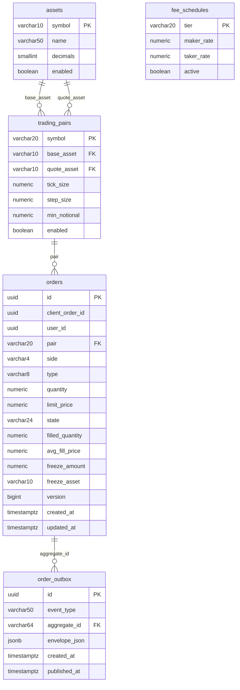
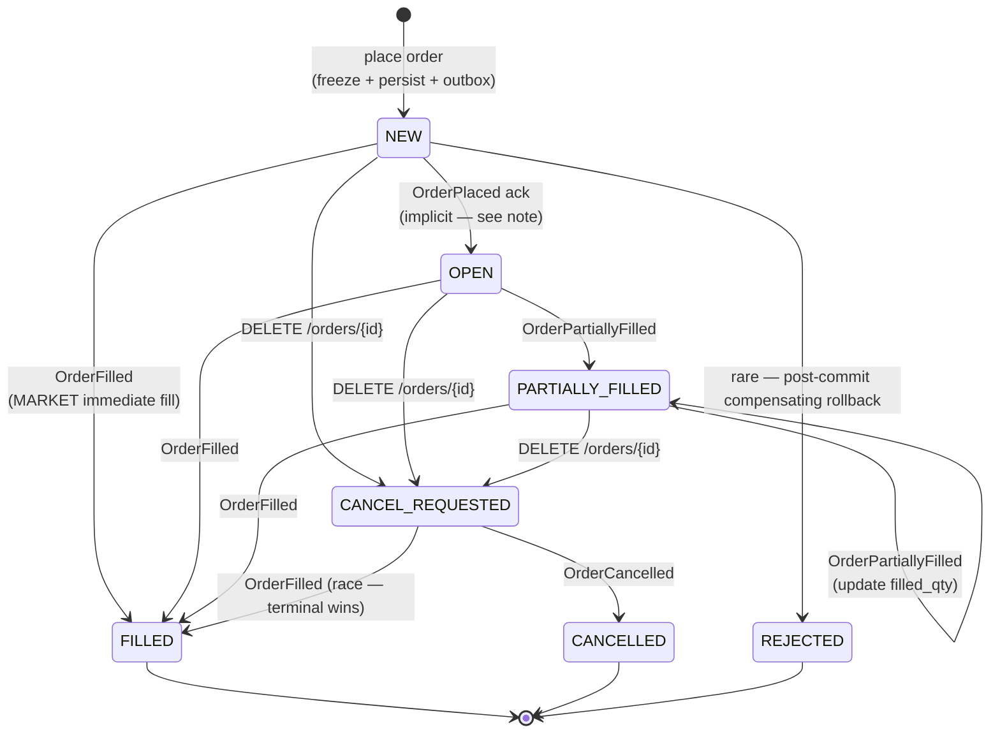

# System Design Appendix — Order Service

**Parent Document:** `SystemDesign.md` v1.0
**Service:** `order-service`
**Port:** 8083
**Owned Bounded Context:** Order intent & lifecycle (+ reference data for MVP)
**Owned Entities:** `Order`, `Asset`, `TradingPair`, `FeeSchedule`
**Related SRS:** `SRS_Appendix_OrderService.md` v1.0
**Status:** Ready for implementation

---

## Table of Contents

1. [Scope & Design Goals](#1-scope--design-goals)
2. [Module Structure](#2-module-structure)
3. [Domain Model](#3-domain-model)
4. [Database Schema](#4-database-schema)
5. [REST API Design](#5-rest-api-design)
6. [Kafka Integration](#6-kafka-integration)
7. [Synchronous Dependencies](#7-synchronous-dependencies)
8. [Key Use Cases (Implementation)](#8-key-use-cases-implementation)
9. [State Machine Implementation](#9-state-machine-implementation)
10. [Configuration](#10-configuration)
11. [Error Handling](#11-error-handling)
12. [Testing Strategy](#12-testing-strategy)
13. [Open Implementation Notes](#13-open-implementation-notes)

---

## 1. Scope & Design Goals

This appendix specifies the **implementation-level design** for Order Service. It assumes familiarity with the master `SystemDesign.md` (particularly §5 Communication Patterns, §6 Data Architecture, §7.2–7.4 Critical Flows, §8 Cross-Cutting Concerns).

### 1.1 Design Goals (in priority order)

1. **Correctness of the freeze-then-persist orchestration.** Wallet must never freeze without a matching Order row; an Order row must never exist without a corresponding freeze.
2. **Strict idempotency on `client_order_id`.** The same client retry must never create two orders.
3. **Clean separation between write side (REST-triggered) and read side (Kafka-consumer-driven).** State updates from Matching Engine flow through consumers; REST never directly mutates `filled_qty` or transitions state forward.
4. **Extractable reference data.** Asset/TradingPair/FeeSchedule live here for MVP (ADR-005). Code organization must make future extraction a package-move, not a rewrite.
5. **Testable in isolation.** The service can be brought up in Testcontainers with in-memory Wallet and Market Data stubs for integration tests.

### 1.2 What's Explicitly Out of Scope for this Service

- Balance mutation — Wallet Service.
- Fill computation — Matching Engine.
- Price quotation — Market Data Service.
- Authentication — Gateway (injects `X-User-Id` after JWT validation).

---

## 2. Module Structure

### 2.1 Maven Module Location

```
haizz-exchange/                         (parent pom)
├── exchange-common/                    (shared kernel)
├── order-service/                      ← this module
├── wallet-service/
├── matching-engine/
├── market-data-service/
├── user-auth-service/
└── api-gateway/
```

`order-service/pom.xml` declares:
- Parent: `haizz-exchange`
- Dependencies: `exchange-common`, `spring-boot-starter-web`, `spring-boot-starter-data-jpa`, `spring-boot-starter-validation`, `spring-boot-starter-actuator`, `spring-kafka`, `spring-boot-starter-data-redis`, `postgresql` driver, `flyway-core`, `resilience4j-spring-boot3`, `micrometer-registry-prometheus`, `caffeine`, `mapstruct`, `lombok`.
- Test: `spring-boot-starter-test`, `testcontainers` (postgresql, kafka), `spring-kafka-test`.

### 2.2 Package Layout

Follows the canonical layout (master §14.B):

```
com.haizz.exchange.order/
├── OrderServiceApplication.java
│
├── api/                                # REST layer — thin, deserializes + delegates
│   ├── OrderController.java            # POST/DELETE/GET/LIST orders
│   ├── ReferenceDataController.java    # GET /pairs, /assets (read-only, public)
│   ├── InternalController.java         # GET /internal/orders — called by Matching Engine startup
│   ├── dto/
│   │   ├── PlaceOrderRequest.java
│   │   ├── OrderResponse.java
│   │   ├── OrderListResponse.java
│   │   └── InternalOrderProjection.java
│   ├── mapper/
│   │   └── OrderMapper.java            # MapStruct: Order ↔ OrderResponse
│   └── GlobalExceptionHandler.java
│
├── application/                        # Use cases — transaction boundaries live here
│   ├── placement/
│   │   ├── PlaceOrderUseCase.java      # §8.1
│   │   ├── FreezeAmountCalculator.java
│   │   └── PlaceOrderCommand.java
│   ├── cancellation/
│   │   └── CancelOrderUseCase.java     # §8.2
│   ├── query/
│   │   ├── GetOrderUseCase.java
│   │   └── ListOrdersUseCase.java
│   └── reaction/                       # Kafka-consumer-driven use cases
│       ├── ApplyTradeUseCase.java      # consumes TradeExecuted, OrderPartiallyFilled, OrderFilled
│       └── ApplyCancelUseCase.java     # consumes OrderCancelled
│
├── domain/                             # Pure domain — no Spring, no JPA imports
│   ├── Order.java                      # aggregate root (JPA-free domain object; separate JPA entity in infra)
│   ├── OrderFactory.java               # creates valid Order from command
│   ├── OrderStateTransition.java       # pure function: (current, event) → next
│   ├── FreezeSpec.java                 # value object: amount + asset
│   ├── rules/
│   │   ├── TickSizeRule.java
│   │   ├── StepSizeRule.java
│   │   ├── MinNotionalRule.java
│   │   └── MaxOpenOrdersRule.java
│   ├── referencedata/
│   │   ├── Asset.java
│   │   ├── TradingPair.java
│   │   └── FeeSchedule.java
│   └── exception/
│       ├── DomainException.java        # re-exported from exchange-common
│       ├── OrderNotFoundException.java
│       ├── OrderNotCancellableException.java
│       ├── DuplicateClientOrderIdException.java
│       ├── MarketDataUnavailableException.java
│       └── ... (one per error code from SRS §3.1.1 error table)
│
├── infrastructure/
│   ├── persistence/
│   │   ├── OrderJpaEntity.java         # JPA-annotated; maps ↔ domain.Order
│   │   ├── OrderJpaRepository.java     # Spring Data
│   │   ├── OrderRepositoryImpl.java    # implements domain-facing OrderRepository interface
│   │   ├── TradingPairJpaEntity.java
│   │   ├── TradingPairJpaRepository.java
│   │   ├── AssetJpaEntity.java
│   │   ├── FeeScheduleJpaEntity.java
│   │   └── OrderOutboxJpaEntity.java   # uses exchange-common outbox schema
│   ├── messaging/
│   │   ├── producer/
│   │   │   └── (uses OutboxWriter from exchange-common — no bespoke producer)
│   │   └── consumer/
│   │       ├── MatchingEventsConsumer.java        # listens to matching.events.v1
│   │       ├── MarketDataFeedStatusConsumer.java  # listens to market-data.events.v1 (only Degraded/Recovered)
│   │       └── EventDispatcher.java               # dispatches envelope → handler
│   ├── http/
│   │   ├── WalletClient.java           # calls /internal/wallets/freeze, /unfreeze
│   │   └── MarketDataClient.java       # calls /internal/ticker, /internal/pairs/{pair}/metadata
│   ├── cache/
│   │   └── PairMetadataCache.java      # Caffeine 5 min TTL + Redis fallback
│   └── idempotency/
│       └── EventIdempotencyStore.java  # Redis-backed
│
├── config/                             # Spring @Configuration
│   ├── WebConfig.java
│   ├── JpaConfig.java
│   ├── KafkaConfig.java
│   ├── RedisConfig.java
│   ├── HttpClientConfig.java           # RestClient beans, Resilience4j decorators
│   ├── OutboxConfig.java               # @EnableOutboxRelay from exchange-common
│   └── ReferenceDataSeeder.java        # ApplicationRunner, @Profile("dev")
│
└── shared/                             # small service-local utilities
    └── Constants.java
```

### 2.3 Dependency Direction (hexagonal)

```
        api  ─────┐
                  ▼
            application ──► domain
                  ▲           ▲
                  │           │
        infrastructure ───────┘
```

- `domain` has zero Spring/JPA/Kafka imports. It uses plain Java + `exchange-common` value objects.
- `application` depends on `domain` interfaces (ports). Infrastructure provides implementations.
- `api` depends on `application` only — never on `infrastructure` directly.
- `infrastructure` implements ports declared in `application` or `domain`.

Enforced by ArchUnit tests (see §12.4).

---

## 3. Domain Model

### 3.1 Order Aggregate

The aggregate is small enough that no internal entities are needed — `Order` is a single class holding all state.

```java
// domain/Order.java (pseudocode, JPA-free)
public final class Order {
    private final OrderId id;
    private final ClientOrderId clientOrderId;   // nullable
    private final UserId userId;
    private final PairSymbol pair;
    private final OrderSide side;
    private final OrderType type;
    private final Quantity quantity;
    private final Price limitPrice;              // null for MARKET
    private final TimeInForce timeInForce;
    private final FreezeSpec freeze;             // amount + asset
    private OrderState state;
    private Quantity filledQuantity;             // starts at 0
    private Price avgFillPrice;                  // null until first fill
    private String rejectionReason;              // populated only in REJECTED
    private final Instant createdAt;
    private Instant updatedAt;
    private long version;                        // optimistic locking

    // factory method
    public static Order create(PlaceOrderCommand cmd, TradingPair pair, FreezeSpec freeze) { ... }

    // state transitions — domain invariants enforced here, not in the consumer
    public void applyPartialFill(Quantity fillQty, Price fillPrice) { ... }
    public void applyFullFill(Quantity totalFilled, Price avgPrice) { ... }
    public void requestCancel() { ... }
    public void applyCancelConfirmed(Quantity finalFilledQty) { ... }

    // queries
    public boolean isTerminal() { ... }
    public boolean isCancellable() { ... }
}
```

**Invariants enforced at domain level** (tested in unit tests):
- `filledQuantity ≤ quantity` at all times.
- `state == FILLED` ⟺ `filledQuantity.equals(quantity)`.
- `limitPrice != null` ⟺ `type == LIMIT`.
- `avgFillPrice != null` ⟺ `filledQuantity > 0`.
- Terminal states (`FILLED`, `CANCELLED`, `REJECTED`) cannot transition to any other state — attempts throw `IllegalStateException`.

### 3.2 Reference Data

These are **read-only at runtime** for Order Service (seeded via migration + dev-profile seeder + optional admin API post-MVP). They are value-ish aggregates, not true DDD aggregates (no lifecycle management beyond CRUD in admin flows).

See SRS §2.2–2.4 for fields. Design notes:

- **`TradingPair.minNotional`**: hard-coded per-pair via seed data (MVP: 10 USDT flat for all pairs). Post-MVP driven by exchange info.
- **`TradingPair.tickSize` / `stepSize`**: seeded from Binance exchangeInfo at service startup (via Market Data `PairMetadataUpdated` consumer, see §6.3). On update, Order Service's local copy is refreshed — but new validations use the updated value immediately; in-flight requests may use a stale value (acceptable — tick sizes change rarely).
- **`FeeSchedule`**: single row `tier_0` for MVP, rates 0.0010 / 0.0010. Order Service does not compute fees (that's Matching Engine); this row is here for reference and for the future case where Order Service might display fee-adjusted totals during placement preview.

### 3.3 Value Objects (from `exchange-common`)

Imported, not redefined:
- `OrderId` (UUID wrapper with validation)
- `UserId` (UUID wrapper)
- `ClientOrderId` (UUID wrapper, optional)
- `PairSymbol` (e.g., "BTCUSDT")
- `AssetCode` (e.g., "BTC", "USDT")
- `OrderSide` enum: `BUY`, `SELL`
- `OrderType` enum: `MARKET`, `LIMIT`
- `OrderState` enum: `NEW`, `OPEN`, `PARTIALLY_FILLED`, `FILLED`, `CANCEL_REQUESTED`, `CANCELLED`, `REJECTED`
- `TimeInForce` enum: `GTC` (only one in MVP)
- `Money(amount: BigDecimal, asset: AssetCode)` — immutable
- `Quantity(value: BigDecimal)` — immutable, enforces `>= 0`
- `Price(value: BigDecimal)` — immutable, enforces `> 0`

### 3.4 Domain Services (Stateless)

- `FreezeAmountCalculator` (lives in application but purely functional) — given `PlaceOrderCommand` + `TradingPair` + `TickerSnapshot`, returns `FreezeSpec`.
- `OrderValidator` — runs ordered rules (see §8.1 step 2), short-circuits on first failure, returns either `Valid` or `Invalid(errorCode, details)`.

---

## 4. Database Schema

Database: `order_db` (shared Postgres instance). Migrations managed by Flyway in `src/main/resources/db/migration/`.

> **NOTE (back-ported 2026-06-17 from services/order/DECISIONS.md):** Confirmed as built — the
> default datasource URL targets database **`order_db`**
> (`jdbc:postgresql://localhost:5432/order_db`), mirroring the wallet service's `wallet_db`
> convention; overridable via `SPRING_DATASOURCE_URL`.

### 4.1 Migration Sequence

```
V1__create_reference_data.sql           # assets, trading_pairs, fee_schedules
V2__create_orders.sql                    # orders + indexes
V3__create_outbox.sql                    # order_outbox + dead letter
V4__seed_reference_data.sql              # initial 6 assets, 5 pairs, 1 fee tier
V5__create_idempotency_index.sql         # unique constraint for client_order_id
```

### 4.2 `orders` Table

```sql
CREATE TABLE orders (
  id                UUID            PRIMARY KEY,
  client_order_id   UUID            NULL,
  user_id           UUID            NOT NULL,
  pair              VARCHAR(20)     NOT NULL,
  side              VARCHAR(4)      NOT NULL,        -- BUY | SELL
  type              VARCHAR(8)      NOT NULL,        -- MARKET | LIMIT
  quantity          NUMERIC(36,18)  NOT NULL         CHECK (quantity > 0),
  limit_price       NUMERIC(36,18)  NULL             CHECK (limit_price IS NULL OR limit_price > 0),
  time_in_force     VARCHAR(8)      NOT NULL         DEFAULT 'GTC',
  state             VARCHAR(24)     NOT NULL,        -- NEW, OPEN, PARTIALLY_FILLED, FILLED, CANCEL_REQUESTED, CANCELLED, REJECTED
  filled_quantity   NUMERIC(36,18)  NOT NULL         DEFAULT 0 CHECK (filled_quantity >= 0),
  avg_fill_price    NUMERIC(36,18)  NULL,
  freeze_amount     NUMERIC(36,18)  NOT NULL         CHECK (freeze_amount >= 0),
  freeze_asset      VARCHAR(10)     NOT NULL,
  rejection_reason  VARCHAR(200)    NULL,
  version           BIGINT          NOT NULL         DEFAULT 0,
  created_at        TIMESTAMPTZ     NOT NULL         DEFAULT NOW(),
  updated_at        TIMESTAMPTZ     NOT NULL         DEFAULT NOW(),

  CONSTRAINT ck_limit_price_presence
    CHECK ((type = 'LIMIT' AND limit_price IS NOT NULL)
        OR (type = 'MARKET' AND limit_price IS NULL)),
  CONSTRAINT ck_filled_not_exceeds_qty
    CHECK (filled_quantity <= quantity)
);

-- Hot query: list user's orders, usually by state
CREATE INDEX ix_orders_user_created
  ON orders (user_id, created_at DESC);

-- For Matching Engine startup rebuild
CREATE INDEX ix_orders_state_pair
  ON orders (state, pair)
  WHERE state IN ('OPEN', 'PARTIALLY_FILLED');

-- Client order idempotency (per user, per 24h window enforced in app code;
-- DB uniqueness is over-strict to act as a final safeguard for a week)
CREATE UNIQUE INDEX uq_orders_user_client_order_id
  ON orders (user_id, client_order_id)
  WHERE client_order_id IS NOT NULL;

-- For admin / analytics queries (rare)
CREATE INDEX ix_orders_pair_created ON orders (pair, created_at DESC);
```

**Notes:**
- `NUMERIC(36, 18)` is the canonical money precision (mandated in master §4.2). 36 digits, 18 decimals — handles BTC satoshis (8 dp) and USDT (6 dp) with margin.
- `client_order_id` uniqueness is partial (allows nulls) and per-user. The 24h semantic window is enforced in app code: after 24h, app rejects the SRS-required "new order with same client_order_id" as conflict only if the original is still within the window; DB-level uniqueness handles accidental races.
- `version` column enables JPA `@Version`-based optimistic locking for concurrent updates from multiple consumer threads (though in practice, matching events for a given order are serialized by Kafka partition).

### 4.3 Reference Data Tables

```sql
CREATE TABLE assets (
  symbol     VARCHAR(10)  PRIMARY KEY,
  name       VARCHAR(50)  NOT NULL,
  decimals   SMALLINT     NOT NULL,
  enabled    BOOLEAN      NOT NULL DEFAULT TRUE,
  created_at TIMESTAMPTZ  NOT NULL DEFAULT NOW(),
  updated_at TIMESTAMPTZ  NOT NULL DEFAULT NOW()
);

CREATE TABLE trading_pairs (
  symbol        VARCHAR(20)    PRIMARY KEY,
  base_asset    VARCHAR(10)    NOT NULL REFERENCES assets (symbol),
  quote_asset   VARCHAR(10)    NOT NULL REFERENCES assets (symbol),
  tick_size     NUMERIC(36,18) NOT NULL CHECK (tick_size > 0),
  step_size     NUMERIC(36,18) NOT NULL CHECK (step_size > 0),
  min_notional  NUMERIC(36,18) NOT NULL CHECK (min_notional > 0),
  enabled       BOOLEAN        NOT NULL DEFAULT TRUE,
  updated_at    TIMESTAMPTZ    NOT NULL DEFAULT NOW()
);

CREATE TABLE fee_schedules (
  tier        VARCHAR(20)    PRIMARY KEY,
  maker_rate  NUMERIC(10,6)  NOT NULL CHECK (maker_rate >= 0 AND maker_rate <= 0.1),
  taker_rate  NUMERIC(10,6)  NOT NULL CHECK (taker_rate >= 0 AND taker_rate <= 0.1),
  active      BOOLEAN        NOT NULL DEFAULT FALSE
);
```

Seed data (`V4__seed_reference_data.sql`):

```sql
INSERT INTO assets (symbol, name, decimals) VALUES
  ('USDT', 'Tether',  6),
  ('BTC',  'Bitcoin', 8),
  ('ETH',  'Ethereum', 8),
  ('BNB',  'Binance Coin', 8),
  ('SOL',  'Solana', 8),
  ('XRP',  'Ripple', 8);

INSERT INTO trading_pairs (symbol, base_asset, quote_asset, tick_size, step_size, min_notional) VALUES
  ('BTCUSDT', 'BTC', 'USDT', 0.01,      0.00001,  10),
  ('ETHUSDT', 'ETH', 'USDT', 0.01,      0.0001,   10),
  ('BNBUSDT', 'BNB', 'USDT', 0.01,      0.001,    10),
  ('SOLUSDT', 'SOL', 'USDT', 0.01,      0.001,    10),
  ('XRPUSDT', 'XRP', 'USDT', 0.0001,    1,        10);

INSERT INTO fee_schedules (tier, maker_rate, taker_rate, active) VALUES
  ('tier_0', 0.0010, 0.0010, TRUE);
```

### 4.4 `order_outbox` Table

Uses `exchange-common` shared outbox schema (master §5.4.2). Migration snippet:

```sql
CREATE TABLE order_outbox (
  id             UUID PRIMARY KEY,
  event_type     VARCHAR(50)  NOT NULL,
  aggregate_type VARCHAR(40)  NOT NULL,       -- always 'Order'
  aggregate_id   VARCHAR(64)  NOT NULL,       -- order_id
  topic          VARCHAR(60)  NOT NULL,       -- 'orders.events.v1'
  partition_key  VARCHAR(64)  NOT NULL,       -- order_id (for per-order ordering)
  envelope_json  JSONB        NOT NULL,
  created_at     TIMESTAMPTZ  NOT NULL DEFAULT NOW(),
  published_at   TIMESTAMPTZ  NULL,
  attempts       INT          NOT NULL DEFAULT 0,
  last_error     TEXT         NULL
);

CREATE INDEX ix_order_outbox_unpublished
  ON order_outbox (created_at)
  WHERE published_at IS NULL;

CREATE TABLE order_outbox_dead_letter (
  -- same shape, populated when attempts > 10
  LIKE order_outbox INCLUDING ALL
);
```

### 4.5 Idempotency Support

No separate idempotency table for Order Service's own endpoints:
- Client order idempotency is handled by the unique index on `(user_id, client_order_id)`.
- Kafka consumer idempotency uses Redis (key pattern `order:idempotency:<event_id>`, TTL 24h) — no DB table needed, since applying a consumed event is itself idempotent (`UPDATE ... WHERE state IN (...)`).

### 4.6 Entity-Relationship Diagram



---

## 5. REST API Design

### 5.1 Endpoint Summary

| Method | Path | Auth | Consumer | Purpose |
|--------|------|------|----------|---------|
| `POST` | `/api/v1/orders` | User JWT | FE via Gateway | Place order |
| `DELETE` | `/api/v1/orders/{orderId}` | User JWT | FE via Gateway | Cancel order |
| `GET` | `/api/v1/orders/{orderId}` | User JWT | FE via Gateway | Fetch single order |
| `GET` | `/api/v1/orders` | User JWT | FE via Gateway | List orders (paginated) |
| `GET` | `/api/v1/trading-pairs` | None | FE via Gateway | List enabled pairs for UI |
| `GET` | `/api/v1/assets` | None | FE via Gateway | List assets |
| `GET` | `/internal/orders` | Network-trust | Matching Engine (startup) | Page open orders for index rebuild |

Full request/response shapes are in SRS Appendix §3. This section specifies implementation-level concerns only.

### 5.2 Request Validation Pipeline

Three layers, executed in order:

**Layer 1 — HTTP parsing & shape** (automatic, Spring):
- Content-Type check, body size limit (10 KB, see SRS §8.5).
- Jackson deserialization.

**Layer 2 — Bean Validation** (automatic via `@Valid`):
- `@NotNull` on required fields.
- `@DecimalMin("0")` on numeric fields.
- Custom `@PairFormat` regex validator on `pair`.
- `@ValidEnum` on `side`, `type`, `time_in_force`.
- Failures → `MethodArgumentNotValidException` → `GlobalExceptionHandler` → HTTP 400 `VALIDATION_FAILED` with field error map.

**Layer 3 — Business validation** (explicit, in `PlaceOrderUseCase`):
- Pair exists & enabled.
- `quantity` is multiple of `stepSize`.
- `limit_price` is multiple of `tickSize` (for LIMIT).
- `quantity × effectivePrice ≥ minNotional`.
- User has fewer than `maxOpenOrdersPerPair` (100) open orders on this pair.
- Market data is fresh (no `MarketDataFeedDegraded` active for pair).
- Failures → specific `DomainException` → HTTP 400 / 409 / 503 per error code map.

This separation matters because Layer 2 failures happen before the service layer is even entered — they can be centralized in `GlobalExceptionHandler`. Layer 3 failures happen inside the use case and must be mapped by the same handler based on exception type.

### 5.3 Response Shaping

All responses use DTOs (never the JPA entity directly). MapStruct generates `OrderMapper`:

```java
@Mapper(componentModel = "spring")
public interface OrderMapper {
    OrderResponse toResponse(Order order);
    List<OrderResponse> toResponseList(List<Order> orders);
}
```

The JPA entity is converted to domain `Order` by `OrderRepositoryImpl` (`toDomain()` method), and the use case hands the domain `Order` to the mapper.

### 5.4 Pagination

`GET /orders` uses offset pagination (Spring Data `Pageable`). Not keyset pagination — MVP queries are modest (< 100 orders/user/day), the index on `(user_id, created_at DESC)` is efficient for `LIMIT 50 OFFSET N` at small N.

Response envelope uses Spring Data's `PageResponse` flattened:
```json
{
  "content": [ ... ],
  "page": 0,
  "size": 50,
  "total_elements": 120,
  "total_pages": 3
}
```

### 5.5 Internal Endpoint: `GET /internal/orders`

Called exclusively by Matching Engine at startup. Contract:

- **Query params:** `state=OPEN,PARTIALLY_FILLED` (required), `page=0`, `size=1000` (max).
- **Response:** `InternalOrderProjection[]` — a compact projection containing only fields Matching Engine needs (id, user_id, pair, side, type, quantity, limit_price, filled_quantity, created_at). This is a **different DTO** from `OrderResponse` — smaller, purpose-built.
- **No JWT required** (network trust for MVP, ADR-010). Gateway does NOT proxy `/internal/*`.
- **Pagination:** Matching Engine iterates until empty page.

> **⚠️ NOTE (back-ported 2026-06-17 from services/order/DECISIONS.md):** As built, the path is
> `GET /api/v1/orders/internal/orders` (gateway-prefixed form, permitted by the `permitAll`
> matcher `/api/v1/orders/internal/**`), not the bare `/internal/orders`. There is **no user
> filter** — it returns ALL users' open orders. Default `state = OPEN,PARTIALLY_FILLED`; size
> default **1000**, max **1000**. Ordering is **FIFO (`createdAt ASC`)** (via
> `findByStateInOrderByCreatedAtAsc`) to preserve matching priority on book rebuild. The
> `InternalOrderProjection` fields are **camelCase**
> (`{id, userId, pair, side, type, quantity, limitPrice, filledQuantity, createdAt}`) with
> decimals rendered as plain strings — distinct from the snake_case public `OrderResponse`.

```java
// InternalController.java
@RestController
@RequestMapping("/internal/orders")
class InternalController {
    @GetMapping
    PageResponse<InternalOrderProjection> listOpenOrders(
        @RequestParam List<OrderState> state,
        @RequestParam(defaultValue = "0") int page,
        @RequestParam(defaultValue = "1000") @Max(1000) int size
    ) { ... }
}
```

---

## 6. Kafka Integration

### 6.1 Produced Events (via outbox)

| Event | Topic | Partition Key | When Published |
|-------|-------|---------------|----------------|
| `OrderPlaced` | `orders.events.v1` | `order_id` | On successful placement (in same txn as order INSERT) |
| `OrderCancelRequested` | `orders.events.v1` | `order_id` | On cancel endpoint call (in same txn as state UPDATE to `CANCEL_REQUESTED`) |
| `OrderRejected` | `orders.events.v1` | `order_id` | Rare — if freeze succeeded but persistence somehow fails (compensating rollback). Mostly for audit; Order Service itself doesn't transition to REJECTED post-commit in normal flows. |

Payload schemas are defined in `exchange-common` as Java records (master §5.3.5).

### 6.2 Consumed Events

| Topic | Event Types | Consumer Group | Handler |
|-------|-------------|----------------|---------|
| `matching.events.v1` | `OrderPartiallyFilled`, `OrderFilled`, `OrderCancelled` | `order-service` | `MatchingEventsConsumer` → `ApplyTradeUseCase` / `ApplyCancelUseCase` |
| `market-data.events.v1` | `MarketDataFeedDegraded`, `MarketDataFeedRecovered`, `PairMetadataUpdated` | `order-service` | `MarketDataFeedStatusConsumer` |

Events with other types on the same topics are filtered out at dispatcher level (not considered an error — just ignored).

### 6.3 Consumer Configuration

```yaml
spring:
  kafka:
    bootstrap-servers: kafka:9092
    consumer:
      group-id: order-service
      auto-offset-reset: earliest       # first-time start; subsequent starts use committed offset
      enable-auto-commit: false         # manual ack for at-least-once
      max-poll-records: 100
      session-timeout-ms: 30000
      properties:
        spring.json.trusted.packages: "com.haizz.exchange.common.events.*"
    listener:
      ack-mode: manual                   # consumer explicitly acks after successful processing
      concurrency: 3                      # matches topic partition count (master §5.3.2)
```

**Per-order ordering:** Partitioning on `order_id` ensures all events for a given order hit the same consumer thread, in Kafka-offset order. Applied events within the same order's history cannot reorder.

### 6.4 Event Dispatcher Pattern

To avoid a giant switch statement in each consumer, `EventDispatcher` uses a type-based registry:

```java
@Component
class EventDispatcher {
    private final Map<String, EventHandler<?>> handlers;

    void dispatch(EventEnvelope envelope) {
        var handler = handlers.get(envelope.schema());
        if (handler == null) {
            log.debug("No handler for schema={} — skipping", envelope.schema());
            return;
        }
        handler.handle(envelope);
    }
}

// One handler per event type
@Component
class OrderFilledHandler implements EventHandler<OrderFilledEvent> {
    private final ApplyTradeUseCase useCase;
    private final EventIdempotencyStore idempotency;

    public void handle(EventEnvelope envelope) {
        if (!idempotency.tryMark(envelope.eventId(), Duration.ofHours(24))) return; // duplicate
        var payload = envelope.payloadAs(OrderFilledEvent.class);
        useCase.applyFullFill(payload);
    }
}
```

### 6.5 Dead-Letter Topic Routing

Spring-Kafka's `DefaultErrorHandler` + `DeadLetterPublishingRecoverer` configured to route poison pills to `<topic>.dlt`:

```java
@Bean
DefaultErrorHandler errorHandler(KafkaTemplate<String, Object> template) {
    var recoverer = new DeadLetterPublishingRecoverer(template,
        (record, ex) -> new TopicPartition(record.topic() + ".dlt", record.partition()));
    var handler = new DefaultErrorHandler(recoverer,
        new ExponentialBackOffWithMaxRetries(3));
    handler.addNotRetryableExceptions(JsonProcessingException.class);
    return handler;
}
```

- **Retryable** (transient): DB lock, Redis timeout → 3 retries with exponential backoff → DLT.
- **Non-retryable** (poison pill): `JsonProcessingException`, unknown schema → directly to DLT.

---

## 7. Synchronous Dependencies

### 7.1 Wallet Client

```java
// infrastructure/http/WalletClient.java
@Component
class WalletClient {
    private final RestClient restClient;        // bean config in HttpClientConfig
    private final CircuitBreaker circuitBreaker;

    FreezeResponse freeze(FreezeRequest req) {
        return circuitBreaker.executeSupplier(() ->
            restClient.post()
                .uri("/api/v1/wallets/internal/freeze")
                .header("X-Correlation-Id", MDC.get("correlation_id"))
                .header("X-Caller-Service", "order-service")
                .header("X-Idempotency-Key", req.referenceId().toString())
                .body(req)
                .retrieve()
                .onStatus(HttpStatusCode::is4xxClientError, (in, out) -> {
                    throw parseError(out);       // map to domain exception
                })
                .body(FreezeResponse.class));
    }

    void unfreeze(UnfreezeRequest req) { ... }
}
```

**Circuit breaker config** (Resilience4j):
```yaml
resilience4j:
  circuitbreaker:
    instances:
      walletFreeze:
        failure-rate-threshold: 50
        sliding-window-size: 10
        minimum-number-of-calls: 5
        wait-duration-in-open-state: 10s
        permitted-number-of-calls-in-half-open-state: 3
```

No retry on freeze (idempotency key handles wallet-side dedup, but retrying from Order Service after timeout creates semantic ambiguity — we prefer explicit failure and let the client retry with the same client_order_id).

**Timeouts:**
```yaml
spring:
  http:
    client:
      connect-timeout: 500ms
      read-timeout: 2s
```

### 7.2 Market Data Client

```java
@Component
class MarketDataClient {
    private final RestClient restClient;
    private final PairMetadataCache metadataCache;   // Caffeine 5min + Redis fallback
    private final CircuitBreaker circuitBreaker;

    TickerSnapshot getTicker(PairSymbol pair) {
        return circuitBreaker.executeSupplier(() ->
            restClient.get()
                .uri("/internal/ticker/{pair}", pair)
                .retrieve()
                .body(TickerSnapshot.class));
    }

    PairMetadata getPairMetadata(PairSymbol pair) {
        return metadataCache.get(pair, () ->
            restClient.get()
                .uri("/internal/pairs/{pair}/metadata", pair)
                .retrieve()
                .body(PairMetadata.class));
    }
}
```

**Ticker:**
- 1 s timeout, 1 retry on 5xx.
- Circuit breaker tracks failure rate.
- **Fallback:** if CB is open, use last known ticker from Redis (key `order:ticker:<pair>`, populated by consuming `ExternalTradeObserved` events). Ticker carries a `staleAt` field; if stale > 10 s, use fallback fails → throw `MarketDataUnavailableException` → HTTP 503.

**Pair metadata:**
- 500 ms timeout, 1 retry.
- Caffeine cache 5 min TTL (local).
- On cache miss, fetch; on upstream fail, use Redis snapshot (written by Market Data `PairMetadataUpdated` consumer).
- If all fail and no cached value exists → fail service startup (pair metadata is essential).

---

## 8. Key Use Cases (Implementation)

### 8.1 Place Order — The Canonical Flow

`PlaceOrderUseCase.execute(cmd)` — this is the most important method in the service. Step-by-step implementation:

```java
@Transactional
public PlacementResult execute(PlaceOrderCommand cmd) {
    // Step 0: MDC populated already (by CorrelationIdFilter at controller layer)

    // Step 1: idempotency check on client_order_id
    if (cmd.clientOrderId() != null) {
        var existing = orderRepository.findByUserIdAndClientOrderId(
            cmd.userId(), cmd.clientOrderId(),
            Duration.ofHours(24));
        if (existing.isPresent()) {
            throw new DuplicateClientOrderIdException(existing.get());
        }
    }

    // Step 2: fetch reference data + business validation
    var pair = tradingPairRepository.findEnabled(cmd.pair())
        .orElseThrow(() -> new PairNotSupportedException(cmd.pair()));

    if (feedStatus.isDegraded(cmd.pair())) {
        throw new MarketDataUnavailableException(cmd.pair());
    }

    orderValidator.validate(cmd, pair);  // throws specific exceptions

    // Step 3: compute freeze amount
    var ticker = (cmd.type() == OrderType.MARKET) ? marketDataClient.getTicker(cmd.pair()) : null;
    var freezeSpec = freezeCalc.compute(cmd, pair, ticker);

    // Step 4: open orders limit check
    var openCount = orderRepository.countOpenByUserAndPair(cmd.userId(), cmd.pair());
    if (openCount >= MAX_OPEN_ORDERS_PER_PAIR) {
        throw new MaxOpenOrdersExceededException();
    }

    // Step 5: freeze balance (synchronous HTTP — OUTSIDE DB txn — see note below)
    // NOTE: This method is @Transactional but the freeze call participates only in
    // logical flow, not in DB txn. The DB txn has NOT been started yet by JPA
    // until first DB access; freeze is before that.
    var freezeResp = walletClient.freeze(FreezeRequest.builder()
        .userId(cmd.userId())
        .asset(freezeSpec.asset())
        .amount(freezeSpec.amount())
        .referenceId(cmd.orderIdToBe())       // pre-generated UUID
        .referenceType("ORDER")
        .build());

    // Step 6: persist order + outbox in ONE DB txn
    var order = OrderFactory.create(cmd, pair, freezeSpec);
    try {
        orderRepository.save(order);
        outbox.write(OutboxEventBuilder
            .of("OrderPlaced")
            .topic("orders.events.v1")
            .aggregate("Order", order.id().toString())
            .partitionKey(order.id().toString())
            .payload(toOrderPlacedEvent(order))
            .build());
    } catch (Exception e) {
        // Compensate: unfreeze. This is best-effort; if it fails, log with full
        // context and flag for manual reconciliation.
        compensateUnfreeze(cmd, freezeSpec);
        throw e;
    }

    // Txn commits automatically on return

    return PlacementResult.success(order);
}
```

**Critical invariants:**
- Freeze happens **before** the DB transaction (which starts on first JPA op). If freeze fails, no DB state is mutated.
- Order insert + outbox insert are **in the same DB transaction**. If either fails, both roll back.
- Compensation (unfreeze) is triggered only if the DB transaction itself fails after successful freeze. This should be rare (DB is local); if it fails, log at ERROR with full context including the freeze details so a human can reconcile via the Wallet Service's transaction log.

**Transaction & freeze ordering — why it works:**

JPA/Hibernate starts a DB txn lazily on first statement. By separating `walletClient.freeze()` (Step 5) from `orderRepository.save()` (Step 6), we guarantee:
- No DB txn is open during the HTTP call (prevents long-held locks).
- If freeze throws, no DB writes have occurred → nothing to roll back.
- If freeze succeeds and save throws, Spring's `@Transactional` rolls back — but freeze is already applied on Wallet side. This is the only case where compensation runs.

**Why not use `@Transactional(propagation=NEVER)` for freeze?** Because the containing method is `@Transactional` — Spring would throw. Cleaner: don't access JPA before freeze; that alone keeps txn un-started.

### 8.2 Cancel Order

`CancelOrderUseCase.execute(orderId, userId)`:

```java
@Transactional
public CancelResult execute(OrderId orderId, UserId userId) {
    var order = orderRepository.findById(orderId)
        .orElseThrow(() -> new OrderNotFoundException(orderId));

    if (!order.userId().equals(userId)) {
        throw new ForbiddenException();
    }

    if (!order.isCancellable()) {
        throw new OrderNotCancellableException(order.state());
    }

    // Idempotency: if already in CANCEL_REQUESTED, just return current state
    if (order.state() == OrderState.CANCEL_REQUESTED) {
        return CancelResult.alreadyRequested(order);
    }

    order.requestCancel();                      // domain transitions NEW/OPEN/PARTIALLY_FILLED → CANCEL_REQUESTED
    orderRepository.save(order);

    outbox.write(OutboxEventBuilder
        .of("OrderCancelRequested")
        .topic("orders.events.v1")
        .aggregate("Order", order.id().toString())
        .partitionKey(order.id().toString())
        .payload(toCancelRequestedEvent(order))
        .build());

    return CancelResult.requested(order);
}
```

Final `CANCELLED` transition happens in `ApplyCancelUseCase` on consuming `OrderCancelled` from Matching Engine.

> **⚠️ NOTE (back-ported 2026-06-17 from services/order/DECISIONS.md):** Cancel uses
> **persist-then-unfreeze** — the inverse of placement's freeze-then-persist. It persists the
> `CANCEL_REQUESTED` transition + `OrderCancelRequested` outbox event in **one** DB transaction,
> then calls `walletClient.unfreeze(...)` **after** the commit (so funds are never released for a
> cancel that wasn't recorded). The transactional persist lives in a separate
> `CancelOrderPersister` bean so the `@Transactional` proxy applies. The released amount is the
> **still-unfilled portion**:
> `releaseAmount = freezeAmount × (quantity − filledQuantity) / quantity`, `RoundingMode.DOWN`
> scale 8 (never over-release). If the post-commit unfreeze fails, the order is already
> `CANCEL_REQUESTED`; the failure is logged for reconciliation — unfreeze is idempotent by
> `(referenceId = orderId, reason = "CANCELLED")`, so retry cannot double-release.
>
> On the **placement** side (§8.1), the freeze `referenceId` is the pre-generated `orderId`, so
> a freeze that succeeds before a failed persist leaves an **orphan freeze** that is reconciled
> later — idempotent by `orderId`. No order row or event is produced on the failure path.

### 8.3 Apply Fill (Consumer-Driven State Update)

`ApplyTradeUseCase.applyPartialFill(OrderPartiallyFilledEvent event)`:

```java
public void applyPartialFill(OrderPartiallyFilledEvent event) {
    // Optimistic-lock retry loop (up to 3 attempts)
    retryTemplate.execute(ctx -> {
        var order = orderRepository.findById(OrderId.of(event.orderId()))
            .orElseThrow(() -> new OrderNotFoundException(event.orderId()));

        // State machine guard — idempotent
        if (order.isTerminal()) {
            log.warn("Received fill for terminal order id={} state={} — ignoring",
                order.id(), order.state());
            return null;
        }

        order.applyPartialFill(
            Quantity.of(event.filledQuantity()),
            Price.of(event.avgFillPrice()));
        orderRepository.save(order);
        return null;
    });
}

public void applyFullFill(OrderFilledEvent event) {
    // Similar, but domain method applies full fill → state becomes FILLED
}
```

Why retry? Two Matching Engine events might be consumed by two consumer threads for the same order (shouldn't happen with partition key = `order_id`, but if a rebalance occurs mid-processing, optimistic lock catches it).

> **⚠️ NOTE (back-ported 2026-06-17 from services/order/DECISIONS.md) — RESIDUAL FREEZE IS OWNED
> BY THE ORDER SERVICE (Phase 6):** This is an architectural settlement decision. The Matching
> Engine sets `residualFrozenAmount = 0` on its trade events, so the **Wallet does NOT release
> the leftover freeze** per fill. Per fill, Wallet only **debits the consumed frozen portion**
> (BUY: `fillQty × fillPrice` from the quote-frozen balance; SELL: `fillQty` from the
> base-frozen balance) and credits available minus fee. The **Order Service** therefore owns
> release of the leftover freeze when an order reaches a **TERMINAL** state, because it is the
> only party that still knows the original `freezeAmount`.
>
> Residual formulas (clamped ≥ 0, rounded **DOWN to 8 dp**; a residual of 0 skips the unfreeze
> call entirely):
> - **BUY**: `consumedQuote = filledQuantity × avgFillPrice (VWAP)`;
>   `residual = freezeAmount − consumedQuote` (asset = quote). The slippage + taker buffer baked
>   into the BUY freeze is released here.
> - **SELL**: `consumedBase = filledQuantity`; `residual = freezeAmount − filledQuantity`
>   (asset = base; = 0 on a full fill, so no spurious unfreeze).
> - **REJECTED / 0-fill** (e.g. market auto-cancel with no fills): consumed = 0 → the **full**
>   `freezeAmount` is released.
>
> The matching-driven release uses unfreeze reason **`"FILL_RESIDUAL"`**, **distinct** from the
> user-cancel DELETE path's `"CANCELLED"`. Wallet `unfreeze` is idempotent by
> `(referenceId = orderId, reason)`, so the two release paths occupy separate idempotency keys
> and cannot silently cancel each other; each releases at most once for its own portion, and
> replays are no-ops. The fill events carry **cumulative** `filledQuantity`, converted to a delta
> under the pessimistic write-lock inside the persister (`delta = eventCumulative −
> order.filledQuantity`; `delta ≤ 0` is an idempotent replay → SKIPPED, no unfreeze). The
> residual unfreeze is issued **after** the persist commits (persist-then-unfreeze, as for
> cancel). **Cross-reference:** the matching side of this contract (`residualFrozenAmount = 0` on
> trade events) is owned by the Matching Engine appendix.

### 8.4 Reference Data Consumers

`PairMetadataUpdatedConsumer`:
```java
@KafkaListener(topics = "market-data.events.v1", groupId = "order-service")
void onMetadataEvent(EventEnvelope envelope) {
    if (!"PairMetadataUpdated".equals(envelope.schema())) return;
    if (!idempotency.tryMark(envelope.eventId(), Duration.ofHours(24))) return;

    var payload = envelope.payloadAs(PairMetadataUpdatedEvent.class);
    tradingPairRepository.updateMetadata(
        payload.pair(),
        payload.tickSize(),
        payload.stepSize()
    );
}
```

Market Data Service emits this event whenever its `exchangeInfo` sync detects changes. Order Service keeps its local `trading_pairs` table in sync with minimal lag (seconds).

---

## 9. State Machine Implementation

### 9.1 State Diagram



**Note on `NEW → OPEN`:** In implementation, these two states are nearly indistinguishable from the user's perspective. We collapse them: upon successful placement, `state` is stored as `NEW` briefly and transitions to `OPEN` as soon as Matching Engine acknowledges (by sending the first state-touching event, OR after a timeout). For simplicity, MVP treats `NEW` and `OPEN` equivalently in queries (both are "open"); the transition is primarily a marker of "Matching Engine has picked this up." A scheduled job (every 30 s) promotes orders stuck in `NEW` for > 5 s to `OPEN` automatically, or the first fill event does it implicitly.

**Simplification for MVP:** Omit `NEW → OPEN` transition. Orders persist as `NEW`; first matching event transitions directly. `OPEN` effectively unused in MVP. Future: add explicit `OrderAcknowledged` event from Matching Engine.

### 9.2 Transition Rules Table

Implemented in `domain.OrderStateTransition`:

| Current | Trigger | Next | Side-Effects on Order |
|---------|---------|------|-----------------------|
| NEW | OrderPartiallyFilled | PARTIALLY_FILLED | `filled_quantity += evt.filled`, `avg_fill_price = evt.avg` |
| NEW | OrderFilled | FILLED | `filled_quantity = quantity`, `avg_fill_price = evt.avg` |
| NEW | DELETE request | CANCEL_REQUESTED | — |
| OPEN | OrderPartiallyFilled | PARTIALLY_FILLED | same as above |
| OPEN | OrderFilled | FILLED | same as above |
| OPEN | DELETE request | CANCEL_REQUESTED | — |
| PARTIALLY_FILLED | OrderPartiallyFilled | PARTIALLY_FILLED | accumulate |
| PARTIALLY_FILLED | OrderFilled | FILLED | — |
| PARTIALLY_FILLED | DELETE request | CANCEL_REQUESTED | — |
| CANCEL_REQUESTED | OrderCancelled | CANCELLED | set final `filled_quantity` from event |
| CANCEL_REQUESTED | OrderFilled | FILLED | **terminal precedence — ignores cancel** |
| CANCEL_REQUESTED | OrderPartiallyFilled | CANCEL_REQUESTED | still pending terminal; accumulate filled |
| FILLED / CANCELLED / REJECTED | any | same (no-op, log WARN) | — |

### 9.3 Terminal Precedence Rule

**Rule:** If an Order is in `CANCEL_REQUESTED` and `OrderFilled` arrives before `OrderCancelled`, the order becomes `FILLED`. The later `OrderCancelled` (if it arrives) is ignored.

Rationale: Matching Engine is authoritative about what actually executed. If a fill completed, the order IS filled — the user's cancellation was racy and lost. The FE shows `FILLED` via the fill push; from the user's perspective, the cancel "didn't take effect fast enough" — which is accurate.

> **NOTE (back-ported 2026-06-17 from services/order/DECISIONS.md):** Confirmed as built — a
> completing fill arriving in `CANCEL_REQUESTED` drives the order to terminal `FILLED` (FILLED
> wins); a non-completing fill goes to `PARTIALLY_FILLED`. `avgFillPrice` is the running VWAP
> `((avg×prevFilled) + fillPrice×fillQty) / (prevFilled + fillQty)`, divided with
> `RoundingMode.HALF_UP` at **scale 18** (matching the `avg_fill_price` column precision).
> `applyFill` rejects overfills and non-positive fill quantity / negative fill price as
> unchecked engine-contract errors (caught + logged fail-soft by the consumer).

Implemented via:
```java
// in domain.Order
public void applyFullFill(Quantity totalFilled, Price avgPrice) {
    if (state == OrderState.FILLED) return;     // idempotent
    if (state == OrderState.CANCELLED || state == OrderState.REJECTED) {
        throw new IllegalStateException("Cannot fill terminal order");
    }
    // CANCEL_REQUESTED is NOT terminal — fill wins
    this.filledQuantity = totalFilled;
    this.avgFillPrice = avgPrice;
    this.state = OrderState.FILLED;
    this.updatedAt = Instant.now();
}
```

---

## 10. Configuration

### 10.1 `application.yml` (base)

```yaml
spring:
  application:
    name: order-service
  datasource:
    url: jdbc:postgresql://postgres:5432/order_db
    username: ${DB_USER:order_user}
    password: ${DB_PASSWORD}
    hikari:
      maximum-pool-size: 20
      connection-timeout: 5000
  jpa:
    hibernate:
      ddl-auto: validate
    properties:
      hibernate.jdbc.time_zone: UTC
      hibernate.order_inserts: true
      hibernate.order_updates: true
  flyway:
    locations: classpath:db/migration
  kafka:
    bootstrap-servers: ${KAFKA_BOOTSTRAP:kafka:9092}
    producer:
      acks: all
      compression-type: lz4
      properties:
        enable.idempotence: true
    consumer:
      group-id: order-service
      auto-offset-reset: earliest
      enable-auto-commit: false
    listener:
      ack-mode: manual
      concurrency: 3
  data:
    redis:
      host: redis
      port: 6379

server:
  port: 8083
  shutdown: graceful

management:
  endpoints:
    web:
      exposure:
        include: health, info, prometheus
  endpoint:
    health:
      show-details: never
      probes:
        enabled: true

order:
  placement:
    max-open-orders-per-pair: 100
    client-order-id-idempotency-window: 24h
  market-order:
    safety-buffer: 0.02           # 2% over ticker for MARKET BUY freeze
  reference-data:
    refresh-interval: 5m

outbox:
  relay:
    enabled: true
    poll-interval-ms: 100
    batch-size: 100
    max-attempts: 10

resilience4j:
  circuitbreaker:
    instances:
      walletFreeze:
        failure-rate-threshold: 50
        sliding-window-size: 10
        minimum-number-of-calls: 5
        wait-duration-in-open-state: 10s
      marketDataTicker:
        failure-rate-threshold: 50
        sliding-window-size: 20
        wait-duration-in-open-state: 30s

http:
  client:
    wallet-base-url: http://wallet-service:8082
    market-data-base-url: http://market-data-service:8085
    connect-timeout: 500ms
    read-timeout: 2s

logging:
  pattern:
    level: "%5p [%X{correlation_id:-},%X{user_id:-}]"
  level:
    root: INFO
    com.haizz.exchange.order: DEBUG
```

### 10.2 Profiles

- **`dev`** (default on workstation): `hibernate.ddl-auto=validate`, verbose logging, `ReferenceDataSeeder` enabled to seed test users/pairs if missing.
- **`test`**: Testcontainers-managed infra; `kafka.listener.auto-startup=false` for controlled test start; `outbox.relay.enabled=false` by default (tests enable per-case).
- **`prod`** (post-MVP): secrets from env only, INFO logging, no seeder.

### 10.3 Secrets

- `DB_PASSWORD`: env var, from `.env`.
- No JWT secret in Order Service (it does not sign tokens; it trusts `X-User-Id` from Gateway).

---

## 11. Error Handling

### 11.1 Exception Hierarchy

```
DomainException (abstract, from exchange-common)
├── OrderNotFoundException             → 404
├── ForbiddenException                 → 403
├── DuplicateClientOrderIdException    → 409 (carries original order)
├── OrderNotCancellableException       → 409
├── MaxOpenOrdersExceededException     → 400
├── PairNotSupportedException          → 400
├── InvalidQuantityException           → 400
├── InvalidPriceException              → 400
├── BelowMinNotionalException          → 400
├── InsufficientAvailableBalanceException → 400 (re-thrown from Wallet's 400)
├── MarketDataUnavailableException     → 503
└── WalletServiceUnavailableException  → 503 (circuit breaker open)
```

Each exception carries an error code (enum value) and optional `details` map. `GlobalExceptionHandler` maps to HTTP via a central switch.

### 11.2 `GlobalExceptionHandler` Sketch

```java
@RestControllerAdvice
class GlobalExceptionHandler {
    @ExceptionHandler(DomainException.class)
    ResponseEntity<ApiError> onDomain(DomainException ex) {
        return status(ex.httpStatus())
            .body(ApiError.of(ex.code(), ex.getMessage(), MDC.get("correlation_id"), ex.details()));
    }

    @ExceptionHandler(MethodArgumentNotValidException.class)
    ResponseEntity<ApiError> onValidation(MethodArgumentNotValidException ex) {
        // flatten field errors
    }

    @ExceptionHandler(OptimisticLockingFailureException.class)
    ResponseEntity<ApiError> onOptimisticLock(OptimisticLockingFailureException ex) {
        return status(409).body(ApiError.of("CONCURRENT_MODIFICATION", ...));
    }

    @ExceptionHandler(Exception.class)
    ResponseEntity<ApiError> onUnknown(Exception ex) {
        log.error("Unexpected error", ex);   // full stack
        return status(500).body(ApiError.of("INTERNAL_ERROR", "Internal error", ...));
    }
}
```

### 11.3 Consumer Error Handling

Already covered in §6.5. Poison pills go to DLT; transient errors retry 3× then DLT.

**Business-logic errors in consumers** (e.g., order not found for a fill event — pathological): log at ERROR, publish to DLT, proceed. Operator inspects DLT offline.

---

## 12. Testing Strategy

### 12.1 Test Pyramid

| Layer | Count | Framework | What's Tested |
|-------|-------|-----------|---------------|
| Unit — domain | ~60 | JUnit 5 + AssertJ | `Order` state machine, invariants, value objects, validators, `FreezeAmountCalculator` |
| Unit — application | ~30 | JUnit 5 + Mockito | Use cases with mocked repositories, clients, outbox |
| Integration — persistence | ~15 | Testcontainers Postgres | JPA mappings, Flyway migrations, complex queries |
| Integration — messaging | ~10 | Testcontainers Kafka + `@EmbeddedKafka` | Outbox relay publishes; consumers handle events idempotently |
| Integration — HTTP | ~10 | MockMvc + WireMock | Full controller stack; Wallet/Market Data clients stubbed via WireMock |
| End-to-end | ~5 | Testcontainers (PG+Kafka+Redis) + WireMock | Full placement flow with mocked downstream services |
| Architecture | ~5 | ArchUnit | Layer-dependency rules |

### 12.2 Critical Test Scenarios

Must exist with these names (or equivalent):

**Placement:**
- `placeLimitBuy_withValidInput_succeeds`
- `placeLimitBuy_withQuantityNotMultipleOfStepSize_rejects400`
- `placeLimitBuy_withPriceNotMultipleOfTickSize_rejects400`
- `placeMarketBuy_whenFeedDegraded_rejects503`
- `placeLimitBuy_whenWalletFreezeFails_rejects400_andNoOrderPersisted`
- `placeLimitBuy_whenDbCommitFailsAfterFreeze_compensatesWithUnfreeze`
- `placeLimitBuy_duplicateClientOrderId_returnsOriginalOrder409`
- `placeLimitBuy_whenUserHas100OpenOrdersOnPair_rejects400`

**Cancellation:**
- `cancelOpen_succeeds_transitionsToCancelRequested`
- `cancelTerminalOrder_returns409_OrderNotCancellable`
- `cancelNonOwner_returns403`
- `cancelAlreadyRequested_isIdempotent_returns200`

**State machine:**
- `stateMachine_partialFillThenCancel_resultsInCancelledWithPartialFilled`
- `stateMachine_cancelRequestedThenFilled_resultsInFilled_terminalWins`
- `stateMachine_duplicateFillEvent_isIgnored`

**Consumer idempotency:**
- `consumeOrderFilled_twice_producesOnlyOneStateChange`

**Outbox:**
- `successfulPlacement_writesExactlyOneOutboxRow_inSameTxn`
- `outboxRelay_publishesUnprocessedRows_marksPublished`
- `outboxRelay_maxAttemptsExceeded_movesToDeadLetter`

### 12.3 Test Data Strategy

- Test users fixed UUIDs (constant in test utilities).
- Reference data seeded via Flyway migrations (same as prod).
- Faker for quantities/prices in property-based scenarios.

### 12.4 ArchUnit Rules

```java
@AnalyzeClasses(packages = "com.haizz.exchange.order")
class ArchitectureTest {
    @ArchTest
    static final ArchRule domain_has_no_framework_imports =
        noClasses().that().resideInAPackage("..domain..")
            .should().dependOnClassesThat().resideInAnyPackage(
                "org.springframework..", "jakarta.persistence..", "com.fasterxml..");

    @ArchTest
    static final ArchRule api_does_not_depend_on_infrastructure =
        noClasses().that().resideInAPackage("..api..")
            .should().dependOnClassesThat().resideInAPackage("..infrastructure..");

    @ArchTest
    static final ArchRule use_cases_are_transactional =
        classes().that().resideInAPackage("..application..")
            .and().haveSimpleNameEndingWith("UseCase")
            .should().beAnnotatedWith(Transactional.class);
}
```

---

## 13. Open Implementation Notes

Items intentionally left open for the implementer to decide:

1. **MapStruct vs manual mappers.** Listed MapStruct above because less boilerplate; manual is fine if the generated code surprises Spring DI.
2. **Outbox relay concurrency.** Single-threaded scheduler is sufficient at MVP volume (< 100 events/min). If events back up, switch to `@EnableAsync` + parallel processing with care around per-aggregate ordering.
3. **`NEW` vs `OPEN` state.** MVP collapses them (per §9.1). If the implementer wants to make this distinction explicit, add a self-transition when Matching Engine emits its first ack/fill.
4. **Reference data admin API.** Not in MVP scope. When added post-MVP, create `AdminController` under `api/admin/` with stricter authz (new `scope=admin` JWT claim). Keep the admin controller separate from user-facing controllers.
5. **Order history pagination — cursor-based.** If `/orders` response times degrade with large offsets, switch to keyset pagination (`WHERE created_at < :cursor ORDER BY created_at DESC LIMIT :size`).
6. **Reference data in-memory caching.** `TradingPairRepository` could cache `findEnabled(pair)` in a `ConcurrentHashMap` on startup and invalidate on `PairMetadataUpdated` consumption. Avoids a DB hit on every placement (currently ~1–5 ms). Nice-to-have; skip if placement throughput is fine.

---

*End of `SystemDesign_Appendix_OrderService.md`.*
