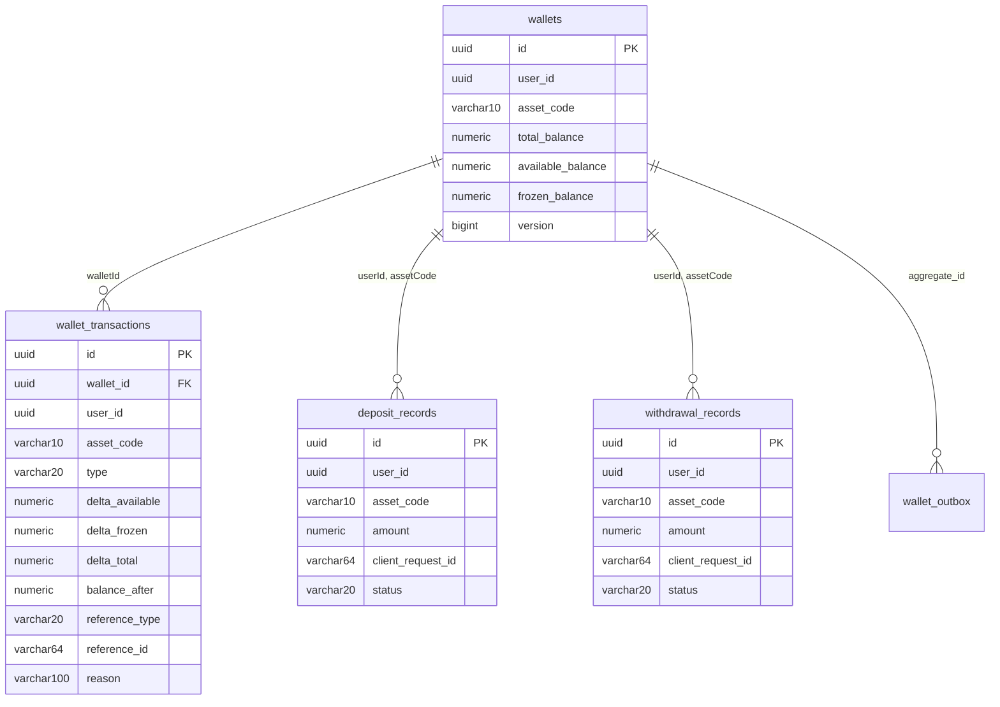

# System Design Appendix — Wallet Service

**Parent Document:** `SystemDesign.md` v1.0
**Service:** `wallet-service`
**Port:** 8082
**Owned Bounded Context:** Balance state & audit
**Owned Entities:** `Wallet`, `WalletTransaction`, `DepositRecord`, `WithdrawalRecord`
**Related SRS:** `SRS_Appendix_WalletService.md` v1.0
**Status:** Ready for implementation

---

## Table of Contents

1. [Scope & Design Goals](#1-scope--design-goals)
2. [Module Structure](#2-module-structure)
3. [Domain Model](#3-domain-model)
4. [Database Schema](#4-database-schema)
5. [REST API Design](#5-rest-api-design)
6. [Kafka Integration](#6-kafka-integration)
7. [Key Use Cases (Implementation)](#7-key-use-cases-implementation)
8. [Concurrency Control (Detailed)](#8-concurrency-control-detailed)
9. [Configuration](#9-configuration)
10. [Error Handling](#10-error-handling)
11. [Testing Strategy](#11-testing-strategy)
12. [Open Implementation Notes](#12-open-implementation-notes)

---

## 1. Scope & Design Goals

This appendix specifies the **implementation-level design** for Wallet Service — the most consistency-critical service in the system. It assumes familiarity with `SystemDesign.md` (§5 Communication Patterns, §6 Data Architecture, §7.1–7.2 Critical Flows, §8.3 Concurrency Control).

### 1.1 Design Goals (in priority order)

1. **Balance invariant must hold at every commit.** `total = available + frozen` is a DB-level CHECK constraint AND a domain assertion. Breaking this is a system-level bug — it should be impossible, not just unlikely.
2. **Every balance change is auditable.** Every mutation produces an immutable `WalletTransaction` row in the same DB transaction. The sum of all `WalletTransaction` deltas for a wallet must equal the wallet's current state at any point in time.
3. **Idempotency on every mutation path.** Freeze (by order_id), unfreeze (by order_id + reason), deposit (by clientRequestId), withdrawal (by clientRequestId), trade settlement (by tradeId) — all naturally idempotent.
4. **Concurrency-safe under contention.** A user spamming 10 orders simultaneously must result in 10 correct, independent freeze operations, no lost updates, and no deadlocks.
5. **No cross-service data leakage.** Wallet Service holds `user_id` as a reference, not user details. It never queries User/Auth Service.

### 1.2 What's Explicitly Out of Scope

- **Order lifecycle** — Order Service. Wallet Service only freezes/unfreezes when told.
- **Trade computation** — Matching Engine computes the fill; Wallet applies it.
- **Fee rate management** — Matching Engine sends `feeAmount` in the trade event; Wallet trusts it.
- **Authentication** — Gateway injects `X-User-Id` header.

---

## 2. Module Structure

### 2.1 Maven Module

```
haizz-exchange/
├── exchange-common/
├── wallet-service/                     ← this module
├── ...
```

Dependencies: `exchange-common`, `spring-boot-starter-web`, `spring-boot-starter-data-jpa`, `spring-boot-starter-validation`, `spring-boot-starter-actuator`, `spring-kafka`, `spring-boot-starter-data-redis`, `postgresql` driver, `flyway-core`, `micrometer-registry-prometheus`, `mapstruct`, `lombok`.

Test: `spring-boot-starter-test`, `testcontainers` (postgresql, kafka, redis), `spring-kafka-test`.

### 2.2 Package Layout

```
com.haizz.exchange.wallet/
├── WalletServiceApplication.java
│
├── api/
│   ├── WalletController.java           # GET /wallets/me
│   ├── DepositController.java           # POST/GET /deposits
│   ├── WithdrawalController.java        # POST/GET /withdrawals
│   ├── TransactionController.java       # GET /wallet-transactions
│   ├── InternalController.java          # POST /internal/freeze, /unfreeze, GET /internal/balance
│   ├── dto/
│   │   ├── WalletResponse.java
│   │   ├── DepositRequest.java
│   │   ├── DepositResponse.java
│   │   ├── WithdrawalRequest.java
│   │   ├── WithdrawalResponse.java
│   │   ├── TransactionResponse.java
│   │   ├── FreezeRequest.java
│   │   ├── FreezeResponse.java
│   │   ├── UnfreezeRequest.java
│   │   └── BalanceResponse.java
│   ├── mapper/
│   │   ├── WalletMapper.java
│   │   └── TransactionMapper.java
│   └── GlobalExceptionHandler.java
│
├── application/
│   ├── freeze/
│   │   ├── FreezeBalanceUseCase.java
│   │   └── UnfreezeBalanceUseCase.java
│   ├── deposit/
│   │   └── DepositUseCase.java
│   ├── withdrawal/
│   │   └── WithdrawalUseCase.java
│   ├── settlement/
│   │   └── ApplyTradeSettlementUseCase.java     # THE critical use case
│   ├── bootstrap/
│   │   └── BootstrapWalletsUseCase.java         # UserRegistered consumer handler
│   ├── query/
│   │   ├── GetWalletsUseCase.java
│   │   ├── ListTransactionsUseCase.java
│   │   ├── ListDepositsUseCase.java
│   │   └── ListWithdrawalsUseCase.java
│   └── concurrency/
│       └── RetryableWalletOperation.java        # retry + escalation template
│
├── domain/
│   ├── Wallet.java                      # aggregate root (JPA-free)
│   ├── WalletTransaction.java           # value object (immutable, audit)
│   ├── DepositRecord.java
│   ├── WithdrawalRecord.java
│   ├── WalletTransactionType.java       # enum: SIGNUP_GRANT, DEPOSIT, WITHDRAWAL, ORDER_FREEZE, ORDER_UNFREEZE, TRADE_DEBIT, TRADE_CREDIT, FEE
│   ├── ReferenceType.java               # enum: USER, ORDER, TRADE, DEPOSIT, WITHDRAWAL
│   ├── BalanceInvariantViolationException.java
│   └── exception/
│       ├── InsufficientAvailableBalanceException.java
│       ├── InsufficientFrozenBalanceException.java
│       ├── FreezeConflictException.java
│       ├── WalletNotFoundException.java
│       ├── DuplicateClientRequestException.java
│       └── ConcurrentModificationException.java
│
├── infrastructure/
│   ├── persistence/
│   │   ├── WalletJpaEntity.java
│   │   ├── WalletJpaRepository.java
│   │   ├── WalletRepositoryImpl.java
│   │   ├── WalletTransactionJpaEntity.java
│   │   ├── WalletTransactionJpaRepository.java
│   │   ├── DepositRecordJpaEntity.java
│   │   ├── DepositRecordJpaRepository.java
│   │   ├── WithdrawalRecordJpaEntity.java
│   │   ├── WithdrawalRecordJpaRepository.java
│   │   └── WalletOutboxJpaEntity.java
│   ├── messaging/
│   │   ├── consumer/
│   │   │   ├── UserRegisteredConsumer.java       # auth.events.v1
│   │   │   ├── TradeExecutedConsumer.java        # matching.events.v1
│   │   │   ├── OrderCancelledConsumer.java       # matching.events.v1 (for residual unfreeze)
│   │   │   └── EventDispatcher.java
│   │   └── producer/                             # uses OutboxWriter
│   ├── idempotency/
│   │   ├── EventIdempotencyStore.java            # Redis-backed
│   │   └── ClientRequestIdempotencyStore.java    # DB-backed (unique index on WalletTransaction)
│   └── cache/                                    # minimal — no heavy caching
│       └── (empty for MVP)
│
├── config/
│   ├── JpaConfig.java
│   ├── KafkaConfig.java
│   ├── RedisConfig.java
│   ├── OutboxConfig.java
│   └── WalletSeeder.java                # @Profile("dev") ApplicationRunner
│
└── shared/
    └── Constants.java
```

### 2.3 Dependency Direction

Same hexagonal rules. **Special emphasis:** the `domain.Wallet` class is the place where balance invariants are enforced. No infrastructure or application code directly sets balance fields — all mutations go through `Wallet.freeze()`, `Wallet.unfreeze()`, `Wallet.creditAvailable()`, etc. These methods throw `BalanceInvariantViolationException` if the invariant would break.

---

## 3. Domain Model

### 3.1 `Wallet` Aggregate

```java
// domain/Wallet.java — JPA-free, pure domain
public final class Wallet {
    private final WalletId id;
    private final UserId userId;
    private final AssetCode assetCode;
    private BigDecimal totalBalance;
    private BigDecimal availableBalance;
    private BigDecimal frozenBalance;
    private long version;               // optimistic lock
    private final Instant createdAt;
    private Instant updatedAt;

    // ─── INVARIANT ───
    private void assertInvariant() {
        if (totalBalance.compareTo(availableBalance.add(frozenBalance)) != 0)
            throw new BalanceInvariantViolationException(this);
        if (availableBalance.compareTo(BigDecimal.ZERO) < 0)
            throw new BalanceInvariantViolationException(this, "available < 0");
        if (frozenBalance.compareTo(BigDecimal.ZERO) < 0)
            throw new BalanceInvariantViolationException(this, "frozen < 0");
    }

    // ─── MUTATIONS (each asserts invariant at end) ───
    public void freeze(BigDecimal amount) {
        requirePositive(amount);
        if (availableBalance.compareTo(amount) < 0)
            throw new InsufficientAvailableBalanceException(this, amount);
        availableBalance = availableBalance.subtract(amount);
        frozenBalance = frozenBalance.add(amount);
        updatedAt = Instant.now();
        assertInvariant();
    }

    public void unfreeze(BigDecimal amount) {
        requirePositive(amount);
        if (frozenBalance.compareTo(amount) < 0)
            throw new InsufficientFrozenBalanceException(this, amount);
        frozenBalance = frozenBalance.subtract(amount);
        availableBalance = availableBalance.add(amount);
        updatedAt = Instant.now();
        assertInvariant();
    }

    public void debitFrozen(BigDecimal amount) {
        // Used in trade settlement — debit from frozen (already reserved)
        requirePositive(amount);
        if (frozenBalance.compareTo(amount) < 0)
            throw new InsufficientFrozenBalanceException(this, amount);
        frozenBalance = frozenBalance.subtract(amount);
        totalBalance = totalBalance.subtract(amount);
        updatedAt = Instant.now();
        assertInvariant();
    }

    public void creditAvailable(BigDecimal amount) {
        // Used in trade settlement — credit received asset to available
        requirePositive(amount);
        availableBalance = availableBalance.add(amount);
        totalBalance = totalBalance.add(amount);
        updatedAt = Instant.now();
        assertInvariant();
    }

    public void deposit(BigDecimal amount) {
        requirePositive(amount);
        availableBalance = availableBalance.add(amount);
        totalBalance = totalBalance.add(amount);
        updatedAt = Instant.now();
        assertInvariant();
    }

    public void withdraw(BigDecimal amount) {
        requirePositive(amount);
        if (availableBalance.compareTo(amount) < 0)
            throw new InsufficientAvailableBalanceException(this, amount);
        availableBalance = availableBalance.subtract(amount);
        totalBalance = totalBalance.subtract(amount);
        updatedAt = Instant.now();
        assertInvariant();
    }

    // Factory
    public static Wallet createEmpty(UserId userId, AssetCode asset) {
        return new Wallet(WalletId.generate(), userId, asset,
            BigDecimal.ZERO, BigDecimal.ZERO, BigDecimal.ZERO, 0, Instant.now(), Instant.now());
    }
}
```

**Critical design decision:** `assertInvariant()` runs after every mutation. If any caller passes a pathological amount that would break the invariant, the exception propagates before the state is committed. This is the **last line of defense** before the DB-level CHECK constraint.

### 3.2 `WalletTransaction` — Immutable Audit Record

```java
public final class WalletTransaction {
    private final WalletTransactionId id;       // UUID
    private final WalletId walletId;
    private final UserId userId;
    private final AssetCode assetCode;
    private final WalletTransactionType type;
    private final BigDecimal deltaAvailable;     // signed: + or -
    private final BigDecimal deltaFrozen;        // signed
    private final BigDecimal deltaTotal;         // signed
    private final BigDecimal balanceAfter;        // snapshot of total after this txn
    private final ReferenceType referenceType;
    private final String referenceId;            // orderId, tradeId, depositId, etc.
    private final String reason;                 // nullable — e.g., "FILL_LEFTOVER_RELEASE"
    private final Instant createdAt;

    // NO setters. Constructed once, persisted, never updated.
}
```

**Audit invariant (verifiable offline):** For any wallet W at time T:
```
W.totalBalance(T) == SUM(txn.deltaTotal) for all txn WHERE walletId=W.id AND createdAt <= T
```

This is a post-MVP reconciliation check, but the schema is designed for it from day one.

### 3.3 `DepositRecord` / `WithdrawalRecord`

Simple tracking records:

```java
public final class DepositRecord {
    private final UUID id;
    private final UserId userId;
    private final AssetCode assetCode;          // USDT only in MVP
    private final BigDecimal amount;
    private final String clientRequestId;        // idempotency key from FE
    private final DepositStatus status;          // PENDING → CONFIRMED (instant)
    private final Instant createdAt;
    private final Instant confirmedAt;
}

public final class WithdrawalRecord {
    private final UUID id;
    private final UserId userId;
    private final AssetCode assetCode;           // any asset
    private final BigDecimal amount;
    private final String clientRequestId;
    private final WithdrawalStatus status;       // PENDING → CONFIRMED (instant)
    private final Instant createdAt;
    private final Instant confirmedAt;
}
```

Both instant-confirm in MVP (no on-chain simulation).

### 3.4 Value Objects (from `exchange-common`)

Imported: `WalletId`, `UserId`, `AssetCode`, `WalletTransactionType` enum, `ReferenceType` enum.

`WalletTransactionType` values:
- `SIGNUP_GRANT` — initial 10,000 USDT credit
- `DEPOSIT` — user-initiated deposit
- `WITHDRAWAL` — user-initiated withdrawal
- `ORDER_FREEZE` — balance reserved for order
- `ORDER_UNFREEZE` — reserved balance released (cancel / leftover)
- `TRADE_DEBIT` — balance consumed by trade (from frozen for seller/buyer quote)
- `TRADE_CREDIT` — balance received from trade (to available)
- `FEE` — audit-only record (no balance movement; fee embedded in TRADE_CREDIT net amount)

---

## 4. Database Schema

Database: `wallet_db` (shared Postgres instance).

### 4.1 Migration Sequence

```
V1__create_wallets.sql
V2__create_wallet_transactions.sql
V3__create_deposit_records.sql
V4__create_withdrawal_records.sql
V5__create_outbox.sql
V6__create_idempotency_indexes.sql
```

### 4.2 `wallets` Table

```sql
CREATE TABLE wallets (
  id                UUID            PRIMARY KEY,
  user_id           UUID            NOT NULL,
  asset_code        VARCHAR(10)     NOT NULL,
  total_balance     NUMERIC(36,18)  NOT NULL DEFAULT 0 CHECK (total_balance >= 0),
  available_balance NUMERIC(36,18)  NOT NULL DEFAULT 0 CHECK (available_balance >= 0),
  frozen_balance    NUMERIC(36,18)  NOT NULL DEFAULT 0 CHECK (frozen_balance >= 0),
  version           BIGINT          NOT NULL DEFAULT 0,
  created_at        TIMESTAMPTZ     NOT NULL DEFAULT NOW(),
  updated_at        TIMESTAMPTZ     NOT NULL DEFAULT NOW(),

  CONSTRAINT ck_wallet_invariant
    CHECK (total_balance = available_balance + frozen_balance),
  CONSTRAINT uq_wallet_user_asset
    UNIQUE (user_id, asset_code)
);

CREATE INDEX ix_wallets_user ON wallets (user_id);
```

**The DB-level invariant CHECK** is the nuclear-option safeguard. Even if the Java domain `assertInvariant()` is somehow bypassed (e.g., raw SQL by a debugging tool), the DB will reject the commit.

### 4.3 `wallet_transactions` Table

```sql
CREATE TABLE wallet_transactions (
  id              UUID            PRIMARY KEY,
  wallet_id       UUID            NOT NULL REFERENCES wallets(id),
  user_id         UUID            NOT NULL,
  asset_code      VARCHAR(10)     NOT NULL,
  type            VARCHAR(20)     NOT NULL,
  delta_available NUMERIC(36,18)  NOT NULL,
  delta_frozen    NUMERIC(36,18)  NOT NULL,
  delta_total     NUMERIC(36,18)  NOT NULL,
  balance_after   NUMERIC(36,18)  NOT NULL,       -- total_balance snapshot
  reference_type  VARCHAR(20)     NOT NULL,
  reference_id    VARCHAR(64)     NOT NULL,
  reason          VARCHAR(100)    NULL,
  created_at      TIMESTAMPTZ     NOT NULL DEFAULT NOW()
);

-- User history (paginated list)
CREATE INDEX ix_wallet_txn_user_created
  ON wallet_transactions (user_id, created_at DESC);

-- Idempotency for trade settlement
CREATE UNIQUE INDEX uq_wallet_txn_trade_debit
  ON wallet_transactions (reference_type, reference_id, type)
  WHERE reference_type = 'TRADE' AND type IN ('TRADE_DEBIT', 'TRADE_CREDIT');

-- Idempotency for freeze
CREATE UNIQUE INDEX uq_wallet_txn_freeze
  ON wallet_transactions (reference_type, reference_id, type)
  WHERE reference_type = 'ORDER' AND type = 'ORDER_FREEZE';

-- Idempotency for unfreeze (includes reason to distinguish cancel vs leftover)
CREATE INDEX ix_wallet_txn_ref ON wallet_transactions (reference_type, reference_id);
```

**Why separate unique indexes per operation type?** Because freeze/unfreeze/trade each have different natural idempotency keys. A single composite unique index would be either too broad (false conflicts) or too narrow (miss true duplicates). Partial unique indexes target exactly the right rows.

### 4.4 `deposit_records` / `withdrawal_records` Tables

```sql
CREATE TABLE deposit_records (
  id                UUID            PRIMARY KEY,
  user_id           UUID            NOT NULL,
  asset_code        VARCHAR(10)     NOT NULL,
  amount            NUMERIC(36,18)  NOT NULL CHECK (amount > 0),
  client_request_id VARCHAR(64)     NOT NULL,
  status            VARCHAR(20)     NOT NULL,        -- PENDING, CONFIRMED
  created_at        TIMESTAMPTZ     NOT NULL DEFAULT NOW(),
  confirmed_at      TIMESTAMPTZ     NULL,

  CONSTRAINT uq_deposit_idempotency
    UNIQUE (user_id, client_request_id)
);

CREATE INDEX ix_deposits_user_created ON deposit_records (user_id, created_at DESC);

CREATE TABLE withdrawal_records (
  id                UUID            PRIMARY KEY,
  user_id           UUID            NOT NULL,
  asset_code        VARCHAR(10)     NOT NULL,
  amount            NUMERIC(36,18)  NOT NULL CHECK (amount > 0),
  client_request_id VARCHAR(64)     NOT NULL,
  status            VARCHAR(20)     NOT NULL,
  created_at        TIMESTAMPTZ     NOT NULL DEFAULT NOW(),
  confirmed_at      TIMESTAMPTZ     NULL,

  CONSTRAINT uq_withdrawal_idempotency
    UNIQUE (user_id, client_request_id)
);

CREATE INDEX ix_withdrawals_user_created ON withdrawal_records (user_id, created_at DESC);
```

Idempotency on `(user_id, client_request_id)` with 60 s semantic window enforced in app code.

### 4.5 `wallet_outbox` Table

Standard `exchange-common` outbox (same as Order Service §4.4).

### 4.6 Entity-Relationship Diagram



---

## 5. REST API Design

### 5.1 Endpoint Summary

| Method | Path | Auth | Consumer | Purpose |
|--------|------|------|----------|---------|
| `GET` | `/api/v1/wallets/me` | User JWT | FE | List all user's wallets |
| `GET` | `/api/v1/wallet-transactions` | User JWT | FE | Paginated txn history |
| `POST` | `/api/v1/deposits` | User JWT | FE | Submit simulated deposit |
| `GET` | `/api/v1/deposits` | User JWT | FE | List user's deposits |
| `POST` | `/api/v1/withdrawals` | User JWT | FE | Submit simulated withdrawal |
| `GET` | `/api/v1/withdrawals` | User JWT | FE | List user's withdrawals |
| `POST` | `/internal/wallets/freeze` | Network-trust | Order Service | Freeze balance |
| `POST` | `/internal/wallets/unfreeze` | Network-trust | Order Service | Unfreeze balance |
| `GET` | `/internal/wallets/balance` | Network-trust | Order Service | Check balance |

### 5.2 Key Request/Response Shapes

**Freeze Request:**
```json
{
  "userId": "uuid",
  "assetCode": "USDT",
  "amount": "60000",
  "referenceType": "ORDER",
  "referenceId": "uuid"
}
```

**Freeze Response (200):**
```json
{
  "walletId": "uuid",
  "assetCode": "USDT",
  "totalBalance": "70000",
  "availableBalance": "10000",
  "frozenBalance": "60000"
}
```

**Deposit Request:**
```json
{
  "assetCode": "USDT",
  "amount": "5000",
  "clientRequestId": "uuid"
}
```

`userId` extracted from JWT (not in request body — prevents user spoofing).

**Wallet List Response (GET /wallets/me):**
```json
{
  "wallets": [
    { "walletId": "uuid", "assetCode": "USDT", "total": "10000", "available": "4000", "frozen": "6000" },
    { "walletId": "uuid", "assetCode": "BTC", "total": "0.999", "available": "0.999", "frozen": "0" },
    ...
  ]
}
```

### 5.3 Validation

Deposit/withdrawal validation (Layer 2 — Bean Validation):
- `amount`: `@NotNull`, `@DecimalMin("0.00000001")` (1 satoshi equivalent).
- `assetCode`: `@NotBlank`, `@Size(max=10)`.
- `clientRequestId`: `@NotBlank`, `@Size(max=64)`.

Deposit asset restriction (Layer 3 — business): only `USDT` allowed in MVP. Other assets → 400 `UNSUPPORTED_DEPOSIT_ASSET`.

Withdrawal asset check: must be in the supported asset catalog. Insufficient balance → 400 `INSUFFICIENT_AVAILABLE_BALANCE`.

---

## 6. Kafka Integration

### 6.1 Consumed Events

| Topic | Event | Consumer Group | Handler |
|-------|-------|----------------|---------|
| `auth.events.v1` | `UserRegistered` | `wallet-service` | `BootstrapWalletsUseCase` |
| `matching.events.v1` | `TradeExecuted` | `wallet-service` | `ApplyTradeSettlementUseCase` |
| `matching.events.v1` | `OrderCancelled` | `wallet-service` | `UnfreezeBalanceUseCase` (residual release) |

### 6.2 Produced Events (via outbox)

| Event | Topic | Partition Key | When |
|-------|-------|---------------|------|
| `WalletTransactionRecorded` | `wallet.events.v1` | `user_id` | After every WalletTransaction INSERT |
| `DepositConfirmed` | `wallet.events.v1` | `user_id` | After deposit confirmation |
| `WithdrawalConfirmed` | `wallet.events.v1` | `user_id` | After withdrawal confirmation |

These are primarily for WS fan-out (Gateway pushes wallet updates to FE) and audit.

### 6.3 Consumer Configuration

```yaml
spring:
  kafka:
    consumer:
      group-id: wallet-service
      auto-offset-reset: earliest
      enable-auto-commit: false
      max-poll-records: 50
    listener:
      ack-mode: manual
      concurrency: 3
```

**Partition key alignment:** `matching.events.v1` is partitioned by `order_id`. For Wallet Service, we want per-user ordering to avoid intra-user concurrency. However, Kafka delivers all events for the same partition to the same consumer thread, and `order_id` is unique per order, not per user.

**Implication:** Two orders from the same user may be on different partitions → processed by different threads. The concurrency control (§8) handles this via optimistic locking on the `Wallet` row. In practice at MVP scale (100 users), contention is extremely rare.

### 6.4 Event Dispatch & Idempotency

Same `EventDispatcher` pattern as other services. Per-handler idempotency:

| Event | Idempotency Key | Storage | Guard |
|-------|-----------------|---------|-------|
| `UserRegistered` | `event_id` | Redis `wallet:idempotency:<event_id>` TTL 24h | Skip if seen |
| `TradeExecuted` | `trade_id` (natural key) | DB unique index `uq_wallet_txn_trade_debit` | DataIntegrityViolation → skip |
| `OrderCancelled` | `event_id` + `order_id` | Redis + DB check (existing ORDER_UNFREEZE for this orderId+reason) | Skip if seen |

**Why `trade_id` in DB and not just Redis?** Because trade settlement touches money. Redis is a fast path; but if Redis loses state (restart), the DB uniqueness constraint is the safety net. Redis prevents hitting the DB on every consumed event; DB catches the edge case.

---

## 7. Key Use Cases (Implementation)

### 7.1 Bootstrap Wallets on UserRegistered

```java
@Transactional
public void execute(UserRegisteredEvent event) {
    // Idempotency — already handled by caller (EventDispatcher checks Redis)
    var userId = UserId.of(event.userId());
    var supportedAssets = List.of("USDT", "BTC", "ETH", "BNB", "SOL", "XRP");

    for (var asset : supportedAssets) {
        var wallet = Wallet.createEmpty(userId, AssetCode.of(asset));
        walletRepo.save(wallet);
    }

    // SIGNUP_GRANT: credit 10,000 USDT
    var usdtWallet = walletRepo.findByUserAndAsset(userId, AssetCode.of("USDT"))
        .orElseThrow();
    usdtWallet.deposit(new BigDecimal("10000"));
    walletRepo.save(usdtWallet);

    txnRepo.save(WalletTransaction.builder()
        .walletId(usdtWallet.id())
        .userId(userId)
        .assetCode(AssetCode.of("USDT"))
        .type(WalletTransactionType.SIGNUP_GRANT)
        .deltaAvailable(new BigDecimal("10000"))
        .deltaFrozen(BigDecimal.ZERO)
        .deltaTotal(new BigDecimal("10000"))
        .balanceAfter(usdtWallet.totalBalance())
        .referenceType(ReferenceType.USER)
        .referenceId(userId.toString())
        .build());

    outbox.write(/* WalletTransactionRecorded event */);
}
```

### 7.2 Freeze Balance (Synchronous — called by Order Service)

```java
public FreezeResult execute(FreezeCommand cmd) {
    // Step 1: idempotency check (DB)
    var existing = txnRepo.findByRefTypeAndRefIdAndType(
        ReferenceType.ORDER, cmd.referenceId(), WalletTransactionType.ORDER_FREEZE);
    if (existing.isPresent()) {
        if (existing.get().deltaAvailable().abs().compareTo(cmd.amount()) == 0) {
            // Same amount — idempotent success
            var wallet = walletRepo.findByUserAndAsset(cmd.userId(), cmd.assetCode())
                .orElseThrow();
            return FreezeResult.alreadyFrozen(wallet);
        } else {
            // Different amount for same order — conflict
            throw new FreezeConflictException(cmd.referenceId());
        }
    }

    // Step 2: load + mutate + persist (with retry)
    return retryableOp.execute(() -> {
        var wallet = walletRepo.findByUserAndAsset(cmd.userId(), cmd.assetCode())
            .orElseThrow(() -> new WalletNotFoundException(cmd.userId(), cmd.assetCode()));

        wallet.freeze(cmd.amount());  // domain enforces invariant
        walletRepo.save(wallet);

        txnRepo.save(WalletTransaction.builder()
            .walletId(wallet.id())
            .userId(cmd.userId())
            .assetCode(cmd.assetCode())
            .type(WalletTransactionType.ORDER_FREEZE)
            .deltaAvailable(cmd.amount().negate())
            .deltaFrozen(cmd.amount())
            .deltaTotal(BigDecimal.ZERO)
            .balanceAfter(wallet.totalBalance())
            .referenceType(ReferenceType.ORDER)
            .referenceId(cmd.referenceId())
            .build());

        // Outbox: WalletTransactionRecorded
        outbox.write(/* ... */);

        return FreezeResult.success(wallet);
    });
}
```

### 7.3 Trade Settlement (THE critical use case)

`ApplyTradeSettlementUseCase.execute(TradeExecutedEvent event)`:

```java
@Transactional
public void execute(TradeExecutedEvent event) {
    // Step 1: idempotency — check if TRADE_DEBIT for this tradeId exists
    if (txnRepo.existsByRefTypeAndRefIdAndType(
            ReferenceType.TRADE, event.tradeId(), WalletTransactionType.TRADE_DEBIT)) {
        log.info("Duplicate TradeExecuted tradeId={} — skipping", event.tradeId());
        return;
    }

    // Step 2: load BOTH wallets in alphabetical order (deadlock prevention)
    var assets = List.of(event.baseAsset(), event.quoteAsset());
    Collections.sort(assets);
    var walletMap = new LinkedHashMap<AssetCode, Wallet>();
    for (var asset : assets) {
        walletMap.put(asset, walletRepo.findByUserAndAssetForUpdate(
            UserId.of(event.userId()), asset)
            .orElseThrow());
    }
    var baseWallet = walletMap.get(AssetCode.of(event.baseAsset()));
    var quoteWallet = walletMap.get(AssetCode.of(event.quoteAsset()));

    if (event.side() == OrderSide.BUY) {
        applyBuyFill(event, baseWallet, quoteWallet);
    } else {
        applySellFill(event, baseWallet, quoteWallet);
    }

    walletRepo.save(baseWallet);
    walletRepo.save(quoteWallet);

    // Outbox events for WS push
    outbox.write(/* WalletTransactionRecorded for each txn */);
}

private void applyBuyFill(TradeExecutedEvent e, Wallet base, Wallet quote) {
    // BUY: user pays quote from frozen, receives base to available
    var quoteDebit = new BigDecimal(e.quoteAmount());
    var baseCredit = new BigDecimal(e.quantity()).subtract(new BigDecimal(e.feeAmount()));

    // 1. Debit quote (from frozen)
    quote.debitFrozen(quoteDebit);
    insertTxn(quote, TRADE_DEBIT, BigDecimal.ZERO, quoteDebit.negate(), quoteDebit.negate(),
              ReferenceType.TRADE, e.tradeId());

    // 2. Residual freeze release (if final fill with leftover)
    if (e.isFinalFill() && e.residualFrozenAmount() != null
            && new BigDecimal(e.residualFrozenAmount()).compareTo(BigDecimal.ZERO) > 0) {
        var residual = new BigDecimal(e.residualFrozenAmount());
        quote.unfreeze(residual);
        insertTxn(quote, ORDER_UNFREEZE, residual, residual.negate(), BigDecimal.ZERO,
                  ReferenceType.ORDER, e.orderId(), "FILL_LEFTOVER_RELEASE");
    }

    // 3. Credit base (to available)
    base.creditAvailable(baseCredit);
    insertTxn(base, TRADE_CREDIT, baseCredit, BigDecimal.ZERO, baseCredit,
              ReferenceType.TRADE, e.tradeId());

    // 4. Fee audit record (informational — no balance impact)
    insertTxn(base, FEE, BigDecimal.ZERO, BigDecimal.ZERO, BigDecimal.ZERO,
              ReferenceType.TRADE, e.tradeId());
}

private void applySellFill(TradeExecutedEvent e, Wallet base, Wallet quote) {
    // SELL: user sends base from frozen, receives quote (minus fee) to available
    var baseDebit = new BigDecimal(e.quantity());
    var quoteCredit = new BigDecimal(e.quoteAmount()).subtract(new BigDecimal(e.feeAmount()));

    base.debitFrozen(baseDebit);
    insertTxn(base, TRADE_DEBIT, BigDecimal.ZERO, baseDebit.negate(), baseDebit.negate(),
              ReferenceType.TRADE, e.tradeId());

    // Residual release (rare for sell — sell freezes exact qty, no buffer)
    if (e.isFinalFill() && e.residualFrozenAmount() != null
            && new BigDecimal(e.residualFrozenAmount()).compareTo(BigDecimal.ZERO) > 0) {
        var residual = new BigDecimal(e.residualFrozenAmount());
        base.unfreeze(residual);
        insertTxn(base, ORDER_UNFREEZE, residual, residual.negate(), BigDecimal.ZERO,
                  ReferenceType.ORDER, e.orderId(), "FILL_LEFTOVER_RELEASE");
    }

    quote.creditAvailable(quoteCredit);
    insertTxn(quote, TRADE_CREDIT, quoteCredit, BigDecimal.ZERO, quoteCredit,
              ReferenceType.TRADE, e.tradeId());

    insertTxn(quote, FEE, BigDecimal.ZERO, BigDecimal.ZERO, BigDecimal.ZERO,
              ReferenceType.TRADE, e.tradeId());
}
```

**Why `findByUserAndAssetForUpdate`?** Trade settlement loads TWO wallets and mutates both. Optimistic locking works for single-wallet ops (freeze/unfreeze). For multi-wallet, we use `SELECT ... FOR UPDATE` (pessimistic) directly — acquired in alphabetical order — to guarantee consistency without retry loops.

**Why not optimistic lock for trades?** Because the retry cost is high (recompute both wallets, risk of deadlock if retry order changes). Pessimistic lock with alphabetical ordering is deterministic and correct — at MVP scale (<10 trades/sec), contention on `FOR UPDATE` is negligible.

### 7.4 OrderCancelled Consumer → Residual Unfreeze

When Matching Engine cancels an order (user-initiated cancel), Wallet Service releases whatever frozen balance remains:

```java
@Transactional
public void handleOrderCancelled(OrderCancelledEvent event) {
    if (event.remainingQuantity().compareTo(BigDecimal.ZERO) == 0) {
        // Order was fully filled before cancel processed — nothing to unfreeze
        return;
    }

    // Compute unfreeze amount from order's original freeze data
    // Option A: event carries residualFrozenAmount (preferred — Matching Engine sends it)
    // Option B: look up WalletTransaction with ORDER_FREEZE + orderId, compute difference
    // Using Option A (per SRS §3.5.4 chosen approach):
    if (event.residualFrozenAmount() == null || event.residualFrozenAmount().compareTo(BigDecimal.ZERO) <= 0)
        return;

    var wallet = walletRepo.findByUserAndAsset(
            UserId.of(event.userId()), AssetCode.of(event.residualAsset()))
        .orElseThrow();

    retryableOp.execute(() -> {
        wallet.unfreeze(event.residualFrozenAmount());
        walletRepo.save(wallet);
        insertTxn(wallet, ORDER_UNFREEZE, event.residualFrozenAmount(),
                  event.residualFrozenAmount().negate(), BigDecimal.ZERO,
                  ReferenceType.ORDER, event.orderId(), "ORDER_CANCELLED");
        outbox.write(/* WalletTransactionRecorded */);
    });
}
```

### 7.5 Deposit / Withdrawal

Straightforward — single wallet, single txn, instant confirm:

```java
@Transactional
public DepositResult execute(DepositCommand cmd) {
    // Idempotency: unique constraint on (user_id, client_request_id)
    if (depositRepo.existsByUserIdAndClientRequestId(cmd.userId(), cmd.clientRequestId())) {
        return DepositResult.alreadyProcessed(
            depositRepo.findByUserIdAndClientRequestId(cmd.userId(), cmd.clientRequestId()));
    }

    // MVP: only USDT
    if (!"USDT".equals(cmd.assetCode().value())) {
        throw new UnsupportedDepositAssetException(cmd.assetCode());
    }

    var wallet = walletRepo.findByUserAndAsset(cmd.userId(), cmd.assetCode())
        .orElseThrow();

    wallet.deposit(cmd.amount());
    walletRepo.save(wallet);

    var record = DepositRecord.create(cmd.userId(), cmd.assetCode(), cmd.amount(),
                                       cmd.clientRequestId(), DepositStatus.CONFIRMED);
    depositRepo.save(record);

    insertTxn(wallet, DEPOSIT, cmd.amount(), BigDecimal.ZERO, cmd.amount(),
              ReferenceType.DEPOSIT, record.id().toString());

    outbox.write(/* DepositConfirmed event */);

    return DepositResult.success(record, wallet);
}
```

---

## 8. Concurrency Control (Detailed)

The most nuanced section. Three strategies, applied per operation.

### 8.1 Strategy Matrix

| Operation | Lock Type | Retry | Escalation |
|-----------|-----------|-------|------------|
| Freeze | Optimistic (`@Version`) | 3× with backoff 10/20/40 ms | Pessimistic `FOR UPDATE` with 5 s timeout |
| Unfreeze | Optimistic | 3× | Pessimistic |
| Deposit | Optimistic | 3× | Pessimistic |
| Withdrawal | Optimistic | 3× | Pessimistic |
| Trade settlement | **Pessimistic directly** (`FOR UPDATE`) | None (single attempt) | 409 `CONCURRENT_MODIFICATION` on lock timeout |
| Bootstrap wallets | None needed | N/A (one-time per user) | N/A |

### 8.2 `RetryableWalletOperation` — Retry + Escalation Template

```java
@Component
public class RetryableWalletOperation {

    public <T> T execute(Supplier<T> operation) {
        // Try optimistic — 3 attempts
        for (int attempt = 1; attempt <= 3; attempt++) {
            try {
                return transactionTemplate.execute(status -> operation.get());
            } catch (OptimisticLockingFailureException e) {
                log.warn("Optimistic lock conflict, attempt {}/3", attempt);
                sleepMs(10 * (long) Math.pow(2, attempt - 1));   // 10, 20, 40 ms
            }
        }

        // Escalate to pessimistic
        log.warn("Escalating to pessimistic lock after 3 optimistic failures");
        try {
            return transactionTemplate.execute(status -> {
                // Caller must use findForUpdate() variant when this template executes
                return operation.get();
            });
        } catch (PessimisticLockingFailureException e) {
            throw new ConcurrentModificationException("Lock timeout after pessimistic escalation");
        }
    }
}
```

**The escalation problem:** The operation lambda uses `findByUserAndAsset()` (optimistic) in the first 3 attempts and needs to switch to `findByUserAndAssetForUpdate()` (pessimistic) on escalation. Solution: the operation receives a `LockMode` parameter:

```java
public <T> T execute(Function<LockMode, T> operation) {
    for (int attempt = 1; attempt <= 3; attempt++) {
        try {
            return txnTemplate.execute(s -> operation.apply(LockMode.OPTIMISTIC));
        } catch (OptimisticLockingFailureException e) { /* retry */ }
    }
    return txnTemplate.execute(s -> operation.apply(LockMode.PESSIMISTIC));
}
```

Use case adapts:
```java
retryableOp.execute(lockMode -> {
    var wallet = (lockMode == PESSIMISTIC)
        ? walletRepo.findByUserAndAssetForUpdate(userId, asset)
        : walletRepo.findByUserAndAsset(userId, asset);
    // ... proceed
});
```

### 8.3 Alphabetical Lock Ordering

Prevents deadlocks when two concurrent transactions both need wallet A and wallet B. Without consistent ordering, Thread 1 grabs A then waits for B, while Thread 2 grabs B then waits for A → deadlock.

Rule: **always acquire locks in ascending alphabetical order of `assetCode`**:
- BTC before ETH, ETH before USDT, etc.
- For a BTCUSDT trade: load BTC first, then USDT.

Implemented in `ApplyTradeSettlementUseCase` via sorted asset list before the `findForUpdate` calls.

### 8.4 Why Not Use Database Advisory Locks?

Advisory locks (`pg_advisory_lock`) are an alternative to row-level `FOR UPDATE`. They would allow locking on a composite key like `(userId, assetCode)` hash. However:
- Row-level locks are simpler, well-understood, and sufficient at MVP scale.
- Advisory locks require manual release and can leak on exception paths.
- JPA/Hibernate natively supports `@Lock(LockModeType.PESSIMISTIC_WRITE)` on `findForUpdate` queries, making the implementation straightforward.

Advisory locks revisited post-MVP if row-level contention causes measurable latency.

---

## 9. Configuration

### 9.1 `application.yml`

```yaml
spring:
  application:
    name: wallet-service
  datasource:
    url: jdbc:postgresql://postgres:5432/wallet_db
    username: ${DB_USER:wallet_user}
    password: ${DB_PASSWORD}
    hikari:
      maximum-pool-size: 20
      connection-timeout: 5000
  jpa:
    hibernate:
      ddl-auto: validate
    properties:
      hibernate.jdbc.time_zone: UTC
      hibernate.order_inserts: true
      hibernate.order_updates: true
      jakarta.persistence.lock.timeout: 5000   # 5s pessimistic lock timeout
  flyway:
    locations: classpath:db/migration
  kafka:
    bootstrap-servers: ${KAFKA_BOOTSTRAP:kafka:9092}
    producer:
      acks: all
      compression-type: lz4
      properties:
        enable.idempotence: true
    consumer:
      group-id: wallet-service
      auto-offset-reset: earliest
      enable-auto-commit: false
    listener:
      ack-mode: manual
      concurrency: 3
  data:
    redis:
      host: redis
      port: 6379

server:
  port: 8082
  shutdown: graceful

management:
  endpoints:
    web:
      exposure:
        include: health, info, prometheus
  endpoint:
    health:
      show-details: never
      probes:
        enabled: true

wallet:
  signup-grant-amount: 10000
  signup-grant-asset: USDT
  supported-assets:
    - USDT
    - BTC
    - ETH
    - BNB
    - SOL
    - XRP
  deposit:
    allowed-assets:
      - USDT
    idempotency-window: 60s
  withdrawal:
    idempotency-window: 60s
  concurrency:
    optimistic-retries: 3
    backoff-initial-ms: 10
    pessimistic-lock-timeout-ms: 5000

outbox:
  relay:
    enabled: true
    poll-interval-ms: 100
    batch-size: 100
    max-attempts: 10

logging:
  pattern:
    level: "%5p [%X{correlation_id:-},%X{user_id:-}]"
  level:
    root: INFO
    com.haizz.exchange.wallet: DEBUG
```

---

## 10. Error Handling

### 10.1 Exception Hierarchy

```
DomainException (from exchange-common)
├── WalletNotFoundException                     → 404
├── InsufficientAvailableBalanceException        → 400
├── InsufficientFrozenBalanceException           → 409 (upstream bug indicator)
├── FreezeConflictException                      → 409
├── DuplicateClientRequestException              → 409 (deposit/withdrawal)
├── UnsupportedDepositAssetException             → 400
├── ConcurrentModificationException              → 409
└── BalanceInvariantViolationException           → 500 (SHOULD NEVER HAPPEN; page-worthy)
```

`BalanceInvariantViolationException` is a **system-level bug**. If this fires:
1. Log at ERROR with full wallet state dump.
2. Return 500 `INTERNAL_ERROR`.
3. Post-MVP: alert/page operator.
4. The DB CHECK constraint will also reject the commit, creating a double safeguard.

### 10.2 GlobalExceptionHandler

Same pattern as Order Service (§11.2 of that appendix). Special handling:

```java
@ExceptionHandler(BalanceInvariantViolationException.class)
ResponseEntity<ApiError> onInvariantViolation(BalanceInvariantViolationException ex) {
    log.error("CRITICAL: Balance invariant violation! wallet={} total={} available={} frozen={}",
        ex.wallet().id(), ex.wallet().totalBalance(),
        ex.wallet().availableBalance(), ex.wallet().frozenBalance());
    // This should NEVER happen. If it does, investigate immediately.
    return status(500).body(ApiError.of("INTERNAL_ERROR", "Internal error", ...));
}
```

---

## 11. Testing Strategy

### 11.1 Test Pyramid

| Layer | Count | Framework | What's Tested |
|-------|-------|-----------|---------------|
| Unit — domain | ~50 | JUnit 5 + AssertJ | `Wallet` mutations, invariant checks, all edge cases for each operation |
| Unit — application | ~30 | JUnit 5 + Mockito | Use cases with mocked repos |
| Integration — persistence | ~15 | Testcontainers PG | JPA mappings, Flyway, CHECK constraints, unique indexes |
| Integration — messaging | ~10 | Testcontainers Kafka | Consumers idempotency, outbox relay |
| Integration — concurrency | ~10 | Testcontainers PG | Multi-threaded freeze/unfreeze/trade tests |
| End-to-end | ~5 | Testcontainers full | Bootstrap → freeze → trade → unfreeze full cycle |
| Architecture | ~5 | ArchUnit | Layer dependencies |

### 11.2 Critical Test Scenarios

**Invariant:**
- `freeze_thenUnfreeze_invariantHoldsAlways`
- `deposit_thenWithdrawAll_balancesAreZero`
- `tradeSettlement_buyFill_invariantOnBothWallets`
- `randomizedOperationSequence_1000ops_invariantNeverViolated` (property-based)

**Freeze / Unfreeze:**
- `freeze_happyPath_updatesAvailableAndFrozen`
- `freeze_insufficientBalance_throws400`
- `freeze_duplicateOrderId_returnsExisting200`
- `freeze_duplicateOrderIdDifferentAmount_throws409`
- `unfreeze_happyPath_releasesFrozenToAvailable`
- `unfreeze_exceedsFrozen_throws409`

**Trade settlement:**
- `buyFill_debitsQuoteFrozen_creditsBaseAvailable_netOfFee`
- `sellFill_debitsBaseFrozen_creditsQuoteAvailable_netOfFee`
- `buyFill_withResidualRelease_unfreezesLeftover`
- `duplicateTradeId_isIdempotent_noDoubleCredit`
- `tradeSettlement_lockOrder_btcBeforeUsdt`

**Concurrency:**
- `tenConcurrentFreezes_sameUser_allSucceed_balanceConsistent`
- `optimisticLockConflict_retriesSuccessfully`
- `optimisticLockExhausted_escalatesToPessimistic`
- `pessimisticLockTimeout_returns409`
- `twoConcurrentTrades_differentUsers_noDeadlock`

**Bootstrap:**
- `userRegistered_creates6Wallets_credits10kUSDT`
- `userRegistered_duplicate_isIdempotent`

**Deposit / Withdrawal:**
- `deposit_usdt_creditsAvailable`
- `deposit_nonUsdt_rejects400`
- `deposit_duplicateClientRequestId_returnsExisting`
- `withdrawal_exceedsAvailable_rejects400_showsFrozenInError`
- `withdrawal_fromFrozenNotAllowed` (implicit — checks `available` only)

### 11.3 Property-Based Testing

Using jqwik — randomized sequences of operations on a wallet:

```java
@Property(tries = 100)
void walletInvariantAlwaysHolds(
    @ForAll("operationSequence") List<WalletOperation> ops
) {
    var wallet = Wallet.createEmpty(someUserId, AssetCode.of("USDT"));
    wallet.deposit(new BigDecimal("100000"));  // start with funds

    for (var op : ops) {
        try {
            op.applyTo(wallet);
        } catch (InsufficientAvailableBalanceException | InsufficientFrozenBalanceException e) {
            // Expected — some ops will fail due to insufficient balance
        }
        // INVARIANT MUST HOLD regardless of success/failure
        assertThat(wallet.totalBalance())
            .isEqualTo(wallet.availableBalance().add(wallet.frozenBalance()));
        assertThat(wallet.availableBalance()).isGreaterThanOrEqualTo(BigDecimal.ZERO);
        assertThat(wallet.frozenBalance()).isGreaterThanOrEqualTo(BigDecimal.ZERO);
    }
}
```

### 11.4 ArchUnit Rules

Same as Order Service:
- Domain has no Spring/JPA imports.
- API does not depend on infrastructure.
- Additional: `WalletTransaction` entity class must not have any setter methods (immutability enforced at code level).

---

## 12. Open Implementation Notes

1. **`balanceAfter` in WalletTransaction.** Snapshot of `totalBalance` at commit time. Enables offline audit without replaying deltas. However, under concurrent mutations, the snapshot reflects the state after THIS transaction, not necessarily the global latest (another concurrent txn may commit first). Acceptable for audit purposes — order of txn records by `createdAt` + delta replay gives the authoritative history.

2. **Fee audit record — zero-delta row.** The FEE transaction has `deltaAvailable=0, deltaFrozen=0, deltaTotal=0`. It exists purely for the audit trail — "this tradeId incurred fee X in asset Y." The fee is already embedded in the `TRADE_CREDIT` net amount. Alternative: store fee as a metadata JSON column on the `TRADE_CREDIT` row. The separate row is clearer for auditing.

3. **Residual freeze release — who calculates?** Per SRS §3.5.4: Matching Engine sends `residualFrozenAmount` in the event. Alternative: Wallet Service looks up the original freeze WalletTransaction and computes `freeze_amount - sum(trade debits for this order)`. The event-carried approach is simpler (no cross-entity query) but couples Wallet to Matching Engine's knowledge of the freeze amount. Acceptable for MVP.

4. **Wallet pagination for `GET /wallets/me`.** At 6 wallets per user, no pagination needed — return all. Post-MVP with more assets: still likely < 50 per user; offset pagination if ever.

5. **Transaction history pagination.** Offset pagination with `(user_id, created_at DESC)` index. Keyset if latency grows with depth (unlikely at MVP scale).

6. **Nightly reconciliation job.** Post-MVP: `SELECT user_id, asset_code, SUM(delta_total), w.total_balance FROM wallet_transactions wt JOIN wallets w ... GROUP BY ... HAVING SUM(delta_total) != w.total_balance`. Any rows = invariant violation. Alert.

7. **Account-level freeze (admin).** Not MVP. When added: new `Wallet.accountFrozen` boolean; all mutations check it and return 403 if true.

8. **Precision & rounding.** All BigDecimal operations use `MathContext.DECIMAL128`. Division (if ever needed) uses `RoundingMode.DOWN` — never credit more than exact. In practice, Wallet Service does no division — all amounts arrive pre-computed from Matching Engine or user input.

---

*End of `SystemDesign_Appendix_WalletService.md`.*
